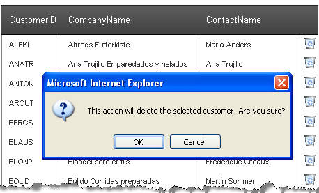

# Confirmation Dialogs


## 

To display a confirmation dialog that prompts the user whether a selected action should be executed (from a button in a template), invoke the __confirm__ javascript method (or use __radConfirm__ for a confirmation dialog that uses skins). If the user chooses the negatve option in the confirmation dialog, return __false__ from the __OnClientClick__ event handler of the button.

Here is an example:

````ASPNET
	  <telerik:RadGrid ID="RadGrid1" runat="server" DataSourceID="SqlDataSource1">
	    <MasterTableView AutoGenerateColumns="False" DataKeyNames="CustomerID" DataSourceID="SqlDataSource1">
	      <Columns>
	        <telerik:GridBoundColumn DataField="CustomerID" HeaderText="CustomerID" ReadOnly="True"
	          SortExpression="CustomerID" UniqueName="CustomerID">
	        </telerik:GridBoundColumn>
	        <telerik:GridBoundColumn DataField="CompanyName" HeaderText="CompanyName" SortExpression="CompanyName"
	          UniqueName="CompanyName">
	        </telerik:GridBoundColumn>
	        <telerik:GridBoundColumn DataField="ContactName" HeaderText="ContactName" SortExpression="ContactName"
	          UniqueName="ContactName">
	        </telerik:GridBoundColumn>
	        <telerik:GridTemplateColumn UniqueName="TemplateColumn">
	          <ItemTemplate>
	            <asp:ImageButton ID="ImageButton1" runat="server" AlternateText="Delete Customer"
	              OnClientClick="javascript:if(!confirm('This action will delete the
	        selected customer. Are you sure?')){return false;}" ImageUrl="~/Images/Delete.gif" OnClick="ImageButton1_Click" />
	          </ItemTemplate>
	        </telerik:GridTemplateColumn>
	      </Columns>
	    </MasterTableView>
	  </telerik:RadGrid>
	  <asp:SqlDataSource ID="SqlDataSource1" runat="server" ConnectionString="<%$ ConnectionStrings:NorthwindConnectionString %>"
	     SelectCommand="SELECT [CustomerID], [CompanyName], [ContactName] FROM [Customers]">
	  </asp:SqlDataSource>
````


The code above results in the following confirmation dialog when the user clicks on the image button:


