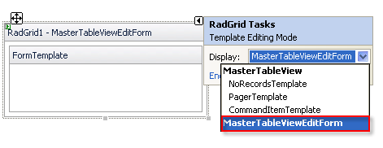

# Custom Edit Forms


When the __EditMode__ property of a table view is "EditForms" or "PopUp", the table view's __EditFormSettings__ property lets you configure the edit form. One of the __EditFormSettings__ sub-properties is __EditFormType__, which lets you specify whether you want to use the built-in edit form or substitute your own custom edit form.

There are three possible settings for __EditFormType__:

* __AutoGenerated__: When __EditFormType__ is "AutoGenerated", the table view uses the built-in edit form.

* __WebUserControl__: When __EditFormType__ is "WebUserControl", you can supply a __UserControl__ that the table view uses as an edit form.

* __Template__: When __EditFormType__ is "Template", you can supply a template that the table view uses to generate the edit form.

>caution Please note that all settings related to the edit form __caption__ are applied only if the EditFormType is "AutoGenerated". Otherwise a caption is not rendered automatically by RadGrid, however, you can add a custom caption in the edit form template or user control edit form.
>


## WebUserControl

When __EditFormType__ is "WebUserControl", you can supply a __UserControl__ to act as a custom edit form.

## Referring to the UserControl from the grid

If you need a reference to the __UserControl__ from an event handler of your __RadGrid__ control, (for example, when the "Update" button is pressed), you must take into account that the __UserControl__ is a __Container__ that is placed inside another __Container__ (the __EditFormCell__). The following example shows how you can access the custom __UserControl__:


````C#
	    UserControl MyUserControl = editFormItem.FindControl(GridEditFormItem.EditFormUserControlID) as UserControl;
````
````VB.NET
	    Dim MyUserControl As UserControl = CType(editFormItem.FindControl(GridEditFormItem.EditFormUserControlID), UserControl)
````


## Accessing the edited grid item from the user control

When __RadGrid__ loads the __UserControl__ Edit Form, the __UserControl__ has full access to the properties of the grid item in which it is loaded. Inside the __UserControl__, you can access the grid item using the __Parent.NamingContainer__ property:


````C#
	    GridEditableItem editedItem = this.Parent.NamingContainer;
````
````VB.NET
	    Dim editedItem As GridEditableItem = Me.Parent.NamingContainer
````


Once you have a reference to the __GridEditableItem__ object, you can access any of its properties, such as cell text values, the __DataItem__ object (available in __DataBinding__ event handler), and so on.

## Accessing the page from the user control

You can use the __Page__ property of the user control to access the Web page that holds the grid instance:


````C#
	    MyPageClassName myPage = this.Page;
````
````VB.NET
	    Dim myPage As MyPageClassName = Me.Page
````


## Binding controls inside the UserControl

When implementing a __UserControl__ to act as a custom edit form, there are three ways you can handle exchanging data between the __RadGrid__ control and your __UserControl__ implementation:

* Using __DataBinder__ expressions to bind directly to a data item from the __RadGrid__ instance.

* Declaring a __DataItem__ property and binding controls in the __UserControl__ from this property's value.

* Setting control properties directly without using any binding expressions.

## Binding directly to a data item

To access data from the object that the custom edit form is binding to, the binding expression used in controls inside the __UserControl__ should be implemented in a slightly different way than usual. This is because the controls are not directly inside the binding container: they are inside the __UserControl__, which is in turn inside the binding container. The controls must bind to __GridEditFormItem__ instead of __UserControl.__ Therefore, the binding expression needs to calculate properties for the parent's binding container.

Here is an example declaration of a __TextBox__ server control inside a __UserControl__ that is bound to the __Region__ property of the __DataItem__ in __RadGrid__:

````ASPNET
	  <asp:TextBox ID="TextBox1" runat="server" Text='<%# DataBinder.Eval( Container, "Parent.BindingContainer.DataItem.Region") %>' />
````


## Using the DataItem Property

If you prefer to use simpler binding expressions when implementing a __UserControl__ to act as a custom edit form, implement a property with the name __DataItem__. This property must be public and assignable from the type of object that constructs the data source for __RadGrid__.

For example, if you bind __RadGrid__ to a __DataSet__, the __DataItem__ property can be declared as:


````C#
	    private object _dataItem = null;
	    public object DataItem
	    {
	        get
	        {
	            return this._dataItem;
	        }
	        set
	        {
	            this._dataItem = value;
	        }
	    }
````
````VB.NET
	    Private _dataItem As Object = Nothing
	    Public Property DataItem As Object
	        Get
	            Return Me._dataItem
	        End Get
	        Set(ByVal value As Object)
	            Me._dataItem = value
	        End Set
	    End Property
	
````


The __DataItem__ property should be declared as of type object. After loading the __UserControl__, __RadGrid__ tries to assign the value of the __DataItem__ property.

Once your __UserControl__ has a __DataItem__ property, you can use binding expressions such as the following:

````ASPNET
	  <asp:TextBox ID="TextBox1" runat="server" Text='<%# Eval( "Country" ) %>'></asp:TextBox>
````


## Setting properties without using binding expressions

You can handle the __ItemDataBound__ event of the grid to access the controls in your __UserControl__ and set their properties when the control is bound. In the __ItemDataBound__ handler,

1. Check whether the type of item is __GridEditFormItem__ and whether the item is in edit mode.

1. Locate the user control inside the __GridEditFormItem__ and make the modifications you wish.

Here is an example that sets the text for a __TextBox__ that resides inside the user control:


````C#
	    private void RadGrid1_ItemDataBound(object sender, Telerik.Web.UI.GridItemEventArgs e)
	    {
	        if (e.Item is GridEditFormItem && e.Item.IsInEditMode)
	        {
	            UserControl MyUserControl = e.Item.FindControl(GridEditFormItem.EditFormUserControlID) as UserControl;
	            GridDataItem parentItem = (e.Item as GridEditFormItem).ParentItem;
	            TextBox box = (TextBox)MyUserControl.FindControl("TextBox1");
	            box.Text = parentItem["Country"].Text;
	        }
	    }
````
````VB.NET
	
	    Private Sub RadGrid1_ItemDataBound(ByVal sender As Object, ByVal e As Telerik.Web.UI.GridItemEventArgs) Handles RadGrid1.ItemDataBound
	        If (TypeOf e.Item Is GridEditFormItem AndAlso e.Item.IsInEditMode) Then
	            Dim MyUserControl As UserControl = CType(e.Item.FindControl(GridEditFormItem.EditFormUserControlID), UserControl)
	            Dim parentItem As GridDataItem = CType(e.Item, GridDataItem).ParentItem
	            Dim box As TextBox = CType(MyUserControl.FindControl("TextBox1"), TextBox)
	            box.Text = parentItem("Country").Text
	        End If
	    End Sub
````


## Binding selected values for drop-down lists

To select the proper item in a drop-down list inside your __UserControl__, handle the __DataBinding__ event of the user control. Inside the event handler, bind the drop-down list and set its __SelectedIndex__ accordingly:


````C#
	    private void MyEditForm_DataBinding(object sender, System.EventArgs e)
	    {
	        String[] tocs = new string[] { "Dr.", "Mr.", "Mrs.", "Ms." };
	        ddlTOC.DataSource = tocs;
	        ddlTOC.DataBind();
	        ddlTOC.SelectedIndex = tocs.IndexOf(DataBinder.Eval(DataItem, "TitleOfCourtesy").ToString());
	        ddlTOC.DataSource = null;
	    }
````
````VB.NET
	    Private Sub MyEditForm_DataBinding(ByVal sender As Object, ByVal e As System.EventArgs) Handles Me.DataBinding
	        Dim tocs As String() = New String() {"Dr.", "Mr.", "Mrs.", "Ms."}
	        ddlTOC.DataSource = tocs
	        ddlTOC.DataBind()
	        ddlTOC.SelectedIndex = tocs.IndexOf(DataBinder.Eval(DataItem, "TitleOfCourtesy").ToString())
	        ddlTOC.DataSource = Nothing
	    End Sub
````


>note An important detail is to assign *empty data source* for the drop-down list to prevent binding it again at a later stage (when the rest of the edited item content is bound). The same conventions stand for nested user controls inside WebUserControl custom edit form or other controls such as listboxes, radiobutton lists, checkbox lists, and so on.
>


For a live example that shows a custom edit form implemented using a UserControl, see [User control edit form](http://demos.telerik.com/aspnet-ajax/Grid/Examples/DataEditing/UserControlEditForm/DefaultVB.aspx).

## Template

When __EditFormType__ is "Template", you can supply a template that the table view uses to generate the edit form. To generate the template at design time, choose __Edit Templates__ from the __RadGrid__ Smart Tag. If the __EditFormType__ for the table view has been set to "Template", the __EditFormTemplate__ appears in the drop-down list of available templates. When you select that item, you can use the Template design surface to generate your template:
>caption 



## Binding controls inside the template

When using a template to implement a custom edit form, you can bind the items using __DataBinder__ expressions:

````C#
	  <EditFormSettings editformtype="Template">
	    <EditColumn uniquename="EditCommandColumn1"/>
	    <FormTemplate>You can use traditional data binding<br/>Which require you to handle the updates yourself<br/>
	      <asp:TextBox ID="TextBox1" runat="server" Text='<%# DataBinder.Eval( Container, "DataItem.Country" ) %>'/>
	      <br/>When using automatic updates, you can use the Bind method<br/> 
	      <asp:TextBoxID="TextBox2" runat="server" Text='<%# Bind("Country") %>' />  
	    </FormTemplate>
	    <PopUpSettings ScrollBars="None" />
	  <EditFormSettings>			
````


For a live example that shows a custom edit form implemented using a template, see [Form template edit form](http://demos.telerik.com/aspnet-ajax/Grid/Examples/DataEditing/TemplateFormUpdate/DefaultCS.aspx).

>note When using[Automatic DataSource operations](), use the __Bind()__ syntax to bind template controls. This allows the grid to extract updated values and pass them to the data source with no additional code on your part.
>


## Setting properties without using binding expressions

Just like with the __UserControl__, when using a template form for a custom edit form, you can handle the __ItemDataBound__ event of the grid to access the controls in edit form and set their properties when the control is bound. In the __ItemDataBound__ handler,

1. Check whether the type of item is __GridEditFormItem__ and whether the item is in edit mode.

1. Locate the user control inside the __GridEditFormItem__ and make the modifications you wish.

Here is an example that sets the text for a __TextBox__ that resides inside the form template:


````C#
	    private void RadGrid1_ItemDataBound(object sender, Telerik.Web.UI.GridItemEventArgs e)
	    {
	        if (e.Item is GridEditFormItem && e.Item.IsInEditMode)
	        {
	            GridEditFormItem editFormItem = e.Item as GridEditFormItem;
	            GridDataItem parentItem = editFormItem.ParentItem;
	            TextBox box = editFormItem.FindControl("TextBox1") as TextBox;
	            box.Text = parentItem["Country"].Text;
	        }
	    }
````
````VB.NET
	    Private Sub RadGrid1_ItemDataBound(ByVal sender As Object, ByVal e As Telerik.Web.UI.GridItemEventArgs) Handles RadGrid1.ItemDataBound
	        If (TypeOf e.Item Is GridEditFormItem AndAlso e.Item.IsInEditMode) Then
	            Dim editFormItem As GridEditFormItem = CType(e.Item, GridEditFormItem)
	            Dim parentItem As GridDataItem = editFormItem.ParentItem
	            Dim box As TextBox = CType(editFormItem.FindControl("TextBox1"), TextBox)
	            box.Text = parentItem("Country").Text
	        End If
	    End Sub
````


## Creating FormTemplate custom edit form programmatically

You can create and assign the edit form template at runtime in the code-behind. To do this, you must design a class that implements the __IBindableTemplate__ interface and assign an instance of that class to the __EditFormSettings.FormTemplate__ property of the table view. As an added touch, you can add an __ExtractValues__ method to facilitate extracting values from the edit form.

The following example illustrates this approach:


````C#
	    protected void Page_Init(object sender, EventArgs e)
	    {
	        RadGrid grid1 = new RadGrid();
	        grid1.DataSourceID = "SqlDataSource1";
	        grid1.MasterTableView.EditFormSettings.EditFormType = GridEditFormType.Template;
	        grid1.MasterTableView.EditFormSettings.FormTemplate = new MyEditFormTemplate();
	        grid1.MasterTableView.Columns.Add(new GridEditCommandColumn());
	        grid1.MasterTableView.DataKeyNames = new string[] { "ProviderName" };
	        grid1.UpdateCommand += new GridCommandEventHandler(grid1_UpdateCommand);
	        placeholder1.Controls.Add(grid1);
	    }
	    private void grid1_UpdateCommand(object source, GridCommandEventArgs e)
	    {
	        GridEditableItem ei = ((GridEditableItem)(e.Item));
	        Hashtable t1 = new Hashtable();
	        ei.ExtractValues(t1);
	    }
	    public class MyEditFormTemplate : IBindableTemplate
	    {
	        public void InstantiateIn(Control container)
	        {
	            GridEditFormItem item = ((GridEditFormItem)(container.NamingContainer));
	            Button btn1 = new Button();
	            btn1.CommandName = "Update";
	            TextBox tb1 = new TextBox();
	            tb1.ID = "MyTextBox";
	            tb1.Text = item.ParentItem.OwnerTableView.DataKeyValues[((GridDataItem)(item.ParentItem)).ItemIndex]["ProviderName"].ToString();
	            container.Controls.Add(tb1);
	            container.Controls.Add(btn1);
	        }
	        public System.Collections.Specialized.IOrderedDictionary ExtractValues(System.Web.UI.Control container)
	        {
	            OrderedDictionary od = new OrderedDictionary();
	            od.Add("ProviderName", ((TextBox)(((GridEditFormItem)(container)).FindControl("MyTextBox"))).Text);
	            return od;
	        }
	    }
````
````VB.NET
	    Protected Sub Page_Init(ByVal sender As Object, ByVal e As EventArgs)
	        Dim grid1 As RadGrid = New RadGrid()
	        grid1.DataSourceID = "SqlDataSource1"
	        grid1.MasterTableView.EditFormSettings.EditFormType = GridEditFormType.Template
	        grid1.MasterTableView.EditFormSettings.FormTemplate = New MyEditFormTemplate()
	        grid1.MasterTableView.Columns.Add(New GridEditCommandColumn())
	        grid1.MasterTableView.DataKeyNames = New String() {"ProviderName"}
	        AddHandler grid1.UpdateCommand, AddressOf grid1_UpdateCommand
	        placeholder1.Controls.Add(grid1)
	    End Sub
	    Private Sub grid1_UpdateCommand(ByVal source As Object, ByVal e As GridCommandEventArgs)
	        Dim ei As GridEditableItem = (DirectCast((e.Item), GridEditableItem))
	        Dim t1 As New Hashtable()
	        ei.ExtractValues(t1)
	    End Sub
	 Public Class MyEditFormTemplate Implements IBindableTemplate
	        Public Sub InstantiateIn(ByVal container As Control)
	            Dim item As GridEditFormItem = (DirectCast((container.NamingContainer), GridEditFormItem))
	            Dim btn1 As New Button()
	            btn1.CommandName = "Update"
	            Dim tb1 As New TextBox()
	            tb1.ID = "MyTextBox"
	            tb1.Text = item.ParentItem.OwnerTableView.DataKeyValues((DirectCast((item.ParentItem), GridDataItem)).ItemIndex)("ProviderName").ToString()
	            container.Controls.Add(tb1)
	            container.Controls.Add(btn1)
	        End Sub
	        Public Function ExtractValues(ByVal container As System.Web.UI.Control) As System.Collections.Specialized.IOrderedDictionary
	            Dim od As New OrderedDictionary()
	            od.Add("ProviderName", (DirectCast(((DirectCast((container), GridEditFormItem)).FindControl("MyTextBox")), TextBox)).Text)
	            Return od
	        End Function
	    End Class
````

