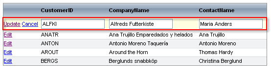

# In Place


To display the grid column editors inline when the grid switches into edit mode, change the table view's **EditMode** property to "InPlace".

````ASPNET
	<telerik:RadGrid
	   ID="RadGrid1" runat="server"
	   DataSourceID="SqlDataSource1"
	   GridLines="None">
	   <MasterTableView
	      EditMode="InPlace"
	      DataSourceID="SqlDataSource1">
	      <Columns>
	         <telerik:GridEditCommandColumn />
	      </Columns>
	   </MasterTableView>
	</telerik:RadGrid>
````




>note To limit the number of characters the user can enter in the text box editor of the inline editor, set the **MaxLength** property of the column.
>


## Relations between the edited item and the item in regular mode

When **InPlace** editing is applied, the grid row is of type **GridDataItem** in regular mode and**GridEditableItem** in edit regime. Hence you can cast the item in the **ItemCreated** event (for example) to those types according to its current mode:


````C#
	    private void RadGrid1_ItemCreated(object sender, Telerik.Web.UI.GridItemEventArgs e)
	    {
	        if (e.Item is GridEditableItem && e.Item.IsInEditMode)
	        {
	            //the item is in edit mode    
	            GridEditableItem editedItem = e.Item as GridEditableItem;
	            //do something here 
	        }
	        else if (e.Item is GridDataItem)
	        {
	            //the item is in regular mode
	            GridDataItem dataItem = e.Item as GridDataItem;
	            //do something here 
	        }
	    }
````
````VB.NET
	    Private Sub RadGrid1_ItemCreated(ByVal sender As Object, ByVal e As Telerik.Web.UI.GridItemEventArgs) Handles RadGrid1.ItemCreated
	        If (TypeOf e.Item Is GridEditableItem AndAlso e.Item.IsInEditMode) Then
	            'the item is in edit mode   
	            Dim editedItem As GridEditableItem = CType(e.Item, GridEditableItem)
	            'do something here
	        ElseIf (TypeOf e.Item Is GridDataItem) Then
	            'the item is in regular mode   
	            Dim dataItem As GridDataItem = CType(e.Item, GridDataItem)
	            'do something here         
	        End If
	    End Sub
````


For information about how to reference controls inside grid rows and edit forms, see [Referencing controls in grid row/edit form]().

## Detecting edit/insert mode with in-place editing

To determine whether edit or insert operation is in progress inside the ItemCreated/ItemDataBound handler of the grid (when having inplace editing), check whether the e.Item instance inside the handler is of type **GridEditableItem**or **GridDataInsertItem**respectively. Here are some code snippets which illustrate the approach in question:


````C#
	    protected void RadGrid1_ItemCreated(object sender, Telerik.Web.UI.GridItemEventArgs e)
	    {
	        if ((e.Item is GridDataInsertItem) && e.Item.IsInEditMode)
	        {
	            //init insert operation triggered   
	        }
	        else if ((e.Item is GridEditableItem) && e.Item.IsInEditMode)
	        {
	            //edit operation triggered   
	        }
	    }
````
````VB.NET
	
	
	    Private Sub RadGrid1_ItemCreated(ByVal sender As Object, ByVal e As Telerik.Web.UI.GridItemEventArgs) Handles RadGrid1.ItemCreated
	        If (TypeOf e.Item Is GridDataInsertItem AndAlso e.Item.IsInEditMode) Then
	            'init insert operation triggered
	        ElseIf (TypeOf e.Item Is GridEditableItem AndAlso e.Item.IsInEditMode) Then
	            'edit operation triggered
	        End If
	    End Sub
````

