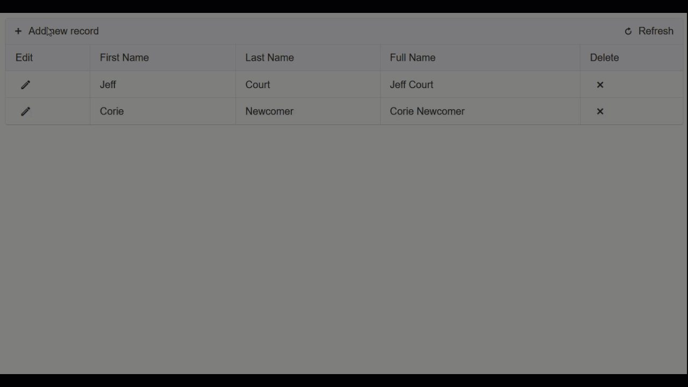

# In Place

>important In-Place Editing replaces the Grid Item as a Form and includes buttons for Save and Cancel. Essentially, it is an in-place form of the Grid Item. See the below walkthrough for a visual reference.



## Getting Started

To display the grid column editors inline when the grid switches into edit mode, change the table view's **EditMode** property to "InPlace" as shown in the below RadGrid sample.

````ASP.NET
<telerik:RadGrid
   ID="RadGrid1" runat="server"
   DataSourceID="SqlDataSource1"
   GridLines="None">
   <MasterTableView
      EditMode="InPlace"
      DataSourceID="SqlDataSource1">
      <Columns>
         <telerik:GridEditCommandColumn />
      </Columns>
   </MasterTableView>
</telerik:RadGrid>
````


>note To limit the number of characters the user can enter in the text box editor of the inline editor, set the **MaxLength** property of the column.
>


## Relations between the edited item and the item in regular mode

When **InPlace** editing is applied, the grid row is of type **GridDataItem** in regular mode and **GridEditableItem** in edit regime. Hence you can cast the item in the **ItemCreated** event (for example) to those types according to its current mode:


````C#
private void RadGrid1_ItemCreated(object sender, Telerik.Web.UI.GridItemEventArgs e)
{
    if (e.Item is GridEditableItem && e.Item.IsInEditMode)
    {
        //the item is in edit mode    
        GridEditableItem editedItem = e.Item as GridEditableItem;
        //do something here 
    }
    else if (e.Item is GridDataItem)
    {
        //the item is in regular mode
        GridDataItem dataItem = e.Item as GridDataItem;
        //do something here 
    }
}
````
````VB
Private Sub RadGrid1_ItemCreated(ByVal sender As Object, ByVal e As Telerik.Web.UI.GridItemEventArgs) Handles RadGrid1.ItemCreated
    If (TypeOf e.Item Is GridEditableItem AndAlso e.Item.IsInEditMode) Then
        'the item is in edit mode   
        Dim editedItem As GridEditableItem = CType(e.Item, GridEditableItem)
        'do something here
    ElseIf (TypeOf e.Item Is GridDataItem) Then
        'the item is in regular mode   
        Dim dataItem As GridDataItem = CType(e.Item, GridDataItem)
        'do something here         
    End If
End Sub
````


For information about how to reference controls inside grid rows and edit forms, see [Referencing controls in grid row/edit form]().

## Detecting edit/insert mode with in-place editing

To determine whether edit or insert operation is in progress inside the ItemCreated/ItemDataBound handler of the grid (when having inplace editing), check whether the e.Item instance inside the handler is of type **GridEditableItem** or **GridDataInsertItem** respectively. Here are some code snippets which illustrate the approach in question:


````C#
protected void RadGrid1_ItemCreated(object sender, Telerik.Web.UI.GridItemEventArgs e)
{
    if ((e.Item is GridDataInsertItem) && e.Item.IsInEditMode)
    {
        //init insert operation triggered   
    }
    else if ((e.Item is GridEditableItem) && e.Item.IsInEditMode)
    {
        //edit operation triggered   
    }
}
````
````VB
Private Sub RadGrid1_ItemCreated(ByVal sender As Object, ByVal e As Telerik.Web.UI.GridItemEventArgs) Handles RadGrid1.ItemCreated
    If (TypeOf e.Item Is GridDataInsertItem AndAlso e.Item.IsInEditMode) Then
        'init insert operation triggered
    ElseIf (TypeOf e.Item Is GridEditableItem AndAlso e.Item.IsInEditMode) Then
        'edit operation triggered
    End If
End Sub
````


## Example
The following exmple recreates the walk through which was shown at the top of the page. 

### Database scripts

SQL scripts to create and drop a sample database

#### Create Script

```sql
-- Create a new database called 'RgInPlaceEditing'
-- Connect to the 'master' database to run this snippet
USE master
GO
-- Create the new database if it does not exist already
IF NOT EXISTS (
    SELECT name
        FROM sys.databases
        WHERE name = N'RgInPlaceEditing'
)
CREATE DATABASE RgInPlaceEditing
GO

USE [RgInPlaceEditing]
GO

-- Create a new table called 'Person' in schema 'dbo'
-- Drop the table if it already exists
IF OBJECT_ID('dbo.Person', 'U') IS NOT NULL
DROP TABLE dbo.Person
GO
-- Create the table in the specified schema
CREATE TABLE dbo.Person
(
    PersonId INT IDENTITY(1,1) NOT NULL PRIMARY KEY,
    FirstName [NVARCHAR](50) NOT NULL,
    LastName [NVARCHAR](50) NOT NULL,
    FullName AS (CONCAT(FirstName,' ', LastName))
);
GO

-- Insert rows into table 'Person'
INSERT INTO Person
( -- columns to insert data into
 [FirstName], [LastName]
)
VALUES
( 
 'Firs1', 'Last1'
),
( 
 'First2', 'Last2'
),
( 
 'First3', 'Last3'
),
( 
 'First4', 'Last4'
),
( 
 'First5', 'Last5'
)
GO
```

#### Delete Script

```SQL
-- Drop the database 'RgInPlaceEditing'
-- Connect to the 'master' database to run this snippet
USE master
GO
-- Uncomment the ALTER DATABASE statement below to set the database to SINGLE_USER mode if the drop database command fails because the database is in use.
-- ALTER DATABASE RgInPlaceEditing SET SINGLE_USER WITH ROLLBACK IMMEDIATE;
-- Drop the database if it exists
IF EXISTS (
  SELECT name
   FROM sys.databases
   WHERE name = N'RgInPlaceEditing'
)
DROP DATABASE RgInPlaceEditing
GO
```

### Connection String

Connection string in from the web.config in a Telerik ASP.NET WebForms Application Template which pionts to Visual Studio's localdb instance.

```XML
<connectionStrings>
  <add name="DefaultConnection" connectionString="Data Source=(localdb)\MSSQLLocalDB;Initial Catalog=RgInPlaceEditing;Integrated Security=True;" providerName="System.Data.SqlClient" />
</connectionStrings>
```

### RadGrid Markup

RadGrid markup for using in-place editing with double click event.

````ASP.NET
<telerik:RadCodeBlock ID="RadCodeBlock1" runat="server">
    <script type="text/javascript">
        function rowDblClick(sender, eventArgs) {
            sender.get_masterTableView().editItem(eventArgs.get_itemIndexHierarchical());
        }
    </script>
</telerik:RadCodeBlock>
<telerik:RadGrid runat="server" ID="RadGrid1" 
    AutoGenerateColumns="false" 
    AllowPaging="true"
    OnItemCreated="RadGrid1_ItemCreated"
    OnInsertCommand="RadGrid1_InsertCommand"
    OnNeedDataSource="RadGrid1_NeedDataSource"
    OnUpdateCommand="RadGrid1_UpdateCommand"
    OnDeleteCommand="RadGrid1_DeleteCommand">
    <MasterTableView DataKeyNames="PersonId" 
        CommandItemDisplay="Top" 
        InsertItemPageIndexAction="ShowItemOnCurrentPage" 
        EditMode="InPlace">
        <Columns>
            <telerik:GridEditCommandColumn HeaderText="Edit" />
            <telerik:GridBoundColumn DataField="PersonId" HeaderText="Person ID" ReadOnly="true"
                ForceExtractValue="Always" Display="false" />
            <telerik:GridBoundColumn DataField="FirstName" HeaderText="First Name" />
            <telerik:GridBoundColumn DataField="LastName" HeaderText="Last Name" />
            <telerik:GridBoundColumn DataField="FullName" HeaderText="Full Name" ReadOnly="true" />
            <telerik:GridButtonColumn HeaderText="Delete" ConfirmText="Delete this Person?" ConfirmDialogType="Classic"
                ConfirmTitle="Delete" ButtonType="FontIconButton" CommandName="Delete" />
        </Columns>
    </MasterTableView>
    <PagerStyle Mode="NextPrevAndNumeric" />
    <ClientSettings>
        <ClientEvents OnRowDblClick="rowDblClick" />
    </ClientSettings>
</telerik:RadGrid>
````

### Code-Behind

Data access and RadGrid CRUD oepration code snippets.

````C#
using System.Data;
using System.Configuration;
using Telerik.Web.UI;
using System.Data.SqlClient;
using System.Collections;
using System.Diagnostics;

public partial class Default : System.Web.UI.Page 
{
    public SqlConnection connection = new SqlConnection(ConfigurationManager.ConnectionStrings["DefaultConnection"].ConnectionString);

    #region Data Access Logic
    protected DataTable DataAccess(string Command = "", string Query = "SELECT * FROM Person", string PersonId = "", string FirstName = "", string LastName = "")
    {
        DataTable dt = new DataTable();

        switch (Command)
        {
            case RadGrid.PerformInsertCommandName:
                using (SqlCommand command = new SqlCommand(Query, connection))
                {
                    command.Parameters.Add(new SqlParameter("@FirstName", FirstName));
                    command.Parameters.Add(new SqlParameter("@LastName", LastName));
                    command.Connection.Open();
                    command.ExecuteNonQuery();
                }
                return dt;
            case RadGrid.UpdateCommandName:
                using (SqlCommand command = new SqlCommand(Query, connection))
                {
                    command.Parameters.Add(new SqlParameter("@PersonId", PersonId));
                    command.Parameters.Add(new SqlParameter("@FirstName", FirstName));
                    command.Parameters.Add(new SqlParameter("@LastName", LastName));
                    command.Connection.Open();
                    command.ExecuteNonQuery();
                }
                return dt;
            case RadGrid.DeleteCommandName:
                using (SqlCommand command = new SqlCommand(Query, connection))
                {
                    command.Parameters.Add(new SqlParameter("@PersonId", PersonId));
                    command.Connection.Open();
                    command.ExecuteNonQuery();
                }
                return dt;
            default:
                using (SqlDataAdapter data = new SqlDataAdapter(Query, connection))
                {
                    data.Fill(dt);
                    connection.Close();
                }
                return dt;
        }
    }
    #endregion

    protected void RadGrid1_InsertCommand(object sender, GridCommandEventArgs e)
    {
        GridEditableItem editableItem = ((GridEditableItem)e.Item);
        Hashtable values = new Hashtable();
        editableItem.ExtractValues(values);
        string query = "INSERT INTO Person (FirstName, LastName) VALUES (@FirstName, @LastName)";
        DataAccess(Command: RadGrid.PerformInsertCommandName, Query: query, FirstName:values["FirstName"].ToString(), LastName:values["LastName"].ToString());
    }

    protected void RadGrid1_NeedDataSource(object sender, GridNeedDataSourceEventArgs e)
    {
        RadGrid1.DataSource = DataAccess();
    }

    protected void RadGrid1_UpdateCommand(object sender, GridCommandEventArgs e)
    {
        GridEditableItem editableItem = ((GridEditableItem)e.Item);
        Hashtable values = new Hashtable();
        editableItem.ExtractValues(values);
        string query = "UPDATE Person SET FirstName=@FirstName, LastName=@LastName WHERE PersonId=@PersonId";
        DataAccess(Command: RadGrid.UpdateCommandName, Query: query, PersonId: values["PersonId"].ToString(), FirstName: values["FirstName"].ToString(), LastName: values["LastName"].ToString());

    }

    protected void RadGrid1_DeleteCommand(object sender, GridCommandEventArgs e)
    {
        GridEditableItem editableItem = ((GridEditableItem)e.Item);
        Hashtable values = new Hashtable();
        editableItem.ExtractValues(values);
        string query = "DELETE FROM Person WHERE PersonId=@PersonId";
        DataAccess(Command: RadGrid.DeleteCommandName, Query: query, PersonId: values["PersonId"].ToString());
    }

    protected void RadGrid1_ItemCreated(object sender, GridItemEventArgs e)
    {
        if (e.Item is GridEditableItem && e.Item.IsInEditMode)
        {
            if ((e.Item is GridDataInsertItem) && e.Item.IsInEditMode)
            {
                Debug.WriteLine("Init Insert Operation Triggered");
            }
            else if ((e.Item is GridEditableItem) && e.Item.IsInEditMode)
            {
                Debug.WriteLine("Edit Operation Triggered");
            }
        }
        else if (e.Item is GridDataItem)
        {
            GridDataItem dataItem = e.Item as GridDataItem;
            Debug.WriteLine($"The {dataItem} Item Is In Regular Mode");
        }
    }
}
````
````VB
Imports System.Data.SqlClient
Imports Telerik.Web.UI

Partial Class [Default]
    Inherits System.Web.UI.Page

    Public connection As SqlConnection = New SqlConnection(ConfigurationManager.ConnectionStrings("DefaultConnection").ConnectionString)

    Protected Function DataAccess(ByVal Optional Command As String = "", ByVal Optional Query As String = "SELECT * FROM Person", ByVal Optional PersonId As String = "", ByVal Optional FirstName As String = "", ByVal Optional LastName As String = "") As DataTable
        Dim dt As DataTable = New DataTable()
        Select Case Command
            Case RadGrid.PerformInsertCommandName
                Using cmd As SqlCommand = New SqlCommand(Query, connection)
                    cmd.Parameters.Add(New SqlParameter("@FirstName", FirstName))
                    cmd.Parameters.Add(New SqlParameter("@LastName", LastName))
                    cmd.Connection.Open()
                    cmd.ExecuteNonQuery()
                End Using
                Return dt
            Case RadGrid.UpdateCommandName
                Using cmd As SqlCommand = New SqlCommand(Query, connection)
                    cmd.Parameters.Add(New SqlParameter("@PersonId", PersonId))
                    cmd.Parameters.Add(New SqlParameter("@FirstName", FirstName))
                    cmd.Parameters.Add(New SqlParameter("@LastName", LastName))
                    cmd.Connection.Open()
                    cmd.ExecuteNonQuery()
                End Using
                Return dt
            Case RadGrid.DeleteCommandName
                Using cmd As SqlCommand = New SqlCommand(Query, connection)
                    cmd.Parameters.Add(New SqlParameter("@PersonId", PersonId))
                    cmd.Connection.Open()
                    cmd.ExecuteNonQuery()
                End Using
                Return dt
            Case Else
                Using data As SqlDataAdapter = New SqlDataAdapter(Query, connection)
                    data.Fill(dt)
                    connection.Close()
                End Using
                Return dt
        End Select
    End Function

    Protected Sub RadGrid1_ItemCreated(sender As Object, e As GridItemEventArgs)
        If TypeOf e.Item Is GridEditableItem AndAlso e.Item.IsInEditMode Then
            If (TypeOf e.Item Is GridDataInsertItem) AndAlso e.Item.IsInEditMode Then
                Debug.WriteLine("Init Insert Operation Triggered")
            ElseIf (TypeOf e.Item Is GridEditableItem) AndAlso e.Item.IsInEditMode Then
                Debug.WriteLine("Edit Operation Triggered")
            End If
        ElseIf TypeOf e.Item Is GridDataItem Then
            Dim dataItem As GridDataItem = TryCast(e.Item, GridDataItem)
            Debug.WriteLine($"The {dataItem} Item Is In Regular Mode")
        End If
    End Sub

    Protected Sub RadGrid1_InsertCommand(sender As Object, e As GridCommandEventArgs)
        Dim editableItem As GridEditableItem = (CType(e.Item, GridEditableItem))
        Dim values As Hashtable = New Hashtable()
        editableItem.ExtractValues(values)
        Dim query As String = "INSERT INTO Person (FirstName, LastName) VALUES (@FirstName, @LastName)"
        DataAccess(Command:=RadGrid.PerformInsertCommandName, Query:=query, FirstName:=values("FirstName").ToString(), LastName:=values("LastName").ToString())
    End Sub

    Protected Sub RadGrid1_NeedDataSource(sender As Object, e As GridNeedDataSourceEventArgs)
        RadGrid1.DataSource = DataAccess()
    End Sub

    Protected Sub RadGrid1_UpdateCommand(sender As Object, e As GridCommandEventArgs)
        Dim editableItem As GridEditableItem = (CType(e.Item, GridEditableItem))
        Dim values As Hashtable = New Hashtable()
        editableItem.ExtractValues(values)
        Dim query As String = "UPDATE Person SET FirstName=@FirstName, LastName=@LastName WHERE PersonId=@PersonId"
        DataAccess(Command:=RadGrid.UpdateCommandName, Query:=query, PersonId:=values("PersonId").ToString(), FirstName:=values("FirstName").ToString(), LastName:=values("LastName").ToString())
    End Sub

    Protected Sub RadGrid1_DeleteCommand(sender As Object, e As GridCommandEventArgs)
        Dim editableItem As GridEditableItem = (CType(e.Item, GridEditableItem))
        Dim values As Hashtable = New Hashtable()
        editableItem.ExtractValues(values)
        Dim query As String = "DELETE FROM Person WHERE PersonId=@PersonId"
        DataAccess(Command:=RadGrid.DeleteCommandName, Query:=query, PersonId:=values("PersonId").ToString())
    End Sub
End Class
````


