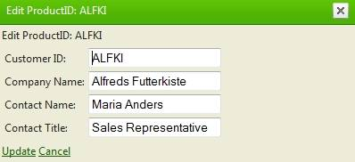

# Popup Edit Form


**RadGrid** supports Popup edit forms. The only prerequisite required is setting the **EditMode** property to **Popup**. Then, on switching an item in edit mode, RadGrid will display the edit form in a popup as shown in the following image:

Below is the markup, used in the example:

````ASPNET
	        <telerik:RadGrid ID="RadGrid1" AutoGenerateEditColumn="True" runat="server" AllowAutomaticDeletes="True"
	            Skin="Silk" DataSourceID="SqlDataSource1" AllowPaging="True" CellSpacing="0" GridLines="None"
	            OnItemDataBound="RadGrid1_ItemDataBound">
	            <PagerStyle Mode="NextPrevAndNumeric" />
	            <MasterTableView EditMode="PopUp" CommandItemDisplay="Top" DataKeyNames="CustomerID"
	                AutoGenerateColumns="True">
	                <CommandItemSettings ExportToPdfText="Export to PDF"></CommandItemSettings>
	                <RowIndicatorColumn Visible="True" FilterControlAltText="Filter RowIndicator column">
	                </RowIndicatorColumn>
	                <ExpandCollapseColumn Visible="True" FilterControlAltText="Filter ExpandColumn column">
	                </ExpandCollapseColumn>
	                <EditFormSettings InsertCaption="Add new item" CaptionFormatString="Edit CustomerID: {0}"
	                    CaptionDataField="CustomerID">
	                    <EditColumn FilterControlAltText="Filter EditCommandColumn column">
	                    </EditColumn>
	                </EditFormSettings>
	            </MasterTableView>
	            <FilterMenu EnableImageSprites="False">
	                <WebServiceSettings>
	                    <ODataSettings InitialContainerName="">
	                    </ODataSettings>
	                </WebServiceSettings>
	            </FilterMenu>
	            <HeaderContextMenu CssClass="GridContextMenu GridContextMenu_Hay">
	                <WebServiceSettings>
	                    <ODataSettings InitialContainerName="">
	                    </ODataSettings>
	                </WebServiceSettings>
	            </HeaderContextMenu>
	        </telerik:RadGrid>
````


All types of edit forms can be displayed in Popup Edit Form: **AutoGenerated**, **Template** and **WebUserControl.**

The Popup EditForm settings are controlled through the **PopUpSettings** property of the **GridEditFormSettings**object. It exposes 3 properties:

* **Height** - defines the height of the popup in pixels or percentage.

* **Width** defines the width of the popup in pixels or percentage.

* **ScrollBars** defines whether and which scrollbars should appear in the edit form. This setting is with higher priority, so if **Height** is set but the vertical scrollbar is not shown and the content requires more room, the popup will be resized to accommodate the entire content. The default value is **None**.

## Customizing the Popup Edit Form titlebar's appearance

In order to change the titlebar text appearance, please use the following CSS selector ("SkinName" should be replaced with the actual skin name):

````ASPNET
	    <style type="text/css">
	        div.RadGrid_[SkinName] .rgEditForm .rgHeader
	        {
	            /*your custom styles here*/
	        }
	    </style>
````


>caution Currently using Popup Edit Form when both grouping and scrolling are enabled is not supported in RadGrid due to browser limitation.
>


You can find this Popup Edit Forms in the following online examples:

[Popup edit for live demo (C#)](http://demos.telerik.com/aspnet-ajax/Grid/Examples/DataEditing/PopUpEditForm/DefaultCS.aspx)

[Popup edit for live demo (VB)]( http://demos.telerik.com/aspnet-ajax/grid/examples/dataediting/popupeditform/defaultvb.aspx )

## Setting focus to an input control in the Popup edit form

Any input control could be focused with a call to its server-side Focus() method. However, when the input control is located in RadGrid PopUp edit form, the container of the form is added after focus has been set and the focus of the input control is lost. In this case to focus the input control you can define an extension method which will execute the code for focusing the control after certain delay.

This method is used the same way as the regular Focus method with the only difference that you need to pass as a parameter an int number that shows how many miliseconds to wait before setting the focus:


````C#
	    protected void RadGrid1_ItemDataBound(object sender, GridItemEventArgs e)
	    {
	        if (e.Item is GridEditableItem && e.Item.IsInEditMode)
	        {
	            GridEditableItem editItem = (GridEditableItem)e.Item;
	            TextBox nameBox = (TextBox)editItem["CustomerID"].Controls[0];
	            //nameBox.Focus();
	            nameBox.Focus(100);
	        }
	    }
````
````VB.NET
	    Protected Sub RadGrid1_ItemDataBound(sender As Object, e As Telerik.Web.UI.GridItemEventArgs) Handles RadGrid1.ItemDataBound
	        If TypeOf e.Item Is GridEditableItem AndAlso e.Item.IsInEditMode Then
	            Dim editItem As GridEditableItem = DirectCast(e.Item, GridEditableItem)
	            Dim nameBox As TextBox = DirectCast(editItem("CustomerID").Controls(0), TextBox)
	            'nameBox.Focus()
	            nameBox.Focus(100)
	        End If
	    End Sub
	#End Region
	End Class
	
	#Region "pop-up-edit-form_1"
	Module ControlExtensions
	    <Extension()>
	    Public Sub Focus(control As Control, delay As Integer)
	        If control Is Nothing Then
	            Throw New ArgumentNullException("control")
	        End If
	        If delay < 0 Then
	            Throw New ArgumentOutOfRangeException("delay")
	        End If
	
	        control.Focus()
	
	        ScriptManager.RegisterStartupScript(control, control.[GetType](), "focus", [String].Format("setTimeout(""WebForm_AutoFocus('{0}')"", {1});", control.ClientID, delay), True)
	    End Sub
	End Module
	#End Region
````


And the respective extension method:


````C#
	public static class ControlExtensions
	{
	    /// <summary>
	    /// Set input focus to a control after the specified number of milliseconds.
	    /// </summary>
	    public static void Focus(this Control control, int delay)
	    {
	        if (control == null)
	        {
	            throw new ArgumentNullException("control");
	        }
	        if (delay < 0)
	        {
	            throw new ArgumentOutOfRangeException("delay");
	        }
	
	        control.Focus();
	
	        ScriptManager.RegisterStartupScript(control, control.GetType(), "focus",
	            String.Format("setTimeout(\"WebForm_AutoFocus('{0}')\", {1});", control.ClientID, delay), true);
	    }
	}
````
````VB.NET
	Module ControlExtensions
	    <Extension()>
	    Public Sub Focus(control As Control, delay As Integer)
	        If control Is Nothing Then
	            Throw New ArgumentNullException("control")
	        End If
	        If delay < 0 Then
	            Throw New ArgumentOutOfRangeException("delay")
	        End If
	
	        control.Focus()
	
	        ScriptManager.RegisterStartupScript(control, control.[GetType](), "focus", [String].Format("setTimeout(""WebForm_AutoFocus('{0}')"", {1});", control.ClientID, delay), True)
	    End Sub
	End Module
	#End Region
````


