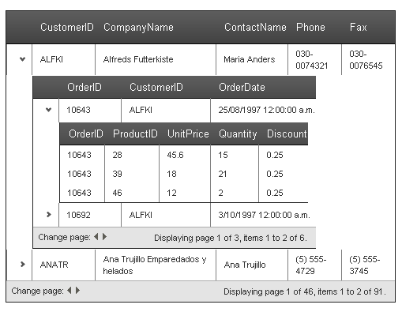

# RadGrid and MasterTableView Difference


The **RadGrid** control has a **MasterTableView** property that represents the top table in the grid. The instances of **RadGrid** and **MasterTableView** are almost identical, although they are of different types (**RadGrid** and **GridTableView**, respectively).

The main difference between **RadGrid** and **MasterTableView** is that the properties of **RadGrid** specify the defaults for every **GridTableView** in the grid (the **MasterTableView** and any **DetailTables**). The properties of **MasterTableView** apply only to the top-level table in the grid. In other words, property settings on **MasterTableView** are not inherited by any **DetailTables** nested inside it. The properties of **MasterTableView**, as with the properties of any **DetailTable** in the grid, act as overrides to the defaults set on the **RadGrid** object.

For example, if you set blue border for the **RadGrid** object, the **MasterTableView** and any **DetailTables** will also have blue border (assuming they do not override the property setting), while if you set blue border for the **MasterTableView**, this border will appear *only* on the top-level table, and not on any detail tables.

## Example

The following examples illustrate this difference.

* The first example shows a **RadGrid** control that enables paging with **PageSize** set to 2. All tables in the grid use paging and a pagesize of 2.

* The second example shows the same declaration, except that the **AllowPaging** and **PageSize** properties are set on the **MasterTableView** instead of on the **RadGrid** control. Only the master table view uses paging.

* The third example shows a **RadGrid** control that enables paging with a **PageSize** set to 2, but with a detail table that overrides this setting.

## Defaults set in RadGrid

````ASP.NET
<telerik:RadGrid ID="RadGrid1" runat="server" DataSourceID="AccessDataSource1" AllowPaging="True"
  PageSize="2">
  <MasterTableView DataKeyNames="CustomerID" DataSourceID="AccessDataSource1" TableLayout="Auto">
    <DetailTables>
      <telerik:GridTableView runat="server" DataKeyNames="OrderID" DataSourceID="AccessDataSource2"
        TableLayout="Auto">
        <ParentTableRelation>
          <telerik:GridRelationFields DetailKeyField="CustomerID" MasterKeyField="CustomerID" />
        </ParentTableRelation>
        <DetailTables>
          <telerik:GridTableView runat="server" TableLayout="Auto" DataSourceID="AccessDataSource3">
            <ParentTableRelation>
              <telerik:GridRelationFields DetailKeyField="OrderID" MasterKeyField="OrderID" />
            </ParentTableRelation>
          </telerik:GridTableView>
        </DetailTables>
      </telerik:GridTableView>
    </DetailTables>
  </MasterTableView>
</telerik:RadGrid>
````


## Properties set in MasterTableView

````ASP.NET
<telerik:RadGrid ID="RadGrid1" runat="server" DataSourceID="AccessDataSource1">
  <MasterTableView DataKeyNames="CustomerID" DataSourceID="AccessDataSource1" TableLayout="Auto"
    AllowPaging="True" PageSize="2">
    <DetailTables>
      <telerik:GridTableView runat="server" DataKeyNames="OrderID" DataSourceID="AccessDataSource2"
        TableLayout="Auto">
        <ParentTableRelation>
          <telerik:GridRelationFields DetailKeyField="CustomerID" MasterKeyField="CustomerID" />
        </ParentTableRelation>
        <DetailTables>
          <telerik:GridTableView runat="server" TableLayout="Auto" DataSourceID="AccessDataSource3">
            <ParentTableRelation>
              <telerik:GridRelationFields DetailKeyField="OrderID" MasterKeyField="OrderID" />
            </ParentTableRelation>
          </telerik:GridTableView>
        </DetailTables>
      </telerik:GridTableView>
    </DetailTables>
  </MasterTableView>
</telerik:RadGrid>
````


## Defaults set in RadGrid with overrides by detail table

````ASP.NET
<telerik:RadGrid ID="RadGrid1" runat="server" DataSourceID="AccessDataSource1" AllowPaging="True"
  PageSize="2">
  <MasterTableView DataKeyNames="CustomerID" DataSourceID="AccessDataSource1" TableLayout="Auto">
    <DetailTables>
      <telerik:GridTableView runat="server" DataKeyNames="OrderID" DataSourceID="AccessDataSource2"
        TableLayout="Auto">
        <ParentTableRelation>
          <telerik:GridRelationFields DetailKeyField="CustomerID" MasterKeyField="CustomerID" />
        </ParentTableRelation>
        <DetailTables>
          <telerik:GridTableView runat="server" TableLayout="Auto" DataSourceID="AccessDataSource3"
            AllowPaging="False">
            <ParentTableRelation>
              <telerik:GridRelationFields DetailKeyField="OrderID" MasterKeyField="OrderID" />
            </ParentTableRelation>
          </telerik:GridTableView>
        </DetailTables>
      </telerik:GridTableView>
    </DetailTables>
  </MasterTableView>
</telerik:RadGrid>
````


