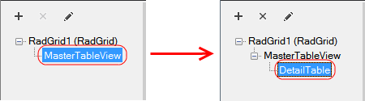
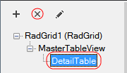

# Creating Hierarchical Grids from Design-Time

## Creating Detail Tables

Using the Telerik RadGrid property builder, the creation of the Detail tables is an easy task. Just point the table, for which you need to add a Detail table and click the [+] button on the right panel.

Then you will need to set the DataSource for the newly created detail table and set the relation to the master table.

## Data binding DetailTable

In order to data bind a detail table, you need to go to the TableView setting property page and there set the **DataMember** and **DataKeyNames** properties. These are drop-down lists and depend on how you have set your data source. The DataKeyNames property will be used for setting the proper relation to the child table of the current table.

## Setting Table Relations

In order to set the relation to the parent table, you need to display the property grid for the selected detail table. Use the [Toggle property grid] link in the properties pane.

Consider the image below:

1. Open the ParentTableRelation Collection

1. Add new relation

1. Go to the relation

1. Set DataKeyField and MasterKeyField. DataKeyField should match a field in the current data source for this detail table. MasterKeyField should match the DataKeyNames field as set in the parent (master) table.

## Setting Detail Table Properties

The properties of the detail tables are set in the same way as for the master table.

## Deleting Detail Tables

In order to delete a detail table, point it in the Grid hierarchy objects tree and click the [X] button. Note that if this detail table has children tables, they will also be deleted.

>caution The master table cannot be deleted.
>

