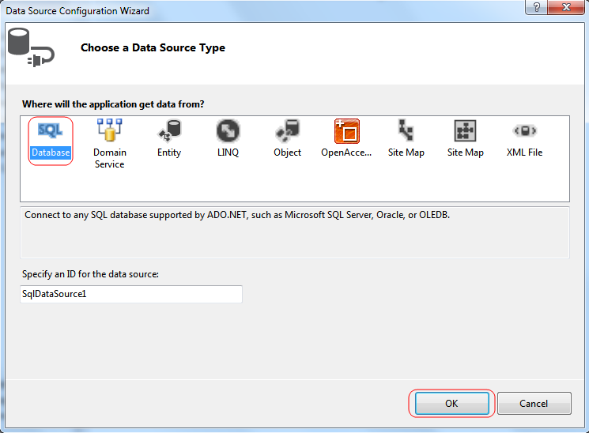
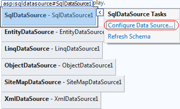

# Declarative Data Source

The ASP.NET 2.x/3.x allows declarative data binding, which eliminates the coding necessary for connecting a control to its underlying data source. __RadGrid__ employs this new way of accessing data, so that its data binding can be accomplished in a completely declarative manner using data source controls.

Declarative data source controls expose data from a back-end store (SQL database, middle-tier business object, XML file, XML Web Service) to data-bound UI control on a page. Data Source controls also provide new capabilities such as sorting, paging, caching, updating, inserting, and deleting data, which UI controls can automatically use of without any additional code.

## Data Source Controls

Data source controls have no rendering, but instead represent a particular backend data store, for example a database, business object, XML file, or XML Web Service. ASP.NET includes the following server controls out-of-the-box, which are all supported by __RadGrid__:

* __SqlDataSource__ - Enables binding to a SQL database represented by an ADO.NET provider, such as Microsoft™ SQL Server, OLEDB, ODBC, or Oracle.

__SqlDataSource__ is intended to replace the ADO.NET code you would normally write in a page to create a connection and command to query a database. Because the data queries are specified directly as properties of the data source control, this is sometimes called a two-tier model. The data queries are still maintained in page code.

* __ObjectDataSource__ - Enables binding to a middle-tier object such as a data access layer or business component.

The __ObjectDataSource__ control object model is similar to the __SqlDataSource__ control. Instead of a __ConnectionString__ property, __ObjectDataSource__ exposes a __TypeName__ property that specifies an object type (class name) to instantiate for performing data operations. Similar to the command properties of __SqlDataSource__, the __ObjectDataSource__ control supports properties such as __SelectMethod__, __UpdateMethod__, __InsertMethod__, and __DeleteMethod__ for specifying methods of the associated type to call to perform these data operations.

* __AccessDataSource__ - Enables binding to a Microsoft™ Access (Jet) database.

* __SiteMapSource__ - Enables binding to the hierarchy exposed by an ASP.NET 2.0 site navigation provider.

The __SiteMapDataSource__ control is associated to a data-bound control through the control's __DataSourceID__ property. For general information on site navigation in ASP.NET, refer to the SiteMap topic of this manual.

* __XmlDataSource__ - Enables binding to an XML file or document.

__XmlDataSource__ supports a __DataFile__ property for specifying the path to an XML data file to be used as input. You may also specify a __TranformFile__ property to apply an XSLT transformation to the data and an __XPath__ property for specifying a subset of nodes to expose from the data source.

* __LinqDataSource__- Enables binding to an object or database using LINQ (Language Integrated Query).

__LinqDataSource__supports a __ContextTypeName__property for specifying the object that encapsulates the data, with the __TableName__ property to specify the field that returns the data collection.

* __ObjectContainerDataSource__- Enables binding to an object with event-driven support for edits.

__ObjectContainerDataSource__supports an __Instance__property for specifying the object that supplies the data. Events are raised for the SELECT, INSERT, DELETE, and UPDATE actions.

## Choosing the DataSource control

The easiest way to set the __DataSource__ control in VS.NET 2005 is to use the grid's Smart Tag. Click to expand the "Choose Data Source" drop-down and select the Data Source control.

If there is no Data Source control, you need to create a new one. Choose the <New data source...> option. This will start the Data Source Wizard where you can easily create the needed Data Source control.

After you choose the Data Source control, your control is automatically bound to the data source.

The Smart Tags for each Data Source control let you easily configure the Data Source (e.g. SQL connection, query string, etc).

