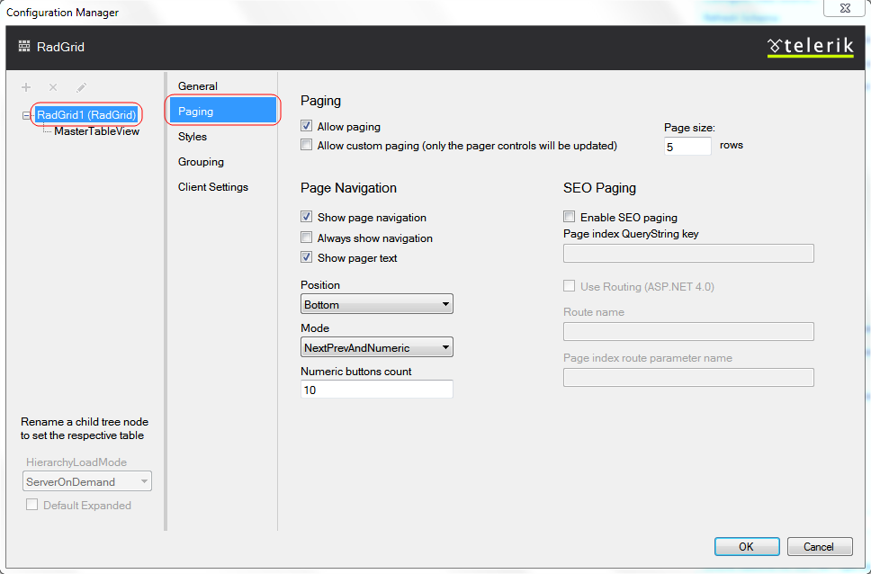

# Setting Paging from Design Time

The Paging section of the Telerik RadGrid Properties lets you specify whether your grid will use pages and the specific paging options.

## Paging

In order to turn the paging on (enable dividing data into portions called pages) you must check the [__Allow Paging__] box [sets the __AllowPaging Property__] on the top of the Editor. This will enable the default paging mechanism of Telerik RadGrid. However you are free to use your __own paging__ system. All you need to do is to check the [__Allow Custom Paging__] box [sets the __AllowCustomPaging Property__] .

The size of a given Page in Telerik RadGrid is defined by the number of rows, this page will hold. You can define the page size using the [__Page size__] [sets the __PageSize Property__] field.

## Page Navigation

This dialog allows you to customize the way navigation is performed. You can show the navigation buttons, which will help the site-visitor to navigate through the data visualized by Telerik RadGrid. In order to enable the buttons, check the [__Show page navigation__] check box.

Now you can customize the navigation button properties:

* __Position__ - use the drop-down list to specify the position of the navigation buttons relative to the grid.

* __Mode__ - Specify the way navigation buttons are displayed. You can have navigation buttons appear as page numbers or as previous/next buttons with text. The custom text can be set in the fields below. Note, that you can even enter HTML tags for formatting the custom text.

* __Numeric buttons__: specifies the maximum number of page numbers, that will be shown. If you set this to "5" and your grid has 10 pages, you will see them in series of five numbers ("* ... ,2, 3, 4, 5, 6, ... *" for example).
