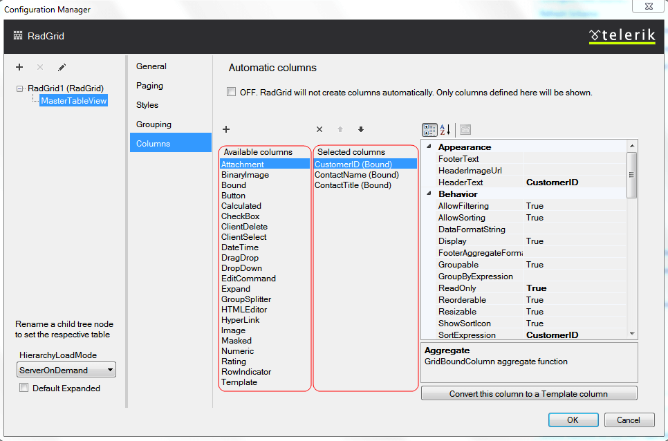
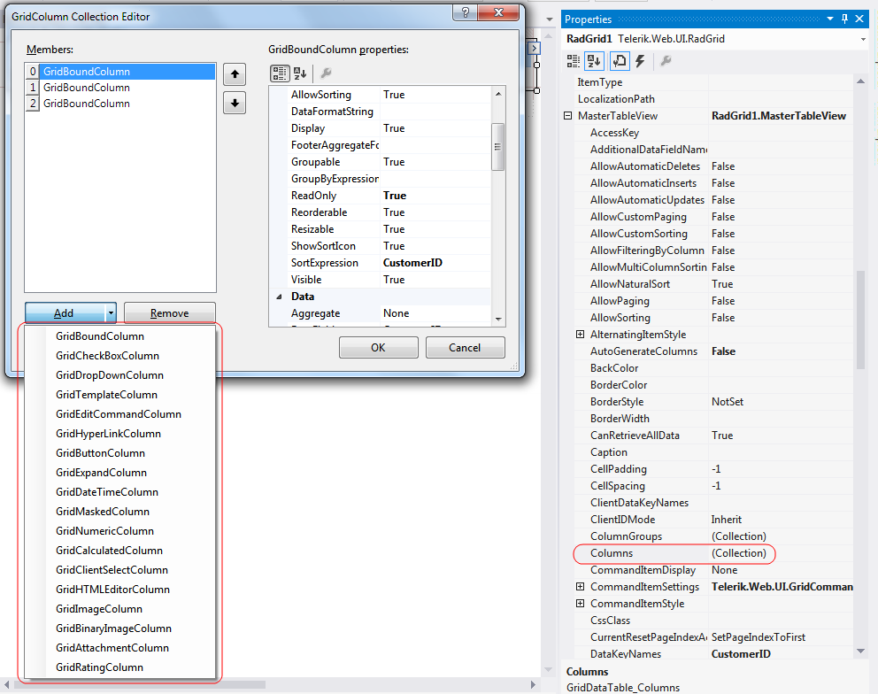

# Adding Columns from Design Time

The Columns section allows you to set the way columns are generated and visualized - this is the view from the RadGrid 'Editor' available from the Smart tag of the control:

## Automatic column generation

At the top of the Telerik RadGrid Property Builder dialog, there is a check box called "Create columns automatically at runtime". This will set the **AutoGenerateColumns** property to **true**.

>note Ticking this check box will override the options for bound columns below. If you need to bound columns, uncheck this box.
>

## Manual Column Binding

Column binding will let you display only specific data fields from a given database. Moreover, you can define custom header and footer texts for the columns that present these fields.

From the "Available Columns" list choose the columns, which you want to bind (display) and click the [>] button. The column will appear in the "Selected Columns" list. You can use the Up and Down buttons to re-order the columns and the [X] button to remove a column from this list.

In the "Available Columns" list there are some special columns. These columns do not represent a data field. They present specific Telerik RadGrid features such as:

* **GridBoundColumn**

* **GridCheckBoxColumn**

* **GridDropDownColumn**

* **GridTemplateColumn**

* **GridEditCommandColumn**

* **GridHyperlinkColumn**

* **GridButtonColumn**

* **GridExpandColumn**

* **GridDateTimeColumn**

* **GridMaskedColumn**

* **GridNumericColumn**

These columns are available in the *MasterTableView -> Columns* collection from the RadGrid Property Grid in Visual Studio (see the screenshot below) and described in the [Column Types]() topic.

