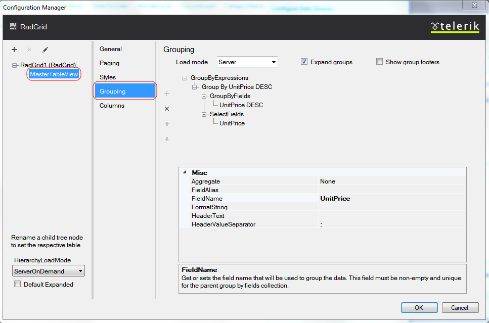

# Setting grouping from Design-Time

## Grouping

The Grouping section of the Telerik RadGrid Properties lets you specify whether your grid will use grouping and the specific group options.

In order to enable grouping you must check the [**Enable Grouping**] box on the top of the Editor. This will enable the default grouping mechanism of Telerik RadGrid. To be able to show grouping options, a special area called the **GridGroupPanel** can be displayed at the top of the grid. You should check the [**Show group panel**] box on the top to display the grid group panel. To allow users to change the grouping by dragging column headers, check the [**Allow drag-to-group**] box.

## MasterTableView Grouping

The following screenshot demonstrates how you can set group-by expressions declaratively at design time:

From the combobox at the top of the editor you can control where the grouping will be handled on the client or on the server, using the **GroupLoadMode** property of the GridTableView instance.Each **GridTableView** object has a **GroupByExpressions** property. GroupByExpressions is a collection of group expressions(GridGroupByExpression objects). **GridGroupByExpression** object contains two collections in turn:

* The **SelectFields** collection determines the information that is displayed in the group header.

* The **GroupByFields** collection determines the field values that are used to group the data.

To expand all groups on grid load you must check [**Expand groups**] box. You can also enable group footers feature which provides the option to render footer under each group in the grid, by checking the [**Show group footers**] box on the top of the Editor.
