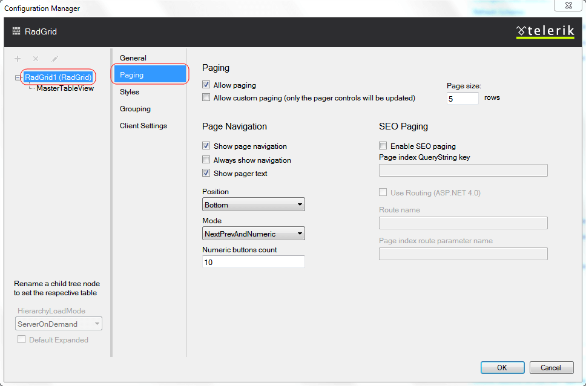

# Setting Paging from Design Time

The Paging section of the Telerik RadGrid Properties lets you specify whether your grid will use pages and the specific paging options.

## Paging

To enable paging, check the **Allow Paging** box at the top of the editor. This enables the default paging mechanism of Telerik RadGrid. To use a custom paging system, check the **Allow Custom Paging** box. These options set the **AllowPaging** and **AllowCustomPaging** properties.

The page size determines the number of rows that each page displays. Set it in the **Page size** field, which controls the **PageSize** property.

## Page Navigation

This dialog allows you to customize the way navigation is performed. You can show the navigation buttons, which will help the site-visitor to navigate through the data visualized by Telerik RadGrid. In order to enable the buttons, check the [**Show page navigation**] check box.

Now you can customize the navigation button properties:

* **Position** - use the drop-down list to specify the position of the navigation buttons relative to the grid.

* **Mode** - Specify the way navigation buttons are displayed. You can have navigation buttons appear as page numbers or as previous/next buttons with text. The custom text can be set in the fields below. Note, that you can even enter HTML tags for formatting the custom text.

* **Numeric buttons**: Specify the maximum number of page numbers to show. If you set this to "5" and your grid has 10 pages, you will see them in series of five numbers ("* ... ,2, 3, 4, 5, 6, ... *" for example).

## See Also

- [Setting grouping from design time]()
- [Setting RadGrid properties]()
