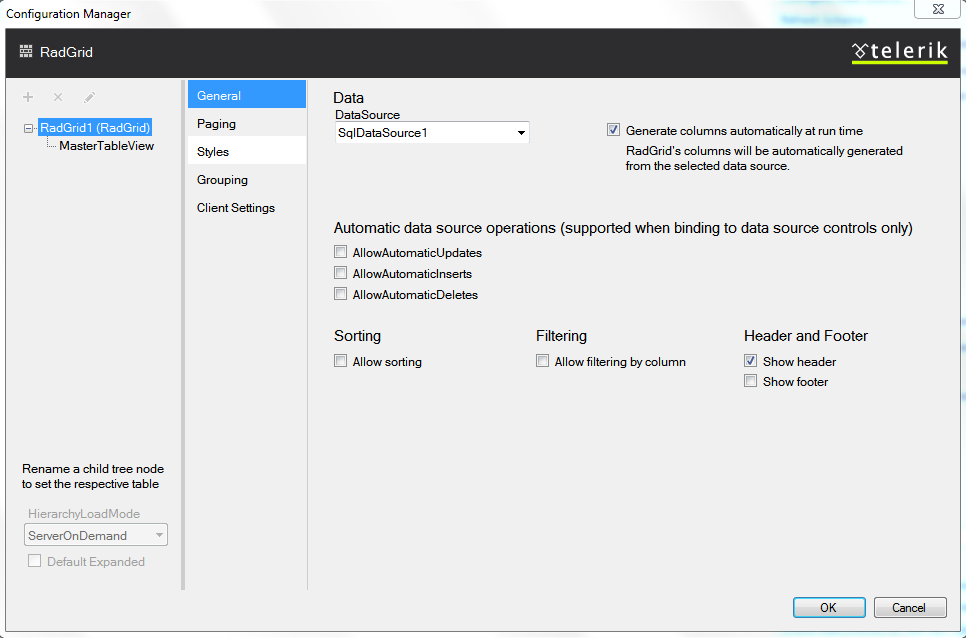

# Setting RadGrid

When you first start the editor, you will see a RadGrid and one MasterTableView. The Telerik RadGrid Properties has two main panes:

* A pane with Grid master and hierarchy objects - in this pane you can add/remove detail tables.

* A pane with properties for the selected object.

The screenshot below shows the initial state of the Telerik RadGrid editor's General Settings page.

## Data options

>note This page provides options that if set, will be available for all grid tables. If you set [Show header] option, all tables in your grid will have headers.
>

|  **Property**  |  **Description**  |
| ------ | ------ |
| **DataSource** |Sets the **DataSource** property, specifying the data-source object that will be used for building the grid. If you have set a dataSet, it will appear in the drop down list.|
| **Generate Columns automatically at runtime** |All columns, available in the specified dataSet will be generated as GridBoundColumns at runtime. This option sets the **AutoGenerateColumns** property to **true** .|

## Automatic data source operations

Use the check-boxes to perform the required operations(insert/update/delete). You must configure the data source so that it supports the automatic operations.

## Sorting

Check the box to enable the data Sorting option. When this option is enabled, the Header cell for each column will be a link and will sort the data.

## Filtering

Check the box to enable the data Filtering option.

## Header and Footer

Use the check-boxes to enable the Header or Footer cells.
