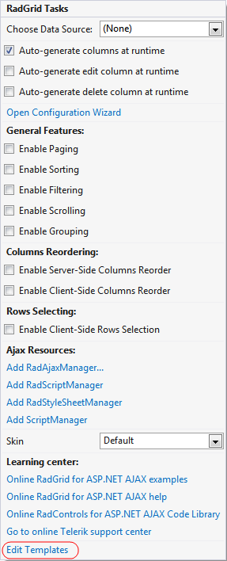

# SmartTag

The **RadGrid** Smart Tag provides convenient access to frequently needed tasks. You can display the **Smart Tag** by right clicking on the grid in the design window, and choosing **Show Smart Tag** from its context menu.

The smart tag lets you perform the following:

## RadGrid Tasks

* The **Choose Data Source** drop-down lets you bind the grid to a [declarative data source](). You can select from the existing data source components on the Web page, or create and configure a new one.

* The **Configure Data Source** link launches the **Configure Data Source wizard** for the current data source. This link does not appear in the Smart Tag unless the grid is bound to a declarative data source.

* The **Refresh Schema** link refreshes the schema for the data source to which the grid is bound. This link does not appear in the Smart Tag unless the grid is bound to a declarative data source.

* The **Auto-generate columns at runtime** check box sets **AutoGenerateColumns** property of the **RadGrid** control. This specifies whether the table views in the grid automatically create [columns]() for all fields in the data source at runtime by default. This default behavior can be overridden by the **AutoGenerateColumns** property of any **GridTableView** in the grid.

* The **Auto-generate edit column at runtime** check box sets the **AutoGenerateEditColumn** property of the **RadGrid** control. This specifies whether the table views in the grid automatically insert a **GridEditCommandColumn** column before any auto-generated data columns to allow the user to edit the data in the grid rows. This default behavior can be overridden by the **AutoGenerateEditColumn** property of any **GridTableView** in the grid.

>note In order to enable editing, you must configure the data source to allow updates as well as adding the edit command column.
>

* The **Auto-generate delete column at runtime** check box sets the **AutoGenerateDeleteColumn** property of the **RadGrid** control. This specifies whether the table views in the grid automatically insert a **GridButtonColumn** column before any auto-generated data or edit columns to allow the user to delete grid rows.

>note In order to enable row deletion, you must configure the data source to allow deletes as well as adding the delete column.
>

* The **Open Editor** link launches the [RadGrid Editor](), where you can configure the grid, including all **GridTableView** objects that it contains. The **RadGrid Editor** helps organize the many child controls and functions of the **RadGrid** control.

## General Features

* The **Enable Paging** check box sets the **AllowPaging** property of the **RadGrid** control. This specifies whether the grid supports [basic paging](). The **AllowPaging** property of the **RadGrid** control can be overridden by the **AllowPaging** property of any **GridTableView** in the grid.

* The **Enable Sorting** check box sets the **AllowSorting** property of the **RadGrid** control. This specifies whether the grid supports [basic sorting](). The **AllowSorting** property of the grid can be overridden by the **AllowSorting** property of any **GridTableView** in the grid.

* The **Enable Filtering** check box sets the **AllowFilteringByColumn** property of the **RadGrid** control. This specifies whether the grid supports [basic filtering](). The **AllowFilteringByColumn** property of the grid can be overridden by the **AllowFilteringByColumn** property of any **GridTableView** in the grid.

* The **Enable Scrolling** check box sets the **ClientSettings.Scrolling.AllowScroll** property of the **RadGrid** control. This property controls whether [scrolling]() is enabled in the grid.

* The **Enable Grouping** check box sets the **ShowGroupPanel** and **ClientSettings.AllDragToGroup** properties of the **RadGrid** control. These controls allow users to specify [grouping]() by columns from the data source.

## Columns Reordering

* The **Enable Server-Side Columns Reorder** check box sets the **ClientSettings.AllowColumnsReorder** and **ClientSettings.ReorderColumnsOnClient** properties of the grid. When **Enable Server-Side Columns Reorder** is checked, the **AllowColumnsReorder** property is set to **True** and the **ReorderColumnsOnClient** property is set to **False**. This allows the user to [re-order the columns of the grid](), where the re-ordering occurs in server-side code.

* The **Enable Client-Side Columns Reorder** check box sets the **ClientSettings.AllowColumnsReorder** and **ClientSettings.ReorderColumnsOnClient** properties of the grid. When **Enable Client-Side Columns Reorder** is checked, both the **AllowColumnsReorder** property and the **ReorderColumnsOnClient** property are set to **True**. This allows the user to re-order the columns of the grid, where the re-ordering occurs in client-side code.

## Rows Selecting

The **Enable Client-Side Rows Selection** check box sets the **ClientSettings.Selecting.AllowRowSelect** property of the grid. This specifies whether the user can [select rows by clicking on them]().

## Ajax Resources

* The **Add RadAjaxManager...** link adds a **RadAjaxManager** component to your Web page, and displays the **RadAjax Property Builder** where you can configure it.Adding a **RadAjaxManager** to your Web page lets you take advantage of the [AJAX technology]() to improve performance by performing postbacks asynchronously.

* The **Replace ScriptManager with RadScriptManager** link replaces the default **ScriptManager** component that is added for AJAX-enabled Web sites with **RadScriptManager**.

* The **Add RadStyleSheetManager** link adds a **RadStyleSheetManager** to your Web page.

## Skin

The **Skin** drop down lets you select a [Skin]() to set the look-and-feel of the grid.

## Learning Center

Links navigate you directly to **RadGrid** examples, help, or code library. You can also search the Telerik web site for a given string.

## Edit Templates

The **Edit Templates** link lets you launch the template design surface for a particular template that the grid uses. You can select from a drop-down list of all possible templates, including templates for [template columns](), the [no records template](), [pager template](), [command item template](), [edit form template](), global item template, or nested view template.

