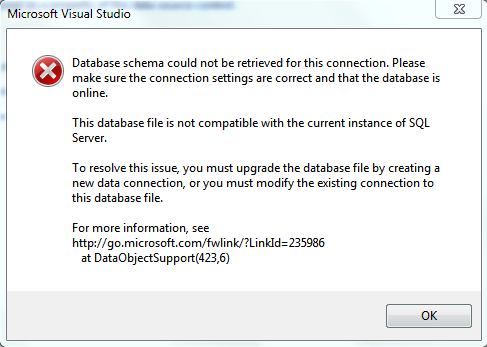
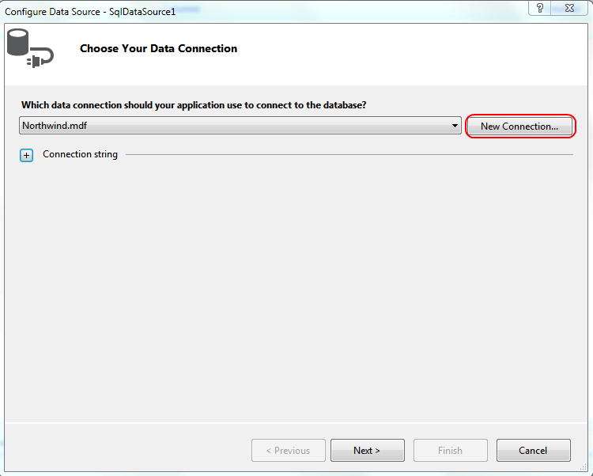
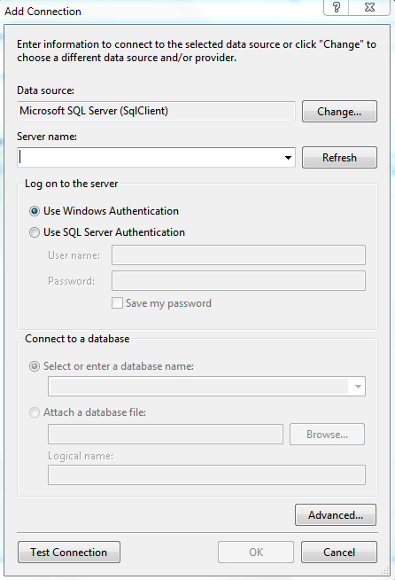
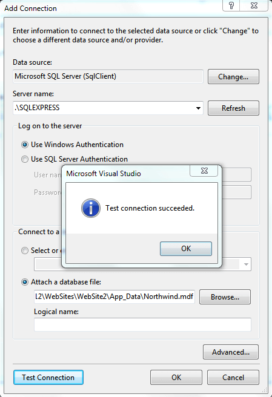

# Visual Studio 2012 Datasource Configuration

## How to resolve the "Database schema could not be retrieved" exception message.

* 

To resolve this error, reconfigure the connection string. By default, Visual Studio 2012 uses LocalDB, which was introduced with SQL Server 2012. For more information, see the [LocalDB overview](http://blogs.msdn.com/b/sqlexpress/archive/2011/07/12/introducing-localdb-a-better-sql-express.aspx).

If LocalDB is not installed or you do not want to use it, follow these steps to use the SQL Server Express server:

* Once you get to the "Choose Your Data Connection" dialog, click the **"New Connection..."** button.

* After that the **"Add Connection"** dialog is displayed. Here you need to choose the server that will be used to host the database file.

* In the **"Server name:"** dropdown control you choose the server instance.

* Next, click the **"Attach a database file:"** RadioButton. Then browse to the database file location.

* Once, you are done with these steps, verify the connection with the **"Test connection"** button.

* Finally, click the **OK** button and proceed as usual.

## See Also

- [Getting started with RadGrid]()
- [Visual Studio support]()
