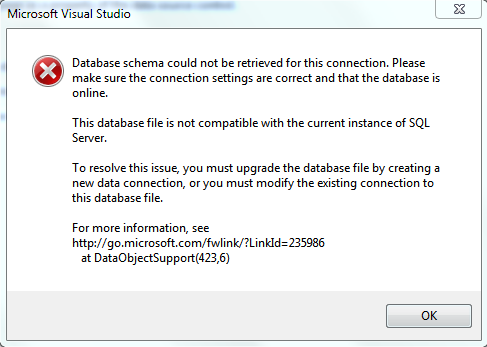
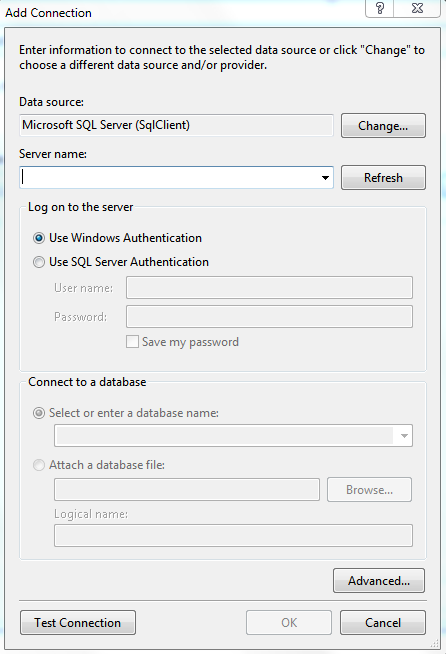

# Visual Studio 2012 Datasource Configuration

## How to resolve the "Database schema could not be retrieved" exception message.

* 

In order to get over this error, you should reconfigure the connection string that will be used. By default Visual Studio 2012 uses the LocalDB SQL Server which was introduced with SQL Server 2012. More information about the LocalDB feature could be found in [this](http://blogs.msdn.com/b/sqlexpress/archive/2011/07/12/introducing-localdb-a-better-sql-express.aspx) blog post.

If you do not have the LocalDB option installed on your machine or if you do not want to use it, you cold use the following steps in order to start using the SQLExpress server again:

* Once you get to the "Choose Your Data Connection" dialog, click the **"New Connection..."** button.

* After that the **"Add Connection"** dialog is displayed. Here you need to choose the server that will be used to host the database file.

* In the **"Server name:"** dropdown control you choose the server instance.

* Next, click the **"Attach a database file:"** RadioButton. Then browse to the database file location.

* Once, you are done with these steps, verify the connection with the **"Test connection"** button.

* Finally, click the "OK" button and proceed as usual.
