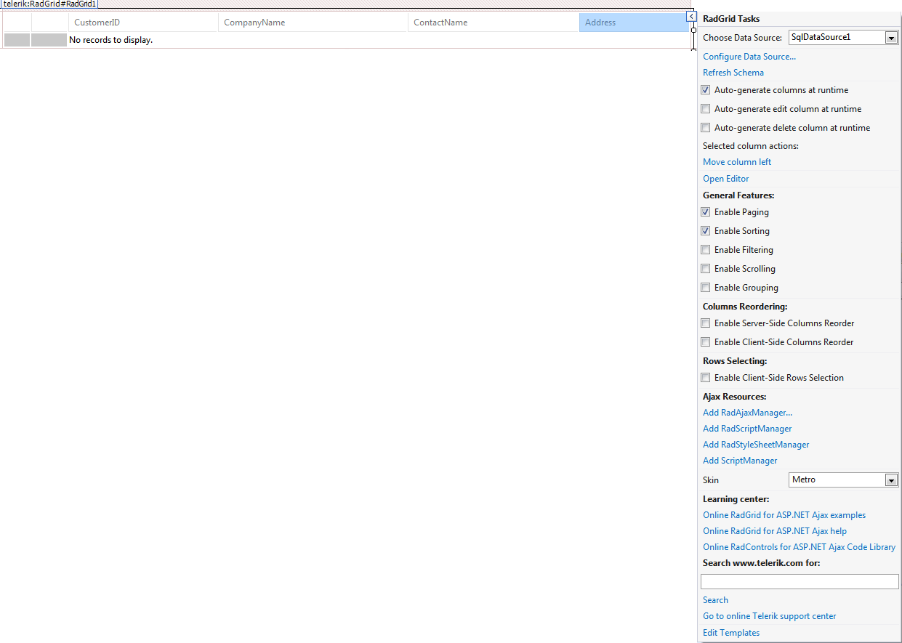

# Visual Studio Support

Telerik RadGrid provides support for:

* Visual Studio 2008, 2010, 2012, 2013, 2015, 2017, 2019 and 2022

Visual Studio extensions such as toolbars and design-time features are supported for Visual Studio 2015 and later. Install the [Telerik ASP.NET AJAX Visual Studio extension](https://marketplace.visualstudio.com/items?itemName=TelerikInc.TelerikASPNETAJAXVSExtensions).

## See Also

- [Visual Studio 2012 data source configuration]()
- [Design-time overview]()
