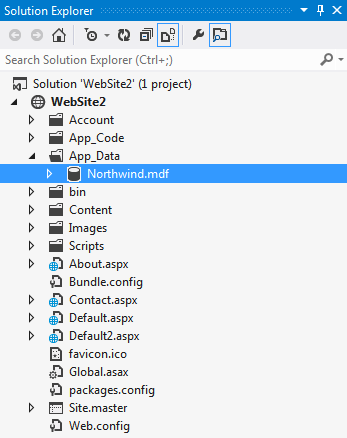
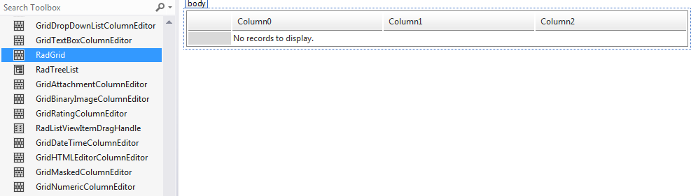
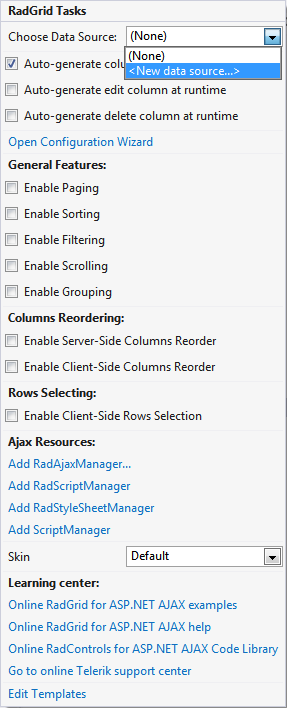
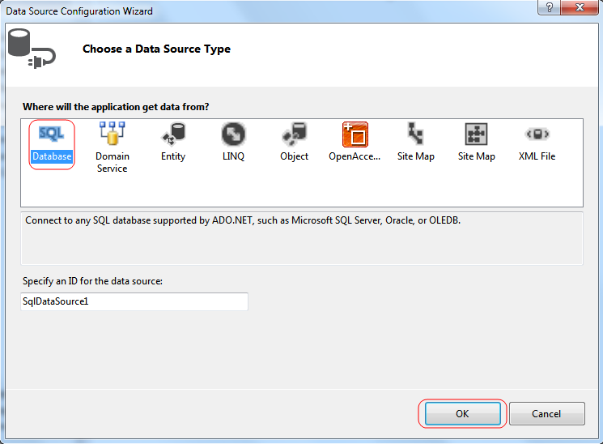
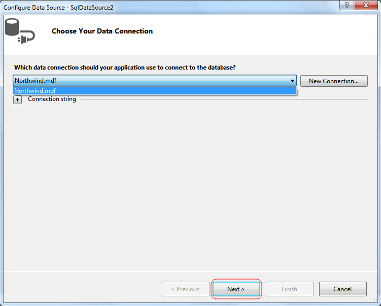
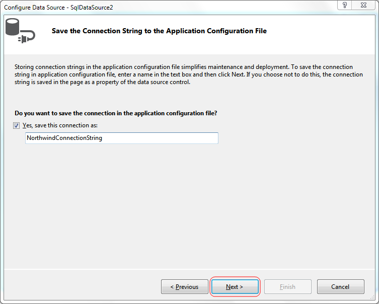
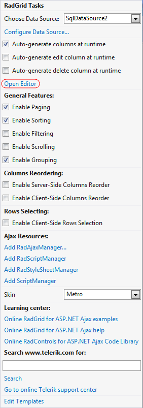

# Building a Hierarchical Grid

This tutorial will walk you through creating a Web page that contains a hierarchical **RadGrid** control. It shows how to:

* Bind detail tables using a declarative data source.

* Bind detail tables dynamically, using the **DetailTableDataBind** event.

## Creating the data sources

1. Locate the "..\Live Demos\App_Data" folder underneath the folder where you have installed yourcontrols. In this folder, find the **Northwind.mdf** file and copy it into the **App_Data** folder of your Web site. The **Solution Explorer** for your application should look something like the following:

1. Drag and drop a **RadGrid** control from the toolbox onto your Web page:

1. Using the **RadGrid's** [Smart Tag]() expand the drop-down list labelled Choose Data Source and select **<New data source...>**:

1. The **Data Source Configuration Wizard** appears. On the **Choose a Data Source Type** page, select **SQL Database** and click **OK**:

1. On the **Choose Your Data Connection** page, expand the drop-down list by clicking the little triangle on the right side and select the **Northwind.mdf** from the available options. Then click the **Next** button:

	_Note_: If you happen to encounter a "Database schema could not be retrieved" exception, please follow the guide in [this] () help topic.
1. On the **Save the Connection String to the Application Configuration File** page, set name for the **Connection String** and then press **Next**:

1. On the **Configure the Select Statement** page, select the **Customers** table from the drop-down list, and select all **(*)** fields. Then choose **Next**:

1. On the **Test Query** page, click the **Test Query** button to see the data. Then click **Finish** to exit the **Configure Data Source** wizard:

1. Using **RadGrid's** [Smart Tag]() add a second **DataSource** component to RadGrid.

1. Choose the same database on the **Choose Your Data Connection** page of the wizard. Then click the **Next** button:

1. On the **Configure the Select Statement** page, choose the **Orders** table and select all columns again. This time, we are creating a data source for a detail table, so we need to add a where clause so the detail records are limited to the ones that match a record in the parent table. Click the **Where...** button to add a **WHERE** clause:

1. On the **Add WHERE Clause** page, choose the **CustomerID** column, and select **None** as the source of the parameter. Then click the **Add** button to add the condition to the **Where** clause, and click **OK**.

1. The **Configure Select Statement** page now shows your WHERE clause. Click the **Next** button, and then, on the next page, choose **Finish**:

1. After you press the **Finish** button **RadGrid** will ask you if you want to apply the new datasource schema, choose **No**:

## Creating the grid and binding its Master Table

1. In the **RadGrid's** Smart Tag, select **SQLDataSource1** as a data source for the grid. This binds the **MasterTableView** to the **Customers** table. If RadGrid asks you whether to apply the new datasource schema, choose **Yes**. In addition, while in the Smart Tag, choose **Metro** from the **Skin** drop-down to give the grid a different skin:

1. Still in the Smart Tag, click the link labelled **Open Configuration Wizard**:

1. In the [ RadGrid Editor](),

	1. Select the **MasterTableView** in the **Grid hierarchy** tree view that you find in the upper left corner.

	1. Select **Columns** tab.

	1. Remove any columns you do not want to display for the Master Table:
	

1. In **General** tab of the **MasterTableView** node make sure that the **DataKeyNames** list contains the string **CustomerID**. This column must be identified as a key name so that it can be used to link to detail tables:

## Creating and binding the first detail table

1. In the **Grid hierarchy** tree view, click the "+" button while the **MasterTableView** is selected to add a Detail TableView.

1. Select the detail table under **MasterTableView** node.

1. In the right pane, set the **DataSourceID** property to **SqlDataSource2** to bind it to the **Orders** table.

1. In the **Parent table relation**, fill in the **CustomerID** string in both fields(**MasterKeyField and DetailKeyField**) click the "+" button to add a relationship between a field in the detail table and its corresponding field in the parent table.

1. Now set the **DataKeyNames** property of the detail table to **OrderID**. This will be useful later when binding a second detail table as a child of this table view.

1. Before exiting the **RadGrid** Editor, return to the **MasterTableView** node, on the right pane click the **Paging** tab and then check the **Allow paging** checkbox and set the **Page size** to **5** rows:

1. Run the application to see that the grid now displays a two-level hierarchy, with the **Orders** table nested inside the **Customers** table:

## Creating and binding the second detail table

1. Bring up the **RadGrid's** Editor again and add a second Detail Table as a child of the first Detail Table:

1. Because we will be binding the detail table dynamically, there is no need to set any more properties, so exit the property builder:

1. Give the **RadGrid** a **DetailTableDataBind** event handler. This event handler

	1. Checks if the detail table has a datasource already.

	1. Creates a SELECT command based on the current value of the data key from the parent table (This is available because we set the **DataKeyNames** property of the parent table).

	1. Fills a **DataTable** using the dynamically created SELECT command.

	1. Assigns the data table as the **DataSource** of the detail table view we are binding:

	**C#**
	
		protected void RadGrid1_DetailTableDataBind(object sender, Telerik.Web.UI.GridDetailTableDataBindEventArgs e)
		{
			if (e.DetailTableView.DataSourceID == "")
			{
				GridDataItem dataItem = (GridDataItem)e.DetailTableView.ParentItem;
				string OrderID = dataItem.GetDataKeyValue("OrderID").ToString();
				e.DetailTableView.DataSource = GetDataTable("Select * from [Order Details] where OrderID = '" + OrderID + "'");
			}

		}

		public DataTable GetDataTable(string query)
		{
			String ConnString = ConfigurationManager.ConnectionStrings["NorthwindConnectionString"].ConnectionString;
			SqlDataAdapter adapter = new SqlDataAdapter();
			DataTable myDataTable = new DataTable();
			using (SqlConnection conn = new SqlConnection(ConnString))
			{
				adapter.SelectCommand = new SqlCommand(query, conn);
				adapter.Fill(myDataTable);
			}
			return myDataTable;
		}
		
	**VB**
	
		Private Sub RadGrid1_DetailTableDataBind(ByVal source As Object, ByVal e As GridDetailTableDataBindEventArgs) Handles RadGrid1.DetailTableDataBind
			If e.DetailTableView.DataSourceID = "" Then
				Dim dataItem As GridDataItem = DirectCast(e.DetailTableView.ParentItem, GridDataItem)
				Dim OrderID As String = dataItem.GetDataKeyValue("OrderID").ToString()
				e.DetailTableView.DataSource = GetDataTable("Select * from [Order Details] where OrderID = '" + OrderID + "'")
			End If
		End Sub

		Public Function GetDataTable(query As String) As DataTable
			Dim ConnString As [String] = ConfigurationManager.ConnectionStrings("NorthwindConnectionString").ConnectionString
			Dim adapter As New SqlDataAdapter()
			Dim myDataTable As New DataTable()
			Using conn As New SqlConnection(ConnString)
				adapter.SelectCommand = New SqlCommand(query, conn)
				adapter.Fill(myDataTable)
			End Using
			Return myDataTable
		End Function

1. Run the application. Note that you can now see the dynamically bound Detail Table:

