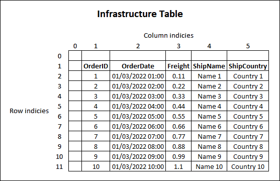

# Excel-Biff (XLS) Export


As of Q3 2012, RadGrid can export its data to binary Excel format (BIFF). 

In addition to the default export, Biff format also supports exporting the following features:

- **Images** (*since Q3 2012*). 
  - In addition to the Image Support, there is also a property called **AutoFitImages**. When this property is enabled, all the images in the grid will occupy the entire area of the cells at the exported excel file. In other words, images that are bigger than the cell will be decreased and similarly the smaller ones size will be increased. The width/height proportions (aspect ration) will not be kept.

- **Captions** of MasterTableView/GridTableView (*since Q1 2013*).

- **DataFormatString** of RadGrid columns are applied to the Export Structure (*since Q1 2013 SP1*).  For more details, check out the [Formatting Cell Values](#formatting-cell-values) section.

- **MultiColumn Headers** (*since Q1 2014*)

## Usage

To export the Grid using this format, set the **Format** property to **Biff** within the `ExportSettings-Excel` element.

>caption Example

````ASP.NET
<ExportSettings>
    <Excel Format="Biff" />
</ExportSettings>
````

## Export events

Server-Side events triggered for the Biff format.

- **OnBiffExporting**: This is the dedicated event that is triggered when the Export Structure is ready. It could be useful in case you want to make changes to the structure before the document is exported/downloaded. The Export Structure can be accessed from the Event argument - (`Telerik.Web.UI.ExportInfrastructure.ExportStructure`)**e.ExportStructure**.

- **OnInfrastructureExporting**: Similarly to the OnBiffExporting event, this is also triggered when the Export Structure is ready. It could be useful in case you want to use the same event for both `Xlsx` and `Biff` formats. The Export Structure can be accessed from the Event argument - (`Telerik.Web.UI.ExportInfrastructure.ExportStructure`)**e.ExportStructure**

- **OnGridExporting**: This event is triggered when the Grid is exporting regardless of the Export Format. It can also be used to access the output, however, unlike in the *OnInfrastructureExporting* event, the output returns a string - (`string`)**e.ExportOutput**. 

- **OnExcelExportCellFormatting**: This is event is triggered when the Grid export functionality formats the cell. It fires for every cell and can be used to apply additional styles to them.

For more details, check out the [Styling](#styling) section.

## Customizing the Export Output

- [Accessing elements of the Export Structure](#accessing-elements-of-the-export-structure)
- [Styling Columns / Rows / Cells](#styling-columns--rows--cells)
- [Formatting Cell Values](#formatting-cell-values)
- [Default Cell Alignment](#default-cell-alignment)
- [Hiding Columns/Rows](#hiding-columnsrows)
- [Adding new Sheets to the Export Structure](#adding-new-sheets-to-the-export-structure)


### Accessing elements of the Export Structure

To access elements of the Export Structure, you can use the **OnInfrastructureExporting** server-side event.

The first row and first cell of each row are empty in the Excel Structure generated by the Biff Export format. To access the Table's content use the indices starting from 1.

>caption Illustration of the Export Structure Table




>caption Example using OnBiffExporting and OnInfrastructureExporting events

````C#
protected void RadGrid1_OnBiffExporting(object sender, GridBiffExportingEventArgs e)
{
    // Accessing the Export Structure
    Telerik.Web.UI.ExportInfrastructure.ExportStructure structure = e.ExportStructure;

    // Accessing the Table of the Structure
    Telerik.Web.UI.ExportInfrastructure.TableCollection tables = structure.Tables;
    Telerik.Web.UI.ExportInfrastructure.Table firstTable = tables[0];

    // Accessing Columns
    // Columns that do not have HeaderStyle.Width set do not populate the Columns collection of the Table in the ExportInfrastructure
    // https://feedback.telerik.com/aspnet-ajax/1377392-the-columns-collection-of-the-export-infrastructure-is-not-populated-by-columns-that-do-not-have-headerstyle-width-set
    Telerik.Web.UI.ExportInfrastructure.ColumnCollection columns = firstTable.Columns;
    Telerik.Web.UI.ExportInfrastructure.Column firstColumn = columns[0]; // Indexes in the Columns collection start with 0

    // Accessing Rows
    Telerik.Web.UI.ExportInfrastructure.RowCollection rows = firstTable.Rows;
        
    // Accessing the Header Row (Note: index 0 = empty, you will need to use index 1)
    Telerik.Web.UI.ExportInfrastructure.Row headerRow = rows[1];

    // Accessing Header Cells
    Telerik.Web.UI.ExportInfrastructure.CellCollection headerCells = headerRow.Cells;
    Telerik.Web.UI.ExportInfrastructure.Cell firstHeaderCell = headerCells[1,1]; // colindex, rowindex

    // Looping through the data rows
    foreach (Telerik.Web.UI.ExportInfrastructure.Row row in rows)
    {
        if (row.Index < 2) continue; // Skip loop for the Empty and Header row

        Telerik.Web.UI.ExportInfrastructure.CellCollection rowCells = row.Cells;

        Telerik.Web.UI.ExportInfrastructure.Cell firstCell = row.Cells[2, 1]; // Data starts from row 2, column 1
    }
}
protected void RadGrid1_InfrastructureExporting(object sender, GridInfrastructureExportingEventArgs e)
{
    if(e.ExportFormat == ExportType.ExcelBiff)
    {
        // Accessing the Export Structure
        Telerik.Web.UI.ExportInfrastructure.ExportStructure structure = e.ExportStructure;

        // Accessing the Table of the Structure
        Telerik.Web.UI.ExportInfrastructure.TableCollection tables = structure.Tables;
        Telerik.Web.UI.ExportInfrastructure.Table firstTable = tables[0];

        // Accessing Columns
        // Columns that do not have HeaderStyle.Width set do not populate the Columns collection of the Table in the ExportInfrastructure
        // https://feedback.telerik.com/aspnet-ajax/1377392-the-columns-collection-of-the-export-infrastructure-is-not-populated-by-columns-that-do-not-have-headerstyle-width-set
        Telerik.Web.UI.ExportInfrastructure.ColumnCollection columns = firstTable.Columns;
        Telerik.Web.UI.ExportInfrastructure.Column firstColumn = columns[0]; // Indexes in the Columns collection start with 0

        // Accessing Rows
        Telerik.Web.UI.ExportInfrastructure.RowCollection rows = firstTable.Rows;
            
        // Accessing the Header Row (Note: index 0 = empty, you will need to use index 1)
        Telerik.Web.UI.ExportInfrastructure.Row headerRow = rows[1];

        // Accessing Header Cells
        Telerik.Web.UI.ExportInfrastructure.CellCollection headerCells = headerRow.Cells;
        Telerik.Web.UI.ExportInfrastructure.Cell firstHeaderCell = headerCells[1,1]; // colindex, rowindex

        // Looping through the data rows
        foreach (Telerik.Web.UI.ExportInfrastructure.Row row in rows)
        {
            if (row.Index < 2) continue; // Skip loop for the Empty and Header row

            Telerik.Web.UI.ExportInfrastructure.CellCollection rowCells = row.Cells;

            Telerik.Web.UI.ExportInfrastructure.Cell firstCell = row.Cells[2, 1]; // Data starts from row 2, column 1
        }
    }
    else if(e.ExportFormat == ExportType.ExcelXlsx)
    {
        // Do something different with the XLSX Structure
    }
}
````
````VB
Protected Sub RadGrid1_OnBiffExporting(ByVal sender As Object, ByVal e As GridBiffExportingEventArgs)
    'Accessing the Export Structure
    Dim structure As Telerik.Web.UI.ExportInfrastructure.ExportStructure = e.ExportStructure

    'Accessing the Table of the Structure
    Dim tables As Telerik.Web.UI.ExportInfrastructure.TableCollection = [structure].Tables
    Dim firstTable As Telerik.Web.UI.ExportInfrastructure.Table = tables(0)

    'Accessing Columns
    'Columns that do not have HeaderStyle.Width set do not populate the Columns collection of the Table in the ExportInfrastructure
    'https://feedback.telerik.com/aspnet-ajax/1377392-the-columns-collection-of-the-export-infrastructure-is-not-populated-by-columns-that-do-not-have-headerstyle-width-set
    Dim columns As Telerik.Web.UI.ExportInfrastructure.ColumnCollection = firstTable.Columns
    Dim firstColumn As Telerik.Web.UI.ExportInfrastructure.Column = columns(0) 'Indexes in the Columns collection start with 0

    'Accessing Rows
    Dim rows As Telerik.Web.UI.ExportInfrastructure.RowCollection = firstTable.Rows

    'Accessing the Header Row (Note: row index 0 = empty, you will need to use row index 1)
    Dim headerRow As Telerik.Web.UI.ExportInfrastructure.Row = rows(1)

    'Accessing Header Cells
    Dim headerCells As Telerik.Web.UI.ExportInfrastructure.CellCollection = headerRow.Cells
    Dim firstHeaderCell As Telerik.Web.UI.ExportInfrastructure.Cell = headerCells(1, 1) 'colindex, rowindex

    'Looping through the data rows
    For Each row As Telerik.Web.UI.ExportInfrastructure.Row In rows
        If row.Index < 2 Then Continue For 'Skip loop for the Empty and Header row
        
        Dim rowCells As Telerik.Web.UI.ExportInfrastructure.CellCollection = row.Cells
        
        Dim firstCell As Telerik.Web.UI.ExportInfrastructure.Cell = row.Cells(2, 1) 'Data starts from row 2, column 1
    Next
End Sub
Protected Sub RadGrid1_InfrastructureExporting(ByVal sender As Object, ByVal e As GridInfrastructureExportingEventArgs)
    If e.ExportFormat = ExportType.ExcelBiff Then
        'Accessing the Export Structure
        Dim structure As Telerik.Web.UI.ExportInfrastructure.ExportStructure = e.ExportStructure

        'Accessing the Table of the Structure
        Dim tables As Telerik.Web.UI.ExportInfrastructure.TableCollection = [structure].Tables
        Dim firstTable As Telerik.Web.UI.ExportInfrastructure.Table = tables(0)

        'Accessing Columns
        'Columns that do not have HeaderStyle.Width set do not populate the Columns collection of the Table in the ExportInfrastructure
        'https://feedback.telerik.com/aspnet-ajax/1377392-the-columns-collection-of-the-export-infrastructure-is-not-populated-by-columns-that-do-not-have-headerstyle-width-set
        Dim columns As Telerik.Web.UI.ExportInfrastructure.ColumnCollection = firstTable.Columns
        Dim firstColumn As Telerik.Web.UI.ExportInfrastructure.Column = columns(0) 'Indexes in the Columns collection start with 0

        'Accessing Rows
        Dim rows As Telerik.Web.UI.ExportInfrastructure.RowCollection = firstTable.Rows

        'Accessing the Header Row (Note: row index 0 = empty, you will need to use row index 1)
        Dim headerRow As Telerik.Web.UI.ExportInfrastructure.Row = rows(1)

        'Accessing Header Cells
        Dim headerCells As Telerik.Web.UI.ExportInfrastructure.CellCollection = headerRow.Cells
        Dim firstHeaderCell As Telerik.Web.UI.ExportInfrastructure.Cell = headerCells(1, 1) 'colindex, rowindex

        'Looping through the data rows
        For Each row As Telerik.Web.UI.ExportInfrastructure.Row In rows
            If row.Index < 2 Then Continue For 'Skip loop for the Empty and Header row
            
            Dim rowCells As Telerik.Web.UI.ExportInfrastructure.CellCollection = row.Cells
            
            Dim firstCell As Telerik.Web.UI.ExportInfrastructure.Cell = row.Cells(2, 1) 'Data starts from row 2, column 1
        Next
    ElseIf e.ExportFormat = ExportType.ExcelXlsx Then
        'Do something different with the XLSX Structure
    End If
End Sub
````

### Styling Columns / Rows / Cells

There are two different ways to style these elements. The standard ASP.NET and the Export Infrastructure approach. In order to use the latter way, you have to handle the BiffExporting event in the code-behind. Note that styling via CSS classes is not possible.

````C#
// styling Columns
xls.Column col = e.ExportStructure.Tables[0].Columns[2];
col.Style.BackColor = Color.Gray;
col.Style.ForeColor = Color.Yellow;

// styling Rows
xls.Row row = e.ExportStructure.Tables[0].Rows[2];
row.Style.BackColor = Color.Blue;

// styling Cells
xls.Cell cell1 = e.ExportStructure.Tables[0].Cells["B2"];
cell1.Style.BackColor = Color.Yellow;

xls.Cell cell2 = e.ExportStructure.Tables[0].Cells[3, 3];
cell2.Style.ForeColor = Color.Tomato;
````
````VB
'styling Columns
Dim col As xls.Column = e.ExportStructure.Tables(0).Columns(2)
col.Style.BackColor = Color.Gray
col.Style.ForeColor = Color.Yellow

'styling Rows
Dim row As xls.Row = e.ExportStructure.Tables(0).Rows(2)
row.Style.BackColor = Color.Blue

'styling Cells
Dim cell1 As xls.Cell = e.ExportStructure.Tables(0).Cells("B2")
cell1.Style.BackColor = Color.Yellow

Dim cell2 As xls.Cell = e.ExportStructure.Tables(0).Cells(3, 3)
cell2.Style.ForeColor = Color.Tomato
````

### Formatting Cell Values

Note that only the [custom numeric format strings](https://msdn.microsoft.com/en-us/library/0c899ak8%28v=vs.71%29.aspx) will work because in most scenarios they match the [Microsoft Excel’s custom numeric format](http://office.microsoft.com/en-gb/excel-help/create-a-custom-number-format-HP010342372.aspx).

>caption Example

````ASP.NET
<telerik:GridBoundColumn DataType="System.DateTime" DataField="DateField" DataFormatString="{0:tt dd-MM(yyyy) }" />
````

The built-in .NET [standard numeric format strings](https://msdn.microsoft.com/en-us/library/dwhawy9k%28v=vs.71%29.aspx) can still be used, but the output will not be as expected.

>caption Example

````ASP.NET
<telerik:GridBoundColumn DataType="System.Double" DataField="DoubleField" DataFormatString="{0:C2}" />
````

>note To prevent applying the Columns DataFormatString to the export Structure, set the **SuppressColumnDataFormatStrings** property to **true** inside the `ExportSettings` element.

### Default Cell Alignment

You can specify a default alignment to all cells by using **DefaultCellAlignment**. This property is supported since **Q2 2015** and its default value is NotSet. Typical values include **Left**, **Right** and **Center**.

````ASP.NET    
<ExportSettings>
    <Excel DefaultCellAlignment="Center" />
</ExportSettings>
````

### Hiding Columns/Rows

Hiding rows and columns is pretty straightforward. Actually you can hide these elements in the same way you hide them in a normal server-side scenario.The expand/collapse column could also be removed by setting the HideStructureColumns property to false.

````C#
// hiding a row
RadGrid1.MasterTableView.Items[1].Visible = false; //when IgnorePaging is false

// hiding a column
RadGrid1.MasterTableView.GetColumn("Col1").Visible = false;
````
````VB
'hiding a row
RadGrid1.MasterTableView.Items(1).Visible = False 'when IgnorePaging is false

'hiding a column
RadGrid1.MasterTableView.GetColumn("Col1").Visible = False
````


>note From Q2 2013 we introduced a new property named **Exportable**. This property allows you to choose whether a certain column should be included in the exported file or not. By setting this property to **false** the related column will be excluded from the exported file. Its default value is true.
>

Additionally you can change the default alignment on **OnInfrastructureExporting** event.


### Adding new Sheets to the Export Structure

This is the most interesting and flexible functionality the new export brings to the table. Simply put, you have to handle the BiffExporting event and then make the desired modification to the structure (accessible via the e.ExportStructure property of the event arguments), generated by RadGrid.


````C#
//Adding new worksheet
xls.Table newSheet = new xls.Table("NEW SHEET");
e.ExportStructure.Tables.Add(newSheet);
newSheet.Cells[1, 1].Value = "NEW CELL";
````
````VB
'Adding new worksheet
Dim newSheet As New xls.Table("NEW SHEET")
e.ExportStructure.Tables.Add(newSheet)
newSheet.Cells(1, 1).Value = "NEW CELL"
````


- Columns that do not have `HeaderStyle.Width` set do not populate the `Columns` collection of the `Table` in the `ExportInfrastructure`. Read more here: [https://feedback.telerik.com/Project/108/Feedback/Details/226862](https://feedback.telerik.com/Project/108/Feedback/Details/226862). This can cause `e.ExportInfrastructure.Tables[0].Columns.Count` to return `0` or an unexpected number smaller than the number of columns, so that you cannot loop through the columns and apply custom styling to them.


## Limitations

The following features are not supported by the export functionality

- Grouping
- Hierarchy
- Automatic Column/Row Resizing
- Image aspect ratio
- [Custom skins]() whose images are set via the `ImagesPath` property instead of referenced in the stylesheet.

 
