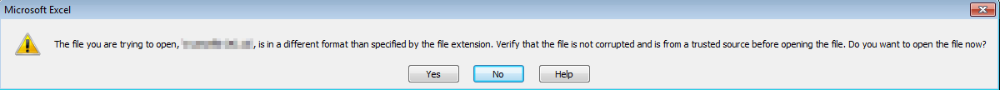
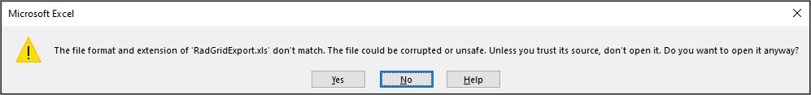

# Excel-Html (XLS) Export

**RadGrid** is able to export your data to **Excel** using **HTML/CSS-based** format. It is not the native binary format used by *Microsoft Office* but it is a popular way to export data and it is also officially supported by **Microsoft**, see [Microsoft® Office HTML and XML Reference](https://msdn.microsoft.com/en-us/library/aa155477%28office.10%29.aspx)

## Usage

To export the Grid using this format, set the **Excel-Format** property to **Html** within the `ExportSettings` element. **Html** is the `default` value, you might as well omit this property.

>caption Example

````ASP.NET
<ExportSettings>
    <Excel Format="Html" />
</ExportSettings>
````

## Export events

Server-Side events triggered for the Html format.

- **OnGridExporting**: This event is triggered when the Grid is exporting. It can be used to access the output from the event argument (`string`)**e.ExportOutput** when using the Excel-Format Html. 

- **OnHtmlExporting**: This event is triggered for the Html format during the export. This event can be used to set the XmlOptions and add additional Styles to the Document. For more details check out the [Styling - Using Headers and Footers](#using-headers-and-footers) or [Styling - Xml Options](#xml-options) sections.

- **OnExcelExportCellFormatting**: This is event is triggered when the Grid export functionality formats the cell. It fires for every cell and can be used to apply additional styles to the Cells. Check out the [Styling - Number Formats/Formulas](#number-formats--formulas) section for more details.


## Customizing the Export Output

- [Using Headers and Footers](#using-headers-and-footers)
- [Number formats / Formulas](#number-formats--formulas)
- [XML Options](#xml-options)


### Using Headers and Footers

Office HTML format supports page headers and footers. Microsoft Excel makes this data persistent through the use of the **mso-header-data** and **mso-footer-data** attributes. Each attribute is a string with metadata identified by the ampersand character(**&**). Below you can find a list of the supported header/footer attributes:


| Metadata | Represents |
| ------ | ------ |
|&L|Left-aligned data|
|&R|Right-aligned data|
|&C|Center-aligned data|
|&D|Date|
|&T|Time|
|&P|Page number|
|&N|Number of pages|
|&\0022fontname\,fontstyle\0022&fontsize|Font name, style, and size|
|&B|Bold|
|&I|Italic|

>caption Example

````ASPX
<telerik:RadGrid RenderMode="Lightweight" ID="RadGrid1" runat="server" OnHTMLExporting="RadGrid1_HtmlExporting">
</telerik:RadGrid>
````


````C#
protected void RadGrid1_HTMLExporting(object sender, GridHTMLExportingEventArgs e)
{
    string header = @"&CMultiplication Table\000ANumber of Pages &N";
    string footer = "&LDate\\: &D &RPage &P\000ASignature\\:";
    e.Styles.AppendFormat("table @page {{ mso-header-data:\"{0}\"; mso-footer-data:\"{1}\"; }}", header, footer);
}	
````
````VB
Protected Sub RadGrid1_HTMLExporting(sender As Object, e As GridHTMLExportingEventArgs)
    Dim header As String = "&CMultiplication Table\000ANumber of Pages &N"
    Dim footer As String = "&LDate\: &D &RPage &P" & vbNullChar & "00ASignature\:"
    e.Styles.AppendFormat("table @page {{ mso-header-data:""{0}""; mso-footer-data:""{1}""; }}", header, footer)
End Sub
````


### Number formats / Formulas

**Microsoft Office HTML** format allows you to define custom number formats by using the **mso-number-format** style attribute. Several examples are shown below:

>caption Example

````C#
protected void RadGrid1_ExportCellFormatting(object source, ExcelExportCellFormattingEventArgs e)
{
    switch (e.FormattedColumn.UniqueName)
    {
        case "C1":
            e.Cell.Style["mso-number-format"] = @"\@";
            break;
        case "C2":
            e.Cell.Style["mso-number-format"] = @"$0.00";
            break;
        case "C3":
            e.Cell.Style["mso-number-format"] = @"0000";
            break;
        case "C4":
            e.Cell.Style["mso-number-format"] = @"mm\/dd\/yyyy";
            break;
    }
}
````
````VB	
Protected Sub RadGrid1_ExportCellFormatting(ByVal source As Object, ByVal e As ExcelExportCellFormattingEventArgs) Handles RadGrid1.ExcelExportCellFormatting
    Select Case e.FormattedColumn.UniqueName
        Case "C1"
            e.Cell.Style("mso-number-format") = "\@"
            Exit Select
        Case "C2"
            e.Cell.Style("mso-number-format") = "$0.00"
            Exit Select
        Case "C3"
            e.Cell.Style("mso-number-format") = "0000"
            Exit Select
        Case "C4"
            e.Cell.Style("mso-number-format") = "mm\/dd\/yyyy"
            Exit Select
    End Select
End Sub
````


You can see some of the most common custom number formats and their description in the following table:


| Format | Description |
| ------ | ------ |
|\@|text|
|"0\.000"|3 decimals|
|\#\,\#\#0\.000|comma separators (and 3 decimals)|
|"mm\/dd\/yy"|Date format|
|"d\\-mmm\\-yyyy"|another date format|
|Percent|percent|

Another interesting feature, supported by the Excel export, is the formulas. You can assign the desired formula to a specific cell by applying the **formula** attribute.

>note The formula attribute is valid in the context of the **Office HTML** only. You shouldn't apply this attribute unconditionally in order to prevent validation problems.

>caption Example

````C#
protected void RadGrid1_ExportCellFormatting(object source, ExcelExportCellFormattingEventArgs e)
{
    GridDataItem item = e.Cell.Parent as GridDataItem;
    if (e.FormattedColumn.UniqueName == "C5")
        e.Cell.Attributes["formula"] = "=E1*2.14";
    if (e.FormattedColumn.UniqueName == "C1")
        e.Cell.Attributes["formula"] = String.Format("=SUM(B{0}:D{0})", item.ItemIndex);
}
````
````VB
Protected Sub RadGrid1_ExportCellFormatting(ByVal source As Object, ByVal e As ExcelExportCellFormattingEventArgs) Handles RadGrid1.ExcelExportCellFormatting
    Dim item As GridDataItem = TryCast(e.Cell.Parent, GridDataItem)
    If e.FormattedColumn.UniqueName = "C5" Then
        e.Cell.Attributes("formula") = "=E1*2.14"
    End If
    If e.FormattedColumn.UniqueName = "C1" Then
        e.Cell.Attributes("formula") = [String].Format("=SUM(B{0}:D{0})", item.ItemIndex)
    End If
End Sub
````


### XML Options

**XmlOptions** property allows you to set different options for the exported file.	The XML element contains one or more sub-elements. These include **DocumentProperties** which is valid for Word and Excel,	**WordDocument** which can be used when exporting to Word, and finally **ExcelWorkbook** which applies to Microsoft Excel.

A list of the supported **ExcelWorkbook** properties is represented below.


| ExcelWorkbook | Represents |
| ------ | ------ |
|\<x:HideWorkbookTabs/\>|Specifies whether the worksheet tabs in a workbook window are hidden.|
|\<x:HideHorizontalScrollBar/\>|Specifies whether the horizontal scroll bar in a workbook window is hidden.|
|\<x:HideVerticalScrollBar/\>|Specifies whether the vertical scroll bar in a workbook window is hidden.|
|\<x:WindowHeight\> \</x:WindowHeight\>|Contains a value specifying the height in points of a workbook window.|
|\<x:WindowWidth\> \</x:WindowWidth\>|Contains a value in points that specifies the width of a workbook window.|
|\<x:WindowTopX\> \</x:WindowTopX\>|Contains a value in points that specifies the horizontal position of a workbook window relative to the left border of the application window.|
|\<x:WindowTopY\> \</x:WindowTopY\>|Contains a value in points that specifies the vertical position of a workbook window relative to the top border of the application window.|
|\<x:ProtectStructure\> \</x:ProtectStructure\>|This element contains the string constant **True** if the structure is protected, and the string constant **False** if the structure is not protected.|
|\<x:ProtectWindows\> \</x:ProtectWindows\>|This element contains the string constant **True** if the windows are protected, and the string constant **False** if the windows are not protected.|

>caption Example

````ASPX
<telerik:RadGrid RenderMode="Lightweight" ID="RadGrid1" runat="server" OnHTMLExporting="RadGrid1_HtmlExporting">
</telerik:RadGrid>
````

````C#
protected void RadGrid1_HTMLExporting(object sender, GridHTMLExportingEventArgs e)
{
    e.XmlOptions = @"<xml>
                        <x:ExcelWorkbook> 
                            <x:WindowHeight>8070</x:WindowHeight>
                            <x:WindowWidth>13260</x:WindowWidth>
                            <x:WindowTopX>240</x:WindowTopX>
                            <x:WindowTopY>75</x:WindowTopY>
                            <x:ProtectStructure>False</x:ProtectStructure>
                            <x:ProtectWindows>False</x:ProtectWindows>
                        </x:ExcelWorkbook>
                     </xml>";
}
````
````VB
	
Protected Sub RadGrid1_HTMLExporting(sender As Object, e As GridHTMLExportingEventArgs)
	e.XmlOptions = "<xml><x:ExcelWorkbook><x:WindowHeight>8070</x:WindowHeight><x:WindowWidth>13260</x:WindowWidth><x:WindowTopX>240</x:WindowTopX><x:WindowTopY>75</x:WindowTopY><x:ProtectStructure>False</x:ProtectStructure><x:ProtectWindows>False</x:ProtectWindows></x:ExcelWorkbook></xml>"
End Sub
	
````


The **Print element** contains different print options which allow you to modify the printed output.

A list of the supported **Print** properties is represented below.


| Print | Represents |
| ------ | ------ |
|\<x:ValidPrinterInfo/\>|If this property is specified, printer properties contained in the subelements of the Print element are valid for the active printer.|
|\<x:PaperSizeIndex\>9\</x:PaperSizeIndex\>|This element contains an integer index to the list of available paper sizes for a printer.|
|\<x:DraftQuality/\>|Specifies whether a worksheet is printed in draft mode.|
|\<x:BlackAndWhite/\>|Specifies whether a workbook, worksheet, or embedded chart is printed in black and white.|
|\<x:Gridlines/\>|Specifies whether gridlines are printed.|
|\<x:RowColHeadings/\>|Specifies whether row and column headings are printed.|

>caption Example

````ASPX
<telerik:RadGrid RenderMode="Lightweight" ID="RadGrid1" runat="server" OnHTMLExporting="RadGrid1_HtmlExporting">
</telerik:RadGrid>
````

````C#
protected void RadGrid1_HTMLExporting(object sender, Telerik.Web.UI.GridHTMLExportingEventArgs e)
{
	e.XmlOptions = @"<xml>
                    <x:ExcelWorkbook> 
                      <x:ExcelWorksheets>
                      <x:ExcelWorksheet>
                        <x:WorksheetOptions>
                        <x:Print>
                          <x:ValidPrinterInfo/> 
                          <x:PaperSizeIndex>9</x:PaperSizeIndex>
                          <x:BlackAndWhite/> 
                          <x:DraftQuality/> 
                          <x:Gridlines/>
                          <x:RowColHeadings/> 
                        </x:Print>
                        </x:WorksheetOptions>
                      </x:ExcelWorksheet>
                      </x:ExcelWorksheets>
                    </x:ExcelWorkbook>
                  </xml>";
}
````
````VB
Protected Sub RadGrid1_HTMLExporting(sender As Object, e As GridHTMLExportingEventArgs)
	e.XmlOptions = "<xml>
                    <x:ExcelWorkbook>
                      <x:ExcelWorksheets>
                        <x:ExcelWorksheet>
                          <x:WorksheetOptions>
                            <x:Print>
                              <x:ValidPrinterInfo/>
                              <x:PaperSizeIndex>9</x:PaperSizeIndex>
                              <x:BlackAndWhite/>
                              <x:DraftQuality/>
                              <x:RowColHeadings/>
                            </x:Print>
                          </x:WorksheetOptions>
                        </x:ExcelWorksheet>
                      </x:ExcelWorksheets>
                    </x:ExcelWorkbook>
                  </xml>"
End Sub
````


Another useful property is **RowBreak**. This property allows you to set page breaks of the rows. Generally, you can assign as many **RowBreak** properties as you need and add them to the **RowBreaks** collection. The example below demonstrates	how to use them. Note that the **Print** element should be set as well in order for the row breaks to be applied correctly.

````ASPX
<telerik:RadGrid RenderMode="Lightweight" ID="RadGrid1" runat="server" OnHTMLExporting="RadGrid1_HtmlExporting">
</telerik:RadGrid>
````

````C#
protected void RadGrid1_HTMLExporting(object sender, Telerik.Web.UI.GridHTMLExportingEventArgs e)
{
	e.XmlOptions = @"<xml>
                    <x:ExcelWorkbook> 
                      <x:ExcelWorksheets>
                      <x:ExcelWorksheet>
                        <x:WorksheetOptions>
                        <x:Print>
                        </x:Print>
                        </x:WorksheetOptions>
                        <x:PageBreaks>
                        <x:RowBreaks>
                        <x:RowBreak><x:Row>3</x:Row></x:RowBreak>
                        <x:RowBreak><x:Row>5</x:Row></x:RowBreak>
                        <x:RowBreak><x:Row>7</x:Row></x:RowBreak>
                        <x:RowBreak><x:Row>10</x:Row></x:RowBreak>
                        </x:RowBreaks>
                        </x:PageBreaks>
                      </x:ExcelWorksheet>
                      </x:ExcelWorksheets>
                    </x:ExcelWorkbook>
                  </xml>";
}
````
````VB
	
Protected Sub RadGrid1_HTMLExporting(sender As Object, e As GridHTMLExportingEventArgs)
	e.XmlOptions = "<xml>
                    <x:ExcelWorkbook>
                      <x:ExcelWorksheets>
                        <x:ExcelWorksheet>
                          <x:WorksheetOptions>
                            <x:Print></x:Print>
                          </x:WorksheetOptions>
                          <x:PageBreaks>
                            <x:RowBreaks>
                              <x:RowBreak>
                                <x:Row>3</x:Row>
                              </x:RowBreak>
                              <x:RowBreak>
                                <x:Row>5</x:Row>
                              </x:RowBreak>
                              <x:RowBreak>
                                <x:Row>7</x:Row>
                              </x:RowBreak>
                              <x:RowBreak>
                                <x:Row>10</x:Row>
                              </x:RowBreak>
                            </x:RowBreaks>
                          </x:PageBreaks>
                        </x:ExcelWorksheet>
                      </x:ExcelWorksheets>
                    </x:ExcelWorkbook>
                  </xml>"
End Sub
	
````

<!-- ## Limitations -->


## Troubleshooting

### The file format and extension don't match

***

*The file you are trying to open, 'Filename.xls', is in a different format than specified by the file extension. Verify that the file is not corrupted and is from a trusted source before opening this file. Do you want to open the file now?*



***

*The file format and extension of 'Filename.xls' don't match. The file could be corrupted or unsafe. Unless you trust its source, don't open it. Do you want to open it anyway?*




This warning message was added as a Security feature to Microsoft Office 2007 and can occur in the following cases:

1. The file is not compatible with the current Excel-version
   - **ExcelML** format is version 2003 which is older than Microsoft Office version 2007 or later, hence the warning. As long the as the document structure is correct, it can still be opened by clicking on the *Yes* button.

2. The file format and extension do not match
   - If the File format is different from the file extension assigned to it this warning would show up. Correcting the File extension to comply with the File format would fix the issue.

3. The file has become corrupt or damaged.
  - If the file or its content has become corrupt or damaged, this Warning will be shown. In this case, the file cannot be opened with Microsoft Office unless repaired.

 

