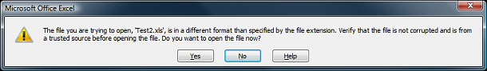

# ExcelML basics


## Overview

**ExcelML** is **XML-based** file format. It complies to the **Microsoft XMLSShttp://msdn.microsoft.com/en-us/library/aa140066(office.10).aspx** specification and is supported in *Microsoft Office 2003* and later. It is different from the rest of the export formats supported by **RadGrid**since its engine builds the output directly from the datasource and not from the page.

>note  **ExcelML** format works best with *advanced data-binding* or *data source control.* You will receive " **NullReferenceException** " if you use *simple data-binding* and ! *IsPostBack* ( *Not IsPostBack* ) check.
>


There are two events, dedicated for the **ExcelML** format: **ExcelMLExportRowCreated** and **ExcelMLExportStylesCreated**.

>caution It is expected to receive the following warning when opening the generated **xls** file in **Microsoft Office 2007** .
> *The file you are trying to open, 'Filename.xls', is in a different format than specified by the file extension. Verify that the file is not corrupted and is from a trusted source before opening this file. Do you want to open the file now?* 
>


The cause of this warning message is explained in details in the following blog posts:

[MSDN blogs: Excel 2007 Extension Warning On Opening Excel Workbook from a Web Site](http://blogs.msdn.com/vsofficedeveloper/pages/Excel-2007-Extension-Warning.aspx)

[Grinn blog: "The file you are trying to open, '[filename]', is in a different format"](http://www.grinn.net/blog/dev/2008/06/file-you-are-trying-to-open-is-in.html)

>caution When exporting *arrays* , *ArrayList* , *custom objects* , *LinqDataSource* you should set **UseAllDataFields="true"** in MasterTableView.
>


>caution It is mandatory to set the **ExportOnlyData** property to true when using **ExcelML** format. Otherwise, an exception will be thrown.
>


>note Due to limitation in the **ExcelML** engine, when exporting **RadGrid** with grouping, all groups will be expanded regardless of their actual state.
>


>note From Q2 2013 **ExcelML** supports exporting of **GridHyperLinkColumn** .It is important to know that when its *DataTextField* property is set, othercolumns bound to the same field are not exported. Also when *Text* property of the **GridHyperLinkColumn** is set and DataField is not defined, columns added to the *DataNavigateUrlFields* are not exported.
>


## ExcelMLRowCreated

This event is handy when the developer wants to modify the structure of the exported table or when assigning styles to grid table elements. It occurs when the **ExcelML** engine creates a new row.

## ExcelMLStylesCreated

**RadGrid** fires this event when creating the build-in styles. It could be used not only for modifying the predefined styles but also to define your own (already assigned to a grid table element on **ExcelMLExportRowCreated**) custom style.

You can access the styles' collection through the **Styles** property (**GridExportExcelMLStyleCreatedArgs)**.

## ExcelMLWorkbookCreated

This event triggers when the XMLSS structure is fully created. It could be useful when you need to traverse that structure or get the whole XML.

## Styles

## Built-in styles

The ID's of the built-in styles are listed below:

* **headerStyle**

* **itemStyle**

* **alternatingItemStyle**

* **dateItemStyle**

* **alternatingDateItemStyle**

The following code-snippet modifies the default **itemStyle**/**alternatingItemStyle**:


````C#
	    protected void RadGrid1_ExcelMLExportStylesCreated(object source, GridExportExcelMLStyleCreatedArgs e)
	    {
	        foreach (StyleElement style in e.Styles)
	        {
	            switch (style.Id)
	            {
	                case "itemStyle":
	                    style.FontStyle.Color = System.Drawing.Color.LightBlue;
	                    break;
	                case "alternatingItemStyle":
	                    style.FontStyle.Color = System.Drawing.Color.Blue;
	                    break;
	            }
	        }
	    }
````
````VB.NET
	
	    Protected Sub RadGrid1_ExcelMLExportStylesCreated(ByVal source As Object, ByVal e As GridExportExcelMLStyleCreatedArgs) Handles RadGrid1.ExcelMLExportStylesCreated
	        For Each style As StyleElement In e.Styles
	            Select Case style.Id
	                Case "itemStyle"
	                    style.FontStyle.Color = System.Drawing.Color.LightBlue
	                    Exit Select
	                Case "alternatingItemStyle"
	                    style.FontStyle.Color = System.Drawing.Color.Blue
	                    Exit Select
	            End Select
	        Next
	    End Sub
````


## Custom styles

In order to define a custom style, you should assign it to the desired element (on **GridExportExcelMLRowCreated**) and then add the style to the collection on **GridExportExcelMLStyleCreated** event.


````C#
	    protected void RadGrid1_ExcelMLExportRowCreated(object source, GridExportExcelMLRowCreatedArgs e)
	    {
	        e.Row.Cells.GetCellByName("Name").StyleValue = "myCustomStyle";
	    }
	    protected void RadGrid1_ExcelMLExportStylesCreated(object source, GridExportExcelMLStyleCreatedArgs e)
	    {
	        StyleElement myStyle = new StyleElement("myCustomStyle");
	        myStyle.NumberFormat.FormatType = NumberFormatType.Currency;
	        myStyle.FontStyle.Bold = true;
	        e.Styles.Add(myStyle);
	    }
````
````VB.NET
	
	    Protected Sub RadGrid1_ExcelMLExportRowCreated(ByVal source As Object, ByVal e As GridExportExcelMLRowCreatedArgs) Handles RadGrid1.ExcelMLExportRowCreated
	        e.Row.Cells.GetCellByName("Name").StyleValue = "myCustomStyle"
	    End Sub
	    Protected Sub RadGrid1_ExcelMLExportStylesCreated(ByVal source As Object, ByVal e As GridExportExcelMLStyleCreatedArgs) Handles RadGrid1.ExcelMLExportStylesCreated
	        Dim myStyle As New StyleElement("myCustomStyle")
	        myStyle.NumberFormat.FormatType = NumberFormatType.Currency
	        myStyle.FontStyle.Bold = True
	        e.Styles.Add(myStyle)
	    End Sub
	
````


## Styling header/footer

You add the symbols from the table below to data of the header / footer elements in order to format them:


| Metadata | Represents |
| ------ | ------ |
|&L|Left-aligned data|
|&R|Right-aligned data|
|&C|Center-aligned data|
|&D|Date|
|&T|Time|
|&P|Page number|
|&N|Number of pages|
|&\0022fontname\,fontstyle\0022&fontsize|Font name, style, and size|
|&B|Bold|
|&I|Italic|


````C#
	    protected void RadGrid1_ExcelMLExportRowCreated(object source, GridExportExcelMLRowCreatedArgs e)
	    {
	        e.Row.Cells.GetCellByName("Name").StyleValue = "myCustomStyle";
	    }
	    protected void RadGrid1_ExcelMLExportStylesCreated(object source, GridExportExcelMLStyleCreatedArgs e)
	    {
	        StyleElement myStyle = new StyleElement("myCustomStyle");
	        myStyle.NumberFormat.FormatType = NumberFormatType.Currency;
	        myStyle.FontStyle.Bold = true;
	        e.Styles.Add(myStyle);
	    }
````
````VB.NET
	
	    Protected Sub RadGrid1_ExcelMLExportRowCreated(ByVal source As Object, ByVal e As GridExportExcelMLRowCreatedArgs) Handles RadGrid1.ExcelMLExportRowCreated
	        e.Row.Cells.GetCellByName("Name").StyleValue = "myCustomStyle"
	    End Sub
	    Protected Sub RadGrid1_ExcelMLExportStylesCreated(ByVal source As Object, ByVal e As GridExportExcelMLStyleCreatedArgs) Handles RadGrid1.ExcelMLExportStylesCreated
	        Dim myStyle As New StyleElement("myCustomStyle")
	        myStyle.NumberFormat.FormatType = NumberFormatType.Currency
	        myStyle.FontStyle.Bold = True
	        e.Styles.Add(myStyle)
	    End Sub
	
````


## StyleElement object

This object contains the whole information about a particular style. Fonts, colors, borders, number formats, cell alignment, etc could be applied by modifying the **StyleElement**.


>caption  

|  **Colors**  |  |
| ------ | ------ |
|Text color|StyleElement.FontStyle.Color|
|Cell background color|StyleElement.InteriorStyle.Color|
|Cell background pattern|StyleElement.InteriorStyle.Pattern|
|Border color|BorderStyles.Border|
|||
| **Alignment** ||
|Horizontal alignment|StyleElement.AlignmentElement.HorizontalAlignment|
|Vertical alignment|StyleElement.AlignmentElement.VerticalAlignment|
|||
| **Fonts** ||
|Bold|StyleElement.FontStyle.Bold|
|Italic|StyleElement.FontStyle.Italic|
|Underline|StyleElement.FontStyle.Underline|
|Font name|StyleElement.FontStyle.FontName|
|Size|StyleElement.FontStyle.Size|
|||
| **Other** ||
|Borders|StyleElement.Borders|
|NumberFormat|StyleElement.NumberFormat|

For more information about the number formats/borders, please visit the following link:

[XML Spreadsheet reference](http://msdn.microsoft.com/en-us/library/aa140066%28office.10%29.aspx)

## Number formats

In addition to the predefined formats,you could add your own custom formats.


````C#
	
	        style.NumberFormat.Attributes["ss:Format"] = "MM/dd";
	
````
````VB.NET
			style.NumberFormat.Attributes("ss:Format") = "MM/dd"
````


## Borders

Each **StyleElement** has a **Borders** property (**BorderStylesCollection**) that contains the definition of each border. Border position should be specified using the **PositionType** enumeration:


>caption  

| 0 | 1 | 2 | 3 | 4 |
| ------ | ------ | ------ | ------ | ------ |
|None|Left|Top|Right|Bottom|


````C#
	    protected void RadGrid1_ExcelMLExportStylesCreated(object source, GridExcelBuilder.GridExportExcelMLStyleCreatedArgs e)
	    {
	        StyleElement cstyle = new StyleElement("MyCustomStyle");
	        BorderStylesCollection borders = new BorderStylesCollection();
	        BorderStyles borderStyle;
	        for (int i = 1; i <= 4; i++) //four borders   
	        {
	            borderStyle = new BorderStyles();
	            borderStyle.PositionType = (PositionType)i;
	            borderStyle.Color = System.Drawing.Color.Black;
	            borderStyle.LineStyle = LineStyle.Continuous;
	            borderStyle.Weight = 1.0;
	            borders.Add(borderStyle);
	        }
	        foreach (BorderStyles border in borders)
	            cstyle.Borders.Add(border);
	        e.Styles.Add(cstyle);
	    }
````
````VB.NET
	
	
	    Protected Sub RadGrid1_ExcelMLExportStylesCreated(ByVal source As Object, ByVal e As GridExportExcelMLStyleCreatedArgs) Handles RadGrid1.ExcelMLExportStylesCreated
	
	        Dim cstyle As New StyleElement("MyCustomStyle")
	        Dim borders As New BorderStylesCollection()
	        Dim borderStyle As BorderStyles
	        For i As Integer = 1 To 4
	            'four borders    
	            borderStyle.PositionType = DirectCast(i, PositionType)
	            borderStyle.Color = System.Drawing.Color.Black
	            borderStyle.LineStyle = LineStyle.Continuous
	            borderStyle.Weight = 1.0R
	            borders.Add(borderStyle)
	        Next
	        For Each border As BorderStyles In borders
	            cstyle.Borders.Add(border)
	        Next
	        e.Styles.Add(cstyle)
	    End Sub
````


## Hiding columns

You can use the **HideStructureColumns** property to hide *GridRowIndicatorColumn*, *GridExpandColumn* and *GridGroupSplitterColumn.* For the other columns types, you can use the following approach:


````C#
	    protected void Button1_Click(object sender, EventArgs e)
	    {
	        RadGrid1.MasterTableView.GetColumn("ColumnName").Visible = false;
	        RadGrid1.MasterTableView.ExportToExcel();
	    }
````
````VB.NET
	    Protected Sub Button1_Click(ByVal sender As Object, ByVal e As EventArgs) Handles Button1.Click
	        RadGrid1.MasterTableView.GetColumn("ColumnName").Visible = False
	        RadGrid1.MasterTableView.ExportToExcel()
	    End Sub
	
````


>note From Q2 2013 we introduced a new propery named **Exportable** . This property allows you tochoose whether a certain column should be included in the exported file or not. By setting this property to **false** the related column will be excluded from the exported file. Its default value is true.
>


## Auto Filter

**ExcelML** is the only excel format which provides build in **auto filter** functionality.To remove the filter controls from the header row set the Range property to empty string.(e.Worksheet.AutoFilter.Range = ""). By setting the range you could move the filter on a different place within the excel sheet.Only the data placed below the filtering dropdown menu will be included in the filter range. (Example: e.Worksheet.AutoFilter.Range = "R4C1: R4C5")

Generally speaking, **R1C1** notation is another way to create cell references which uses numbers for both the rows and columns.R1C1 stands for row index and column index number. This notation is only useful in RadGrid for setting the AutoFilter range.

## Cells Protection

**ExcelML** is one of the excel format which supports cells protection.When you enable the worksheet protection all the cells will be protected as the default state of the cells is “locked”.In order to unlock them you have to create a custom **StyleElement** and set its **IsProtected** property to **false**.Then you could apply this style to the cells which should be unlocked.

The example below demonstrates how you could remove the protection on each second row:


````C#
	    protected void RadGrid1_ExcelMLWorkBookCreated(object sender, Telerik.Web.UI.GridExcelBuilder.GridExcelMLWorkBookCreatedEventArgs e)
	    {
	        e.WorkBook.Worksheets[0].IsProtected = true;
	
	        StyleElement protectionStyle = new StyleElement("ProtectionStyle");
	        protectionStyle.CellProtection.IsProtected = false;
	        e.WorkBook.Styles.Add(protectionStyle);
	
	        foreach (RowElement row in e.WorkBook.Worksheets[0].Table.Rows)
	        {
	            int rowIndex = e.WorkBook.Worksheets[0].Table.Rows.IndexOf(row);
	            //check whether the row is even
	            if (rowIndex % 2 == 0)
	            {
	                //only the cells on the even rows will be unlocked
	                foreach (CellElement cell in row.Cells)
	                {
	                    cell.StyleValue = "ProtectionStyle";
	                }
	            }
	        }
	    }
````
````VB.NET
	    Protected Sub RadGrid1_ExcelMLWorkBookCreated(sender As Object, e As Telerik.Web.UI.GridExcelBuilder.GridExcelMLWorkBookCreatedEventArgs)
	        e.WorkBook.Worksheets(0).IsProtected = True
	
	        Dim protectionStyle As New StyleElement("ProtectionStyle")
	        protectionStyle.CellProtection.IsProtected = False
	        e.WorkBook.Styles.Add(protectionStyle)
	
	        For Each row As RowElement In e.WorkBook.Worksheets(0).Table.Rows
	            Dim rowIndex As Integer = e.WorkBook.Worksheets(0).Table.Rows.IndexOf(row)
	            'check whether the row is even
	            If rowIndex Mod 2 = 0 Then
	                'only the cells on the even rows will be unlocked
	                For Each cell As CellElement In row.Cells
	                    cell.StyleValue = "ProtectionStyle"
	                Next
	            End If
	        Next
	    End Sub
````


## Print option

ExcelML export format provide two print options which allow you to modify the printed output. The first option is **FitHeight**	which specifies the maximum count of the pages in which the content is distributed to. Meaningful when FitToPage is *true*.The second one is **PaperSize** which specifies the paper size in a value from the PaperKind enumeration.

The following code snippet demonstrates how to use them.


````C#
	    protected void grid_ExcelMLWorkBookCreated(object sender, Telerik.Web.UI.GridExcelBuilder.GridExcelMLWorkBookCreatedEventArgs e)
	    {
	        e.WorkBook.Worksheets[0].WorksheetOptions.Print.PaperSize = System.Drawing.Printing.PaperKind.A4;
	        e.WorkBook.Worksheets[0].WorksheetOptions.FitToPage = true;
	        e.WorkBook.Worksheets[0].WorksheetOptions.Print.FitHeight = 1;
	    }
````
````VB.NET
	    Protected Sub grid_ExcelMLWorkBookCreated(sender As Object, e As Telerik.Web.UI.GridExcelBuilder.GridExcelMLWorkBookCreatedEventArgs)
	        e.WorkBook.Worksheets(0).WorksheetOptions.Print.PaperSize = System.Drawing.Printing.PaperKind.A4
	        e.WorkBook.Worksheets(0).WorksheetOptions.FitToPage = True
	        e.WorkBook.Worksheets(0).WorksheetOptions.Print.FitHeight = 1
	    End Sub
````

