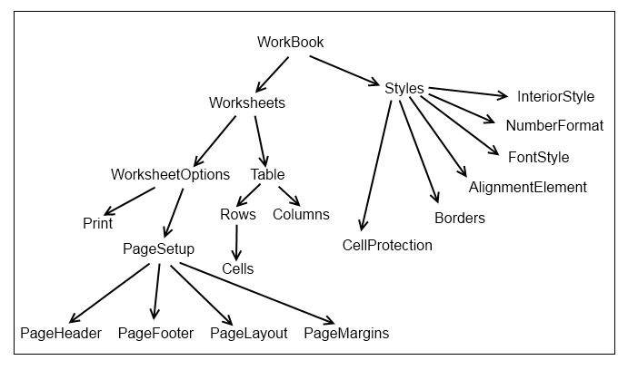

# ExcelML structure / GridExcelBuilder


## Overview

**GridExcelBuilder** is a namespace that unifies the classes, methods and properties used by **RadGrid** to build an **ExcelML** file. The following table shows the structure of the namespace in a hierarchical view.


The **WorkBook** element is not directly accessible when using the built-in export however it can (and should ) be used when using the **GridExcelBuilder** to export manually.

## WorksheetElement

**AutoFilter** - define the range of the **AutoFilter** header. To remove the filter controls from the header row set the **Range** property to empty string. (e.Worksheet.AutoFilter.Range = "").

**IsProtected** - enable/disable the worksheet protection (used in conjunction with the cell protection).

**Name** - the name of the worksheet as displayed in **Microsoft Excel.**

**Table** - this element holds the actual content of the worksheet - **Rows**/**Cells**/**Columns.**

**WorksheetOptions** - defines various Worksheet-related options (for more information - see below).

## TableElement

**Rows** - **RowElement** collection.

**Columns** - **ColumnElement** collection.

## RowElement

**Cells** - **CellElement** collection.

**Hidden** - **True** specifies that this row is hidden. **False** (or omitted) specifies that this row is shown.

**Cells.GetCellByUniqueName** method - accepts a **Column** name as parameter and returns a **CellElement.**

## CellElement

**ColumnName** - the name of the **Column** the **CellElement** belongs to.

**Data** - the **DataElement** represents the content of the current cell.

**HRef** - enables the content of a cell to work as a hyperlink with the specified target:


````C#
protected void RadGrid1_ExcelMLExportRowCreated(object sender, GridExportExcelMLRowCreatedArgs e)
{
    CellElement cell = e.Row.Cells.GetCellByName("ContactName");
    cell.HRef = String.Format("http://www.google.com/search?hl=en&amp;q={0}&amp;btnG=Google+Search", cell.Data.DataItem.ToString());
}
````
````VB
	    Protected Sub RadGrid1_ExcelMLExportRowCreated(sender As Object, e As GridExportExcelMLRowCreatedArgs)
	        Dim cell As CellElement = e.Row.Cells.GetCellByName("ContactName")
	        cell.HRef = [String].Format("http://www.google.com/search?hl=en&amp;q={0}&amp;btnG=Google+Search", cell.Data.DataItem.ToString())
	    End Sub
````


**MergeAcross** - specifies the number of cells to merge across (right in LTR mode).

**MergeDown** - specifies the number of cells to merge down.

**StyleValue** - the **Style ID** of the relevant cell.

## DataElement

**DataItem** - cell contents.

**DataType** - represents the data type bound to the cell. Read-only.


## ColumnElement

**Width** - Specifies the width of a column. This value must be greater than or equal to 0.

**Hidden** - **True** specifies that this column is hidden. **False** (or omitted) specifies that this column is shown.

## WorksheetOptionsElement

**AllowFreezePanes** - enable the**Frozen Panes** functionality.

**LeftColumnRightPaneNumber** - contains the column number of the leftmost visible column in the right pane of a worksheet window.

**FitToPage** - boolean property, which specifies whether all columns should be fitted in a single page when printing or not.

**PageSetup - PageSetupElement** - used to set **Page** -specific options like **orientation**, **margins**, **footer**/**header**, etc.

**SplitHorizontalOffset** - contains the number of points from the top of the window that a worksheet is split horizontally.

**SplitVerticalOffset** - contains the number of points from the left of the window that a worksheet is split vertically.

**TopRowBottomPanelNumber** - contains the row number of the topmost visible row in the bottom pane of a worksheet window.

**Zoom** - specifies the percentage in which the content is zoomed when opening the exported file.

## PrintElement

**FitHeight** - specifies the maximum count of the pages in which the content is distributed to. Meaningful when **FitToPage** is *true*.

**PaperSize** - specifies the paper size in a value from the [PaperKind](http://msdn.microsoft.com/en-us/library/system.drawing.printing.paperkind.aspx) enumeration.

## PageSetupElement

**PageHeaderElement** - represents the **Page Header.**

**PageFooterElement** - represents the **Page Footer.**

**PageLayoutElement** - contains various options to control the page layout.

**PageMarginsElement** - defines the page margins - top, bottom, left, right.

## PageHeaderElement / PageFooterElement

**Data** - the contents of the footer/header.

**Margin** - the margin of the footer/header (in inches; default = 0.5).

## PageLayoutElement

**IsCenteredHorizontal** - you can set this property to **true** to center the page horizontally on the page.

**IsCenteredVertical** - this property determines whether the page is centered vertically on the page.

**PageOrientation** - used to set the page orientation - **Portrait** (default) or **Landscape.**

## PageMarginsElement

**Top** - top margin (in inches; default = 1).

**Bottom** - bottom margin (in inches; default = 1).

**Right** - right margin (in inches; default = 0.75).

**Left** - left margin (in inches; default = 0.75).

## StyleElement

**AlignmentElement** - determines the horizontal/vertical alignment.

**Borders** - represents the cell borders - please go to the [ExcelML export topic]( http://www.telerik.com/help/aspnet-ajax/grid-excelml-export.html ) for more information.

**CellProtection** - the **CellProtectionElement** contains information whether the current cell is protected.

**FontStyle** - **FontStyleElement** - contains the font-related information.

**Id** - the **Style Id**

**InteriorStyle** - background options provided by the **InteriorStyleElement.**

**NumberFormat** - the **NumberFormatStyleElement** is used to set the number format of a given style manually.

## AlignmentStyleElement

**HorizontalAlignment** - determines the horizontal alignment for the current cell.

**VerticalAlignment** - determines the vertical alignment for the current cell.

## CellProtectionElement

**IsProtected** - the cell will be protected (read-only) if this property is set to **true** (default).

## FontStyleElement

**Bold** - sets/gets the relevant font style.

**Color** - contains the font color.

**FontName** - specifies the name of the font (case insensitive).

**Italic** - sets/gets the relevant font style.

**Size** - specifies the font size in points.

**Underline** -sets/gets the relevant font style.

## InteriorStyleElement

**Color** - the interior (background) color.

**Pattern** - determines the fill type for the current cell.

## NumberFormatStyleElement

**FormatType** - used to get/set the number format for the relevant cell. Visit [ExcelML export topic](http://www.telerik.com/help/aspnet-ajax/grid-excelml-export.html) for more information.
