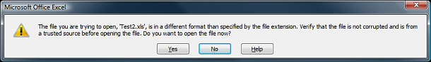

# Excel Format (HTML-Based)


It is expected to receive the following warning when opening the generated __xls__ file in __Microsoft Office 2007__.

*The file you are trying to open, 'Filename.xls', is in a different format than specified by the file extension. Verify that the file is not corrupted and is from a trusted source before opening this file. Do you want to open the file now?*

The cause of this warning message is explained in details in the following blog posts:

[MSDN blogs: Excel 2007 Extension Warning On Opening Excel Workbook from a Web Site](http://blogs.msdn.com/vsofficedeveloper/pages/Excel-2007-Extension-Warning.aspx)

[Grinn blog: "The file you are trying to open, '[filename]', is in a different format"](http://www.grinn.net/blog/dev/2008/06/file-you-are-trying-to-open-is-in.html)

## Using Headers and Footers

Office HTML format supports page headers and footers.	Microsoft Excel makes this data persistent through the use of the __mso-header-data__ and __mso-footer-data__ attributes.Each attribute is a string with metadata identified by the ampersand character(__&__).Below you can find a list of the supported header/footer attributes:


| Metadata | Represents |
| ------ | ------ |
|&L|Left-aligned data|
|&R|Right-aligned data|
|&C|Center-aligned data|
|&D|Date|
|&T|Time|
|&P|Page number|
|&N|Number of pages|
|&\0022fontname\,fontstyle\0022&fontsize|Font name, style, and size|
|&B|Bold|
|&I|Italic|

An example is shown below:

>tabbedCode

````C#
	    protected void RadGrid1_HTMLExporting(object sender, GridHTMLExportingEventArgs e)
	    {
	        string header = @"&CMultiplication Table\000ANumber of Pages &N";
	        string footer = "&LDate\\: &D &RPage &P\000ASignature\\:";
	        e.Styles.AppendFormat("table @page {{ mso-header-data:\"{0}\"; mso-footer-data:\"{1}\"; }}", header, footer);
	    }
	
````
````VB.NET
	
	    Protected Sub RadGrid1_HTMLExporting(sender As Object, e As GridHTMLExportingEventArgs)
	        Dim header As String = "&CMultiplication Table\000ANumber of Pages &N"
	        Dim footer As String = "&LDate\: &D &RPage &P" & vbNullChar & "00ASignature\:"
	        e.Styles.AppendFormat("table @page {{ mso-header-data:""{0}""; mso-footer-data:""{1}""; }}", header, footer)
	    End Sub
	
````
>end

## Number formats / Formulas

__Microsoft Office HTML__ format allows you to define custom number formats by using the __mso-number-format__ style attribute. Several examples are shown below:

>tabbedCode

````C#
	    protected void RadGrid1_ExportCellFormatting(object source, ExcelExportCellFormattingEventArgs e)
	    {
	        switch (e.FormattedColumn.UniqueName)
	        {
	            case "C1":
	                e.Cell.Style["mso-number-format"] = @"\@";
	                break;
	            case "C2":
	                e.Cell.Style["mso-number-format"] = @"$0.00";
	                break;
	            case "C3":
	                e.Cell.Style["mso-number-format"] = @"0000";
	                break;
	            case "C4":
	                e.Cell.Style["mso-number-format"] = @"mm\/dd\/yyyy";
	                break;
	        }
	    }
````
````VB.NET
	
	    Protected Sub RadGrid1_ExportCellFormatting(ByVal source As Object, ByVal e As ExcelExportCellFormattingEventArgs) Handles RadGrid1.ExcelExportCellFormatting
	        Select Case e.FormattedColumn.UniqueName
	            Case "C1"
	                e.Cell.Style("mso-number-format") = "\@"
	                Exit Select
	            Case "C2"
	                e.Cell.Style("mso-number-format") = "$0.00"
	                Exit Select
	            Case "C3"
	                e.Cell.Style("mso-number-format") = "0000"
	                Exit Select
	            Case "C4"
	                e.Cell.Style("mso-number-format") = "mm\/dd\/yyyy"
	                Exit Select
	        End Select
	    End Sub
	
````
>end

You can see some of the most common custom number formats and their description in the following table:


| Format | Description |
| ------ | ------ |
|\@|text|
|"0\.000"|3 decimals|
|\#\,\#\#0\.000|comma separators (and 3 decimals)|
|"mm\/dd\/yy"|Date format|
|"d\\-mmm\\-yyyy"|another date format|
|Percent|percent|

Another interesting feature, supported by the Excel export are the formulas. You can assign the desired formula to a specific cell by applying the __formula__ attribute.

>note The formula attribute is valid in the context of the __Office HTML__ only. You shouldn't apply this attribute unconditionally in order to prevent validation problems.
>


>tabbedCode

````C#
	    protected void RadGrid1_ExportCellFormatting(object source, ExcelExportCellFormattingEventArgs e)
	    {
	        GridDataItem item = e.Cell.Parent as GridDataItem;
	        if (e.FormattedColumn.UniqueName == "C5")
	            e.Cell.Attributes["formula"] = "=E1*2.14";
	        if (e.FormattedColumn.UniqueName == "C1")
	            e.Cell.Attributes["formula"] = String.Format("=SUM(B{0}:D{0})", item.ItemIndex);
	    }
````
````VB.NET
	
	    Protected Sub RadGrid1_ExportCellFormatting(ByVal source As Object, ByVal e As ExcelExportCellFormattingEventArgs) Handles RadGrid1.ExcelExportCellFormatting
	        Dim item As GridDataItem = TryCast(e.Cell.Parent, GridDataItem)
	        If e.FormattedColumn.UniqueName = "C5" Then
	            e.Cell.Attributes("formula") = "=E1*2.14"
	        End If
	        If e.FormattedColumn.UniqueName = "C1" Then
	            e.Cell.Attributes("formula") = [String].Format("=SUM(B{0}:D{0})", item.ItemIndex)
	        End If
	    End Sub
	
````
>end

## XML Options

__XmlOptions__ property allows you to set different options of the exported file.	The XML element contains one or more sub-elements. These include __DocumentProperties__ which is valid for Word and Excel,	__WordDocument__ which can be used when exporting to Word, and finally __ExcelWorkbook__ which applies to Microsoft Excel.

A list of the supported __ExcelWorkbook__ properties is represented below.


| ExcelWorkbook | Represents |
| ------ | ------ |
|<x:HideWorkbookTabs/>|Specifies whether the worksheet tabs in a workbook window are hidden.|
|<x:HideHorizontalScrollBar/>|Specifies whether the horizontal scroll bar in a workbook window is hidden.|
|<x:HideVerticalScrollBar/>|Specifies whether the vertical scroll bar in a workbook window is hidden.|
|<x:WindowHeight> </x:WindowHeight>|Contains a value specifying the height in points of a workbook window.|
|<x:WindowWidth> </x:WindowWidth>|Contains a value in points that specifies the width of a workbook window.|
|<x:WindowTopX> </x:WindowTopX>|Contains a value in points that specifies the horizontal position of a workbook window relative to the left border of the application window.|
|<x:WindowTopY> </x:WindowTopY>|Contains a value in points that specifies the vertical position of a workbook window relative to the top border of the application window.|
|<x:ProtectStructure> </x:ProtectStructure>|This element contains the string constant __True__ if the structure is protected, and the string constant __False__ if the structure is not protected.|
|<x:ProtectWindows> </x:ProtectWindows>|This element contains the string constant __True__ if the windows are protected, and the string constant __False__ if the windows are not protected.|

Example:

>tabbedCode

````C#
	    protected void RadGrid1_HTMLExporting(object sender, GridHTMLExportingEventArgs e)
	    {
	        e.XmlOptions = @"<xml>
	                            <x:ExcelWorkbook> 
	                                <x:WindowHeight>8070</x:WindowHeight>
	                                <x:WindowWidth>13260</x:WindowWidth>
	                                <x:WindowTopX>240</x:WindowTopX>
	                                <x:WindowTopY>75</x:WindowTopY>
	                                <x:ProtectStructure>False</x:ProtectStructure>
	                                <x:ProtectWindows>False</x:ProtectWindows>
	                            </x:ExcelWorkbook>
	                         </xml>";
	    }
````
````VB.NET
	
	    Protected Sub RadGrid1_HTMLExporting(sender As Object, e As GridHTMLExportingEventArgs)
	        e.XmlOptions = "<xml><x:ExcelWorkbook><x:WindowHeight>8070</x:WindowHeight><x:WindowWidth>13260</x:WindowWidth><x:WindowTopX>240</x:WindowTopX><x:WindowTopY>75</x:WindowTopY><x:ProtectStructure>False</x:ProtectStructure><x:ProtectWindows>False</x:ProtectWindows></x:ExcelWorkbook></xml>"
	    End Sub
	
````
>end

__Print element__ contains different print options which allow you to modify the printed output.

A list of the supported __Print__ properties is represented below.


| Print | Represents |
| ------ | ------ |
|<x:ValidPrinterInfo/>|If this property is specified, printer properties contained in the subelements of the Print element are valid for the active printer.|
|<x:PaperSizeIndex>9</x:PaperSizeIndex>|This element contains an integer index to the list of available paper sizes for a printer.|
|<x:DraftQuality/>|Specifies whether a worksheet is printed in draft mode.|
|<x:BlackAndWhite/>|Specifies whether a workbook, worksheet, or embedded chart is printed in black and white.|
|<x:Gridlines/>|Specifies whether gridlines are printed.|
|<x:RowColHeadings/>|Specifies whether row and column headings are printed.|

Example:

>tabbedCode

````C#
	    protected void RadGrid1_HTMLExporting(object sender, Telerik.Web.UI.GridHTMLExportingEventArgs e)
	    {
	        e.XmlOptions = @"<xml>
	                        <x:ExcelWorkbook> 
	                          <x:ExcelWorksheets>
	                            <x:ExcelWorksheet>
	                              <x:WorksheetOptions>
	                                <x:Print>
	                                  <x:ValidPrinterInfo/> 
	                                  <x:PaperSizeIndex>9</x:PaperSizeIndex>
	                                  <x:BlackAndWhite/> 
	                                  <x:DraftQuality/> 
	                                  <x:Gridlines/>
	                                  <x:RowColHeadings/> 
	                                </x:Print>
	                              </x:WorksheetOptions>
	                            </x:ExcelWorksheet>
	                          </x:ExcelWorksheets>
	                        </x:ExcelWorkbook>
	                     </xml>";
	    }
````
````VB.NET
	
	    Protected Sub RadGrid1_HTMLExporting(sender As Object, e As GridHTMLExportingEventArgs)
	        e.XmlOptions = "<xml><x:ExcelWorkbook><x:ExcelWorksheets><x:ExcelWorksheet><x:WorksheetOptions><x:Print><x:ValidPrinterInfo/><x:PaperSizeIndex>9</x:PaperSizeIndex><x:BlackAndWhite/><x:DraftQuality/><x:RowColHeadings/></x:Print></x:WorksheetOptions></x:ExcelWorksheet></x:ExcelWorksheets></x:ExcelWorkbook></xml>"
	    End Sub
	
````
>end

Another useful property is __RowBreak__. This property allows you to set a page breaks of the rows. Generally you can assign as	many __RowBreak__ properties as you need and add them in the __RowBreaks__ collection. The example below demonstrates	how to use them. Note that the __Print__ element should be set as well in order the row breaks to be applied correctly.

>tabbedCode

````C#
	    protected void RadGrid1_HTMLExporting(object sender, Telerik.Web.UI.GridHTMLExportingEventArgs e)
	    {
	        e.XmlOptions = @"<xml>
	                    <x:ExcelWorkbook> 
	                      <x:ExcelWorksheets>
	                        <x:ExcelWorksheet>
	                          <x:WorksheetOptions>
	                            <x:Print>
	                            </x:Print>
	                          </x:WorksheetOptions>
	                          <x:PageBreaks>
	                            <x:RowBreaks>
	                            <x:RowBreak><x:Row>3</x:Row></x:RowBreak>
	                            <x:RowBreak><x:Row>5</x:Row></x:RowBreak>
	                            <x:RowBreak><x:Row>7</x:Row></x:RowBreak>
	                            <x:RowBreak><x:Row>10</x:Row></x:RowBreak>
	                            </x:RowBreaks>
	                          </x:PageBreaks>
	                        </x:ExcelWorksheet>
	                      </x:ExcelWorksheets>
	                    </x:ExcelWorkbook>
	                 </xml>";
	    }
````
````VB.NET
	
	    Protected Sub RadGrid1_HTMLExporting(sender As Object, e As GridHTMLExportingEventArgs)
	        e.XmlOptions = "<xml><x:ExcelWorkbook><x:ExcelWorksheets><x:ExcelWorksheet><x:WorksheetOptions><x:Print></x:Print></x:WorksheetOptions><x:PageBreaks><x:RowBreaks><x:RowBreak><x:Row>3</x:Row></x:RowBreak><x:RowBreak><x:Row>5</x:Row></x:RowBreak><x:RowBreak><x:Row>7</x:Row></x:RowBreak><x:RowBreak><x:Row>10</x:Row></x:RowBreak></x:RowBreaks></x:PageBreaks></x:ExcelWorksheet></x:ExcelWorksheets></x:ExcelWorkbook></xml>"
	    End Sub
	
````
>end
