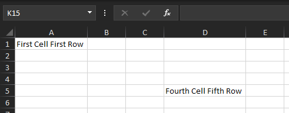
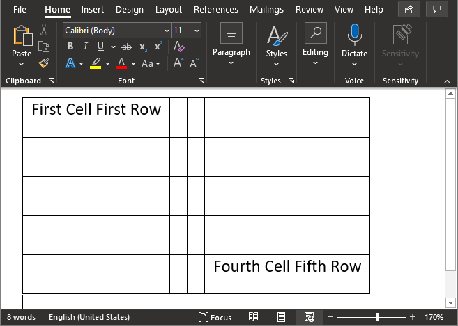
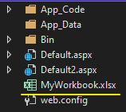

# Integration with Telerik Document Processing Libraries (DPL)

Telerik Document Processing is a bundle of UI-independent cross-platform libraries that enable you to process the most commonly used text, PDF, and spreadsheet file formats. The Document Processing library allows you to create, import, modify and export documents without relying on external dependencies like Adobe Acrobat or Microsoft Office.

For more details about the benefits of using Telerik Document Processing, see the [Telerik Document Processing product overview page](https://www.telerik.com/document-processing-libraries).

The DPL are supported and shipped with the **Telerik® UI for ASP.NET AJAX** suite starting from Q2 2014. More information about the assemblies and how to include them in your project can be found in the [Included assemblies]() help article.

## Create an Excel Document

Required Assemblies for building the Excel Document

   - Telerik.Windows.Documents.Core.dll
   - Telerik.Windows.Documents.Spreadsheet.dll
   - Telerik.Windows.Documents.Spreadsheet.FormatProviders.OpenXml.dll
   - Telerik.Windows.Zip.dll

Using/Imports statement

````C#
using Telerik.Windows.Documents.Spreadsheet.FormatProviders;
using Telerik.Windows.Documents.Spreadsheet.FormatProviders.OpenXml.Xlsx;
using xlsx = Telerik.Windows.Documents.Spreadsheet.Model;
````
````VB
Imports Telerik.Windows.Documents.Spreadsheet.FormatProviders
Imports Telerik.Windows.Documents.Spreadsheet.FormatProviders.OpenXml.Xlsx
Imports xlsx = Telerik.Windows.Documents.Spreadsheet.Model
````

Steps to create a Workbook object, and Write text into Cells

````C#
// Create a Workbook object
xlsx.Workbook myWorkbook = new xlsx.Workbook();

// Create Worksheet object for the Workbook
xlsx.Worksheet myWorksheet = myWorkbook.Worksheets.Add();

// Write a Text to the First Cell of the First Row
// Select the First Cell
int columnIndex = 0; // 1st Cell Index
var rowIndex = 0; // 1st Row Index
xlsx.CellSelection selectedCell = myWorksheet.Cells[rowIndex, columnIndex];

// Set Cell Value
selectedCell.SetValue("First Cell First Row");

// Wite a Text to the 4th Cell in the 5th Row
// Select the Next Cell
columnIndex = 3; // 4th Cell index
rowIndex = 4; // 5th Row Index
selectedCell = myWorksheet.Cells[rowIndex, columnIndex];

// Set Cell Value
selectedCell.SetValue("Fourth Cell Fifth Row");
````
````VB
'Create a Workbook object
Dim myWorkbook As xlsx.Workbook = New xlsx.Workbook()

'Create Worksheet object for the Workbook
Dim myWorksheet As xlsx.Worksheet = myWorkbook.Worksheets.Add()

'Write a Text to the First Cell of the First Row
'Select the First Cell
Dim columnIndex As Integer = 0 '1st Cell Index
Dim rowIndex As Integer = 0 '1st Row Index
Dim selectedCell As xlsx.CellSelection = myWorksheet.Cells(rowIndex, columnIndex)

'Set Cell Value
selectedCell.SetValue("First Cell First Row")

'Wite a Text to the 4th Cell in the 5th Row
'Select the Next Cell
columnIndex = 3
rowIndex = 4
selectedCell = myWorksheet.Cells(rowIndex, columnIndex)

'Set Cell Value
selectedCell.SetValue("Fourth Cell Fifth Row")
````

>caption Result



This was just a very basic example of creating an Excel Document using the DPL. More information about the APIs and examples can be found on the DPL documentation page, see [Telerik Document Processing - SpreadProcessing](https://docs.telerik.com/devtools/document-processing/libraries/radspreadprocessing/overview).

Once done building the Workbook, you can convert it to an Excel Document and save it to the disk or Send it back in the Response for Downloading.

## Create a Word Document

````C#
// Create a FlowDocument
docx.RadFlowDocument flowDocument = new docx.RadFlowDocument();
// Create a Document Section
docx.Section section = flowDocument.Sections.AddSection();
// Insert a Table into the Document Section
docx.Table table = section.Blocks.AddTable();
        
// Create Cell Border Style
docx.Styles.TableCellBorders tableCellBorders = new docx.Styles.TableCellBorders(new docx.Styles.Border(docx.Styles.BorderStyle.Single));

// Loop for creating 5 rows and 4 cells per row
for (int rowIndex = 0; rowIndex < 5; rowIndex++)
{
    // Insert more Rows into the Table
    docx.TableRow row = table.Rows.AddTableRow();

    for (int colIndex = 0; colIndex < 4; colIndex++)
    {
        docx.TableCell cell = row.Cells.AddTableCell();
        // Apply the border style to the Cell
        cell.Borders = tableCellBorders;
    }
}

// First Cell in the First Row
docx.TableCell selectedCell = table.Rows[0].Cells[0];
// Add a Paragraph to the Cell
docx.Paragraph paragraph = selectedCell.Blocks.AddParagraph();
// Set Paragraph value
paragraph.Inlines.AddRun("First Cell First Row");

// Fourth Cell Fifth Row
selectedCell = table.Rows[4].Cells[3];
// Add a Paragraph to the Cell
paragraph = selectedCell.Blocks.AddParagraph();
// Set Paragraph value
paragraph.Inlines.AddRun("Fourth Cell Fifth Row");
````
````VB
````

>caption Result




## Save the Document to Disk

This uses the Workbook object created in the [Create an Excel Document](#create-an-excel-document) section to save it to the Disk.

````C#
// Create an Excel Format Provider which will be used to convert the Workbook to an Excel Document
IWorkbookFormatProvider formatProvider = new XlsxFormatProvider();

// Create a Path including the Filename and Extension
string virtualPath = "~/MyWorkbook.xlsx";

// FileStream only Supports Physical Path, if you used a Virtual Path, Convert it to a Physical Path
string absolutePath = Server.MapPath(virtualPath);

// Use Stream to Create the Excel File
using (Stream output = new FileStream(absolutePath, FileMode.Create))
{
    // Export the Workbook Object to the Excel File
    formatProvider.Export(myWorkbook, output);
}
````
````VB
'Create an Excel Format Provider which will be used to convert the Workbook to an Excel Document
Dim formatProvider As IWorkbookFormatProvider = New XlsxFormatProvider()
'Create a Path including the Filename and Extension
Dim virtualPath As String = "~/MyWorkbook.xlsx"
'FileStream only Supports Physical Path, if you used a Virtual Path, Convert it to a Physical Path
Dim absolutePath As String = Server.MapPath(virtualPath)

'Use Stream to Create the Excel File
Using output As Stream = New FileStream(absolutePath, FileMode.Create)
    'Export the Workbook Object to the Excel File
    formatProvider.Export(myWorkbook, output)
End Using
````

>caption Result




## Download the Document

````C#
// Create an Excel Format Provider which will be used to convert the Workbook to an Excel Document
IWorkbookFormatProvider formatProvider = new XlsxFormatProvider();

using (MemoryStream ms = new MemoryStream())
{
    // Convert Workbook to MemoryStream
    formatProvider.Export(myWorkbook, ms);

    // Convert MemoryStream to Byte array
    byte[] output = ms.ToArray();

    // Clear Previous Response
    Response.Clear();
    // Set the Content (mime) type for Excel XLSX
    Response.ContentType = "application/vnd.openxmlformats-officedocument.spreadsheetml.sheet";

    // Define the FileName
    string fileName = "MyWorkBook.xlsx";

    // Use Content-Disposition: attachment if you want browser to offer the File to Download
    Response.AddHeader("Content-Disposition", "attachment;filename=\"" + fileName + "\"");

    // Use "Content-Disposition: inline" if you want browsers to open the file directly (only works with browsers that have extensions to open this document)
    //Response.AddHeader("Content-Disposition", "inline;filename=\"" + fileName + "\"");

    // Return the Output
    Response.BinaryWrite(output);

    // End the Response
    Response.End();
}
````
````VB
'Create an Excel Format Provider which will be used to convert the Workbook to an Excel Document
Dim formatProvider As IWorkbookFormatProvider = New XlsxFormatProvider()
'
Using ms As MemoryStream = New MemoryStream()
    'Convert Workbook to MemoryStream
    formatProvider.Export(myWorkbook, ms)
    
    'Convert MemoryStream to Byte array
    Dim output As Byte() = ms.ToArray()
    
    'Clear Previous Response
    Response.Clear()
    
    'Set the Content (mime) type for Excel XLSX
    Response.ContentType = "application/vnd.openxmlformats-officedocument.spreadsheetml.sheet"
    
    'Define the FileName
    Dim fileName As String = "MyWorkBook.xlsx"
    
    'Use Content-Disposition: attachment if you want browser to offer the File to Download
    Response.AddHeader("Content-Disposition", "attachment;filename=""" & fileName & """")
    'Use "Content-Disposition: inline" if you want browsers to open the file directly (only works with browsers that have extensions to open this document)
    'Response.AddHeader("Content-Disposition", "inline;filename=""" & fileName & """")
    
    'Return the Output
    Response.BinaryWrite(output)
    
    'End the Response
    Response.[End]()
End Using
````

>caption Result


## Export RadGrid to Excel

In addition to the built-in export functionalities and [Support Export Formats](#supported-formats) the RadGrid can offer, you can also use the DPL APIs to export the Grid to Excel (XLSX) and Word (DOCX) document manually.

Exporting the Grid manually comes handy when trying to create a Document structure that is beyond the built-in functionality.

The following steps walk you through the entire process of Exporting the a simple structure of Grid (headers & rows) to Excel Document manually.

1. Required Assemblies for building the Excel Document:

   - Telerik.Windows.Documents.Core.dll
   - Telerik.Windows.Documents.Spreadsheet.dll
   - Telerik.Windows.Documents.Spreadsheet.FormatProviders.OpenXml.dll
   - Telerik.Windows.Zip.dll

1. Using/Imports statement

    ````C#
    using Telerik.Windows.Documents.Spreadsheet.FormatProviders;
    using Telerik.Windows.Documents.Spreadsheet.FormatProviders.OpenXml.Xlsx;
    using xlsx = Telerik.Windows.Documents.Spreadsheet.Model;
    ````
    ````VB
    Imports Telerik.Windows.Documents.Spreadsheet.FormatProviders
    Imports Telerik.Windows.Documents.Spreadsheet.FormatProviders.OpenXml.Xlsx
    Imports xlsx = Telerik.Windows.Documents.Spreadsheet.Model
    ````

2. Start by creating a **Workbook** object and add a new **Worksheet** object to the **Worksheets** collection.

    ````C#
    xlsx.Workbook workbook = new xlsx.Workbook();
    xlsx.Worksheet worksheet = workbook.Worksheets.Add();
    ````
    ````VB
    Dim workbook As New xlsx.Workbook()
    Dim worksheet As xlsx.Worksheet = workbook.Worksheets.Add()
    ````

3. Create an array of GridItemTypes containing the following GridItemTypes: Header, Item and AlternatingItem.

    ````C#
    GridItemType[] supportedItemTypes = new GridItemType[]   {
        GridItemType.Header,
        GridItemType.AlternatingItem,
        GridItemType.Item
    };
    ````
    ````VB
    Dim supportedItemTypes As GridItemType() = New GridItemType() {GridItemType.Header, GridItemType.AlternatingItem, GridItemType.Item}
    ````

4. Get a Collection of Items that will include the Grid Header and Grid Rows by using the GetItems() method of the Grid MasterTable.

    ````C#
    GridItem[] gridItems = RadGrid1.MasterTableView.GetItems(supportedItemTypes);
    ````
    ````VB
    Dim gridItems As GridItem() = RadGrid1.MasterTableView.GetItems(supportedItemTypes)
    ````


5. Traverse all cells of each item which will be contained in the exported file and assign their text to the appropriate cell of the Excel document.In the following code snippet an enumeration with tree values is created which will help you get the items which need to be exported.

	**C#**
		private GridItemType[] supportedItemTypes = new GridItemType[] 
        { 
            GridItemType.Header, 
            GridItemType.AlternatingItem, 
            GridItemType.Item 
        };
	**VB**
	
		Private supportedItemTypes As GridItemType() = New GridItemType() {GridItemType.Header, GridItemType.AlternatingItem, GridItemType.Item}

	**C#**
	
		foreach (GridItem item in RadGrid1.MasterTableView.GetItems(supportedItemTypes))
		{
		    int currentColumn = 0;
		    foreach (System.Web.UI.WebControls.TableCell cell in item.Cells)
		    {
		        if (!cell.Visible)
		            continue;
		
		        worksheet.Cells[currentRow, currentColumn].SetValue(cell.Text);
		        currentColumn++;
		    }
		    currentRow++;
	}

	**VB**

		For Each item As GridItem In RadGrid1.MasterTableView.GetItems(supportedItemTypes)
		Dim currentColumn As Integer = 0
		    For Each cell As System.Web.UI.WebControls.TableCell In item.Cells
			    If Not cell.Visible Then
				    Continue For
			    End If
		
			    worksheet.Cells(currentRow, currentColumn).SetValue(cell.Text)
			    currentColumn += 1
		    Next
		    currentRow += 1
		Next


3. After the worksheet is populated with data an instance of the **XlsxFormatProvider** is created and by calling its **Export** method a file is generated on the server.


````C#
string excelFile = Server.MapPath("~/ExcelFile.xlsx");
using (FileStream fs = new FileStream(excelFile, FileMode.Create))
{
    XlsxFormatProvider provider = new XlsxFormatProvider();
    provider.Export(worksheet.Workbook, fs);
}
````
````VB
Dim excelFile As String = Server.MapPath("~/ExcelFile.xlsx")
Using fs As New FileStream(excelFile, FileMode.Create)
Dim provider As New XlsxFormatProvider()
    provider.Export(worksheet.Workbook, fs)
End Using
````


After following these steps you will get the following example that presents exporting on button click.


````ASP.NET
<telerik:RadScriptManager ID="RadScriptManager2" runat="server">  
</telerik:RadScriptManager>
<asp:Button Text="Export to excel" ID="ExportToExcel" OnClick="ExportToExcel_Click" runat="server" />
<telerik:RadGrid RenderMode="Lightweight" ID="RadGrid1" runat="server" OnNeedDataSource="RadGrid1_NeedDataSource" AutoGenerateColumns="false">
    <MasterTableView CommandItemDisplay="Top">
        <Columns>
            <telerik:GridBoundColumn DataField="ID" HeaderText="ID"></telerik:GridBoundColumn>
            <telerik:GridBoundColumn DataField="ContactName" HeaderText="Contact Name"></telerik:GridBoundColumn>
            <telerik:GridBoundColumn DataField="CompanyName" HeaderText="Company Name"></telerik:GridBoundColumn>
        </Columns> 
    </MasterTableView>
</telerik:RadGrid>
````
````C#
private GridItemType[] supportedItemTypes = new GridItemType[] 
    { 
        GridItemType.Header, 
        GridItemType.AlternatingItem, 
        GridItemType.Item 
    };

protected void RadGrid1_NeedDataSource(object sender, Telerik.Web.UI.GridNeedDataSourceEventArgs e)
{
    RadGrid1.DataSource = GeneratingTable();
}
private DataTable GeneratingTable()
{
    DataTable table = new DataTable();
    table.Columns.Add("ID");
    table.Columns.Add("ContactName");
    table.Columns.Add("CompanyName");


    table.Rows.Add(1, "Alejandra Camino", "Romero y tomillo");
    table.Rows.Add(2, "Alexander Feuer", "Morgenstern Gesundkost");
    table.Rows.Add(3, "Ana Trujillo", "Ana Trujillo Emparedados y helados");
    table.Rows.Add(4, "Anabela Domingues", "Tradicao Hipermercados");
    table.Rows.Add(5, "Andre Fonseca", "Gourmet Lanchonetes");

    return table;
}
protected void ExportToExcel_Click(object sender, EventArgs e)
{
    Workbook workbook = new Workbook();
    Worksheet worksheet = workbook.Worksheets.Add();

    int currentRow = 0;
    foreach (GridItem item in RadGrid1.MasterTableView.GetItems(supportedItemTypes))
    {
        int currentColumn = 0;
        foreach (System.Web.UI.WebControls.TableCell cell in item.Cells)
        {
            if (!cell.Visible)
                continue;

            worksheet.Cells[currentRow, currentColumn].SetValue(cell.Text);
            currentColumn++;
        }
        currentRow++;
    }
    string excelFile = Server.MapPath("~/ExcelFile.xlsx");
    using (FileStream fs = new FileStream(excelFile, FileMode.Create))
    {
        XlsxFormatProvider provider = new XlsxFormatProvider();
        provider.Export(worksheet.Workbook, fs);
    }
}
````
````VB
Private supportedItemTypes As GridItemType() = New GridItemType() {GridItemType.Header, GridItemType.AlternatingItem, GridItemType.Item}

Protected Sub RadGrid1_NeedDataSource(sender As Object, e As Telerik.Web.UI.GridNeedDataSourceEventArgs)
    RadGrid1.DataSource = GeneratingTable()
End Sub
Private Function GeneratingTable() As DataTable
    Dim table As New DataTable()
    table.Columns.Add("ID")
    table.Columns.Add("ContactName")
    table.Columns.Add("CompanyName")


    table.Rows.Add(1, "Alejandra Camino", "Romero y tomillo")
    table.Rows.Add(2, "Alexander Feuer", "Morgenstern Gesundkost")
    table.Rows.Add(3, "Ana Trujillo", "Ana Trujillo Emparedados y helados")
    table.Rows.Add(4, "Anabela Domingues", "Tradicao Hipermercados")
    table.Rows.Add(5, "Andre Fonseca", "Gourmet Lanchonetes")

    Return table
End Function
Protected Sub ExportToExcel_Click(sender As Object, e As EventArgs)
    Dim workbook As New Workbook()
    Dim worksheet As Worksheet = workbook.Worksheets.Add()

    Dim currentRow As Integer = 0
    For Each item As GridItem In RadGrid1.MasterTableView.GetItems(supportedItemTypes)
        Dim currentColumn As Integer = 0
        For Each cell As System.Web.UI.WebControls.TableCell In item.Cells
            If Not cell.Visible Then
                Continue For
            End If

            worksheet.Cells(currentRow, currentColumn).SetValue(cell.Text)
            currentColumn += 1
        Next
        currentRow += 1
    Next
    Dim excelFile As String = Server.MapPath("~/ExcelFile.xlsx")
    Using fs As New FileStream(excelFile, FileMode.Create)
        Dim provider As New XlsxFormatProvider()
        provider.Export(worksheet.Workbook, fs)
    End Using
End Sub
````

>note As of R1 2021, the MasterTableView's `GenerateXlsxOutput()` method can return an already populated Workbook. It is perfect for a scenario where you need to populate the data to a preformatted template Xlsx file. More information can be found in [Xlsx and Docx export - Generate Export Output](https://docs.telerik.com/devtools/aspnet-ajax/controls/grid/functionality/exporting/excel-export/excel-xlsx#generate-export-output) article and the [Export Grid to a Preformatted Template file](https://demos.telerik.com/aspnet-ajax/grid/Examples/Functionality/Exporting/Excel-Export-To-Template-File/DefaultCS.aspx) online demo.


## Export RadGrid to Word

The assemblies that must be referenced in order to export the RadGrid are:

* Telerik.Windows.Documents.Core.dll

* Telerik.Windows.Documents.Flow.dll

* Telerik.Windows.Zip.dll

The following steps walk you through the entire process of creating an Word document and then export it to the server.

1. Create an instance of the **RadFlowDocument** class and add a new **Section** object to the **Sections** collection. After the section is created a new **Table** object is added to it.


	**C#**
	
		RadFlowDocument flowDoc = new RadFlowDocument();
		Section section = flowDoc.Sections.AddSection();
		Table table = section.Blocks.AddTable();
		
	**VB**
	
		Dim flowDoc As New RadFlowDocument()
		Dim section As Section = flowDoc.Sections.AddSection()
		Dim table As Table = section.Blocks.AddTable()


2. Traverse all cells of each item which will be contained in the exported file and assign their text to the appropriate cell of the created Word table.In the following code snippet an enumeration with tree values is created which will help you get the items which need to be exported.

	**C#**
	
		private GridItemType[] supportedItemTypes = new GridItemType[] 
		    { 
		        GridItemType.Header, 
		        GridItemType.AlternatingItem, 
		        GridItemType.Item 
		    };
		
	**VB**
	
		Private supportedItemTypes As GridItemType() = New GridItemType() {GridItemType.Header, GridItemType.AlternatingItem, GridItemType.Item}
		
		
	
	
	**C#**

		foreach (GridItem item in RadGrid1.MasterTableView.GetItems(supportedItemTypes))
		    {
		        Telerik.Windows.Documents.Flow.Model.TableRow wordRow = null;
		        wordRow = table.Rows.AddTableRow();
		        foreach (System.Web.UI.WebControls.TableCell cell in item.Cells)
		        {
		            if (!cell.Visible)
		                continue;
		
		            Telerik.Windows.Documents.Flow.Model.TableCell wordCell = wordRow.Cells.AddTableCell();
		            Paragraph paragraph = wordCell.Blocks.AddParagraph();
		            paragraph.Inlines.AddRun(cell.Text);
		        }
		    }
	
	**VB**
	
		For Each item As GridItem In RadGrid1.MasterTableView.GetItems(supportedItemTypes)
		Dim wordRow As Telerik.Windows.Documents.Flow.Model.TableRow = Nothing
		    wordRow = table.Rows.AddTableRow()
		    For Each cell As System.Web.UI.WebControls.TableCell In item.Cells
			    If Not cell.Visible Then
				    Continue For
			    End If
		
		Dim wordCell As Telerik.Windows.Documents.Flow.Model.TableCell = wordRow.Cells.AddTableCell()
		Dim paragraph As Paragraph = wordCell.Blocks.AddParagraph()
			    paragraph.Inlines.AddRun(cell.Text)
		    Next
		Next


3. After the worksheet is populated with data an instance of the **DocxFormatProvider** is created and by calling its **Export** method a file is generated on the server.


````C#
string wordFile = Server.MapPath("~/WordFile.docx");
using (FileStream fs = new FileStream(wordFile, FileMode.Create))
{
    DocxFormatProvider provider = new DocxFormatProvider();
    provider.Export(table.Document, fs);
}
````
````VB
Dim wordFile As String = Server.MapPath("~/WordFile.docx")
Using fs As New FileStream(wordFile, FileMode.Create)
Dim provider As New DocxFormatProvider()
    provider.Export(table.Document, fs)
End Using
````


After following these steps you will get the following example that presents exporting on button click.


````ASP.NET
<telerik:RadScriptManager ID="RadScriptManager3" runat="server">  
</telerik:RadScriptManager>
<asp:Button Text="Export to word" ID="Button1" OnClick="ExportToWord_Click" runat="server" />
<telerik:RadGrid RenderMode="Lightweight" ID="RadGrid2" runat="server" OnNeedDataSource="RadGrid1_NeedDataSource" AutoGenerateColumns="false">
    <MasterTableView CommandItemDisplay="Top">
        <Columns>
            <telerik:GridBoundColumn DataField="ID" HeaderText="ID"></telerik:GridBoundColumn>
            <telerik:GridBoundColumn DataField="ContactName" HeaderText="Contact Name"></telerik:GridBoundColumn>
            <telerik:GridBoundColumn DataField="CompanyName" HeaderText="Company Name"></telerik:GridBoundColumn>
        </Columns> 
    </MasterTableView>
</telerik:RadGrid>
````
````C#
private GridItemType[] supportedItemTypes = new GridItemType[] 
{ 
    GridItemType.Header, 
    GridItemType.AlternatingItem, 
    GridItemType.Item 
};

protected void RadGrid1_NeedDataSource(object sender, Telerik.Web.UI.GridNeedDataSourceEventArgs e)
{
    RadGrid1.DataSource = GeneratingTable();
}
private DataTable GeneratingTable()
{
    DataTable table = new DataTable();
    table.Columns.Add("ID");
    table.Columns.Add("ContactName");
    table.Columns.Add("CompanyName");


    table.Rows.Add(1, "Alejandra Camino", "Romero y tomillo");
    table.Rows.Add(2, "Alexander Feuer", "Morgenstern Gesundkost");
    table.Rows.Add(3, "Ana Trujillo", "Ana Trujillo Emparedados y helados");
    table.Rows.Add(4, "Anabela Domingues", "Tradicao Hipermercados");
    table.Rows.Add(5, "Andre Fonseca", "Gourmet Lanchonetes");

    return table;
}
protected void ExportToWord_Click(object sender, EventArgs e)
{
    RadFlowDocument flowDoc = new RadFlowDocument();
    Section section = flowDoc.Sections.AddSection();
    Telerik.Windows.Documents.Flow.Model.Table table = section.Blocks.AddTable();

    foreach (GridItem item in RadGrid1.MasterTableView.GetItems(supportedItemTypes))
    {
        Telerik.Windows.Documents.Flow.Model.TableRow wordRow = null;
        wordRow = table.Rows.AddTableRow();
        foreach (System.Web.UI.WebControls.TableCell cell in item.Cells)
        {
            if (!cell.Visible)
                continue;

            Telerik.Windows.Documents.Flow.Model.TableCell wordCell = wordRow.Cells.AddTableCell();
            Paragraph paragraph = wordCell.Blocks.AddParagraph();
            paragraph.Inlines.AddRun(cell.Text);
        }
    }
    string wordFile = Server.MapPath("~/WordFile.docx");
    using (FileStream fs = new FileStream(wordFile, FileMode.Create))
    {
        DocxFormatProvider provider = new DocxFormatProvider();
        provider.Export(table.Document, fs);
    }
}
````
````VB
Private supportedItemTypes As GridItemType() = New GridItemType() {GridItemType.Header, GridItemType.AlternatingItem, GridItemType.Item}

Protected Sub RadGrid1_NeedDataSource(sender As Object, e As Telerik.Web.UI.GridNeedDataSourceEventArgs)
    RadGrid1.DataSource = GeneratingTable()
End Sub
Private Function GeneratingTable() As DataTable
    Dim table As New DataTable()
    table.Columns.Add("ID")
    table.Columns.Add("ContactName")
    table.Columns.Add("CompanyName")


    table.Rows.Add(1, "Alejandra Camino", "Romero y tomillo")
    table.Rows.Add(2, "Alexander Feuer", "Morgenstern Gesundkost")
    table.Rows.Add(3, "Ana Trujillo", "Ana Trujillo Emparedados y helados")
    table.Rows.Add(4, "Anabela Domingues", "Tradicao Hipermercados")
    table.Rows.Add(5, "Andre Fonseca", "Gourmet Lanchonetes")

    Return table
End Function
Protected Sub ExportToWord_Click(sender As Object, e As EventArgs)
    Dim flowDoc As New RadFlowDocument()
    Dim section As Section = flowDoc.Sections.AddSection()
    Dim table As Telerik.Windows.Documents.Flow.Model.Table = section.Blocks.AddTable()

    For Each item As GridItem In RadGrid1.MasterTableView.GetItems(supportedItemTypes)
        Dim wordRow As Telerik.Windows.Documents.Flow.Model.TableRow = Nothing
        wordRow = table.Rows.AddTableRow()
        For Each cell As System.Web.UI.WebControls.TableCell In item.Cells
            If Not cell.Visible Then
                Continue For
            End If

            Dim wordCell As Telerik.Windows.Documents.Flow.Model.TableCell = wordRow.Cells.AddTableCell()
            Dim paragraph As Paragraph = wordCell.Blocks.AddParagraph()
            paragraph.Inlines.AddRun(cell.Text)
        Next
    Next
    Dim wordFile As String = Server.MapPath("~/WordFile.docx")
    Using fs As New FileStream(wordFile, FileMode.Create)
        Dim provider As New DocxFormatProvider()
        provider.Export(table.Document, fs)
    End Using
End Sub
````


## See Also

 * [Included assemblies](https://www.telerik.com/help/aspnet-ajax/introduction-included-assemblies.html)
