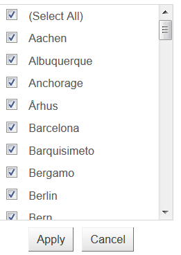

# CheckList Filtering


## CheckList Filtering

Apart from the default filtering that RadGrid supports, since Q3 2013 there is a support for filtering based on multiple selected values from a list. In order to enable this type of filtering you should set the **FilterType** property of RadGrid to either **CheckList** or **Combined**.

>note Note that the **CheckList filtering** functionality works properly only for filterable type of columns or in other words such that implements the **IGridDataColumn** interface.In short the functionality columns ( **Expand** , **RowIndicator** , **Button** , **EditCommand** , **DragDrop** , and **Splitter** ) are not implementing this interface; therefore they could not be filtered.
>


In this mode when you click the filter menu icon a ListBox control with predefined values is displayed:


When you set the **FilterType** property to **Combined** mode the best from both worlds is available:

>note Please note that filtering functionality is not supported when using simple	databinding(calling DataBind() method of RadGrid).
>


To specify what values will be displayed in the ListBox control you need to define its	datasource. You could implement this using two approaches:

1. Using the newly exposed “**RadGrid1_FilterCheckListItemsRequested**” event. This way the ListBox control rendered in the filter template will be automatically populated. (See Ex.1)**Ex.1**


````ASPNET
<telerik:RadGrid ID="RadGrid1" AllowFilteringByColumn="True" runat="server" FilterType="Combined"
    AllowPaging="True" OnFilterCheckListItemsRequested="RadGrid1_FilterCheckListItemsRequested"
    DataSourceID="SqlDataSource1">
    <CommandItemStyle />
    <MasterTableView DataSourceID="SqlDataSource1" AutoGenerateColumns="False" DataKeyNames="CustomerID">
        <Columns>
            <telerik:GridBoundColumn DataField="CustomerID" FilterCheckListEnableLoadOnDemand="false"
                FilterControlAltText="Filter CustomerID column" HeaderText="CustomerID" ReadOnly="True"
                SortExpression="CustomerID" UniqueName="CustomerID">
            </telerik:GridBoundColumn>
            <telerik:GridBoundColumn DataField="ContactName" FilterCheckListEnableLoadOnDemand="false"
                FilterControlAltText="Filter ContactName column" HeaderText="ContactName" SortExpression="ContactName"
                UniqueName="ContactName">
            </telerik:GridBoundColumn>
            <telerik:GridBoundColumn FilterCheckListEnableLoadOnDemand="true" DataField="City"
                FilterControlAltText="Filter City column" HeaderText="City" SortExpression="City"
                UniqueName="City">
            </telerik:GridBoundColumn>
            <telerik:GridBoundColumn FilterCheckListEnableLoadOnDemand="true" DataField="Country"
                FilterControlAltText="Filter Country column" HeaderText="Country" SortExpression="Country"
                UniqueName="Country">
            </telerik:GridBoundColumn>
        </Columns>
    </MasterTableView>
    <FilterMenu CssClass="RadFilterMenu_CheckList">
    </FilterMenu>
</telerik:RadGrid>
<asp:SqlDataSource ID="SqlDataSource1" runat="server" ConnectionString="<%$ ConnectionStrings:NorthwindConnectionString %>"
    SelectCommand="SELECT * FROM [Customers]"></asp:SqlDataSource>
````
````C#
protected void RadGrid1_FilterCheckListItemsRequested(object sender, GridFilterCheckListItemsRequestedEventArgs e)
{
    string DataField = (e.Column as IGridDataColumn).GetActiveDataField();
    e.ListBox.DataSource = GetDataTable(DataField);
    e.ListBox.DataKeyField = DataField;
    e.ListBox.DataTextField = DataField;
    e.ListBox.DataValueField = DataField;
    e.ListBox.DataBind();
}

public DataTable GetDataTable(string field)
{
    string query = string.Format("SELECT DISTINCT {0} FROM Customers", field);

    String ConnString = ConfigurationManager.ConnectionStrings["NorthwindConnectionString"].ConnectionString;
    SqlConnection conn = new SqlConnection(ConnString);
    SqlDataAdapter adapter = new SqlDataAdapter();
    adapter.SelectCommand = new SqlCommand(query, conn);

    DataTable myDataTable = new DataTable();

    conn.Open();
    try
    {
        adapter.Fill(myDataTable);
    }
    finally
    {
        conn.Close();
    }

    return myDataTable;
}
````
````VB.NET
Protected Sub RadGrid1_FilterCheckListItemsRequested(sender As Object, e As GridFilterCheckListItemsRequestedEventArgs)
    Dim DataField As String = TryCast(e.Column, IGridDataColumn).GetActiveDataField()
    e.ListBox.DataSource = GetDataTable(DataField)
    e.ListBox.DataKeyField = DataField
    e.ListBox.DataTextField = DataField
    e.ListBox.DataValueField = DataField
    e.ListBox.DataBind()
End Sub

Public Function GetDataTable(field As String) As DataTable
    Dim query As String = String.Format("SELECT DISTINCT {0} FROM Customers", field)

    Dim ConnString As [String] = ConfigurationManager.ConnectionStrings("NorthwindConnectionString").ConnectionString
    Dim conn As New SqlConnection(ConnString)
    Dim adapter As New SqlDataAdapter()
    adapter.SelectCommand = New SqlCommand(query, conn)

    Dim myDataTable As New DataTable()

    conn.Open()
    Try
        adapter.Fill(myDataTable)
    Finally
        conn.Close()
    End Try

    Return myDataTable
End Function
````


1. By providing a path to a **web service** which will provide the data.You specify the path using the **CheckListWebServicePath** property of RadGrid.	Beside that you may need to set the name of the method that will provide the actual data	to the ListBox control using the **FilterCheckListWebServiceMethod** property if	you have more than one method defined in your web service.(See Ex.2)**Ex.2**


````ASPNET
<telerik:RadGrid runat="server" ID="RadGrid2" AllowFilteringByColumn="true" FilterType="CheckList"
    AllowPaging="true" PagerStyle-AlwaysVisible="true" AllowSorting="true">
    <MasterTableView AutoGenerateColumns="False" CheckListWebServicePath="NorthwindCustomersWcfService.svc"
        DataKeyNames="CustomerID" ClientDataKeyNames="CustomerID">
        <Columns>
            <telerik:GridBoundColumn FilterDelay="200" ShowFilterIcon="false" DataField="CompanyName"
                HeaderText="Company Name">
            </telerik:GridBoundColumn>
            <telerik:GridBoundColumn FilterDelay="200" FilterCheckListWebServiceMethod="LoadCities"
                DataField="City" HeaderText="City">
            </telerik:GridBoundColumn>
            <telerik:GridTemplateColumn FilterDelay="200" FilterCheckListWebServiceMethod="LoadCountries"
                DataField="Country" HeaderText="Country">
                <clientitemtemplate>
                    #= Country #
                </clientitemtemplate>
            </telerik:GridTemplateColumn>
            <telerik:GridBoundColumn FilterDelay="200" FilterCheckListWebServiceMethod="LoadContactTitles"
                DataField="ContactTitle" HeaderText="Contact Title">
            </telerik:GridBoundColumn>
            <telerik:GridBoundColumn FilterDelay="200" ShowFilterIcon="false" DataField="ContactName"
                HeaderText="Contact Name">
            </telerik:GridBoundColumn>
            <telerik:GridBoundColumn FilterDelay="200" ShowFilterIcon="false" FilterCheckListWebServiceMethod="LoadPhones"
                DataField="Phone" HeaderText="Phone">
            </telerik:GridBoundColumn>
        </Columns>
    </MasterTableView>
    <ClientSettings>
        <DataBinding Location="NorthwindCustomersWcfService.svc" SelectMethod="GetDataAndCount"
            SortParameterType="Linq" FilterParameterType="Linq">
        </DataBinding>
    </ClientSettings>
</telerik:RadGrid>
<asp:SqlDataSource ID="SqlDataSource2" ConnectionString="<%$ ConnectionStrings:NorthwindConnectionString %>"
    ProviderName="System.Data.SqlClient" SelectCommand="SELECT * FROM Orders" runat="server">
</asp:SqlDataSource>
````
````C#
[ServiceKnownType(typeof(Customer))]
[ServiceContract(Namespace = "")]
[AspNetCompatibilityRequirements(RequirementsMode = AspNetCompatibilityRequirementsMode.Allowed)]
public class NorthwindCustomersWcfService
{
    [OperationContract]
    public RadListBoxItemData[] LoadContactNames(Dictionary<string, object> context)
    {
        NorthwindReadOnlyDataContext northwind = new NorthwindReadOnlyDataContext();
        var allCustomers = (from customer in northwind.Customers
                            orderby customer.ContactName
                            select new RadListBoxItemData
                            {
                                Text = customer.ContactName
                            }).Distinct();

        return allCustomers.ToArray<RadListBoxItemData>();
    }
    [OperationContract]
    public RadListBoxItemData[] LoadCompanyNames(Dictionary<string, object> context)
    {
        NorthwindReadOnlyDataContext northwind = new NorthwindReadOnlyDataContext();
        var allCustomers = (from customer in northwind.Customers
                            orderby customer.CompanyName
                            select new RadListBoxItemData
                            {
                                Text = customer.CompanyName
                            }).Distinct();

        return allCustomers.ToArray<RadListBoxItemData>();
    }
    [OperationContract]
    public RadListBoxItemData[] LoadContactTitles(Dictionary<string, object> context)
    {
        NorthwindReadOnlyDataContext northwind = new NorthwindReadOnlyDataContext();
        var allCustomers = (from customer in northwind.Customers
                            orderby customer.ContactTitle
                            select new RadListBoxItemData
                            {
                                Text = customer.ContactTitle
                            }).Distinct();


        return allCustomers.ToArray<RadListBoxItemData>();
    }
    [OperationContract]
    public RadListBoxItemData[] LoadCities(Dictionary<string, object> context)
    {
        NorthwindReadOnlyDataContext northwind = new NorthwindReadOnlyDataContext();
        var allCustomers = (from customer in northwind.Customers
                            orderby customer.City
                            select new RadListBoxItemData
                            {
                                Text = customer.City
                            }).Distinct();

        return allCustomers.ToArray<RadListBoxItemData>();
    }
    [OperationContract]
    public RadListBoxItemData[] LoadCountries(Dictionary<string, object> context)
    {
        NorthwindReadOnlyDataContext northwind = new NorthwindReadOnlyDataContext();
        var allCustomers = (from customer in northwind.Customers
                            orderby customer.Country
                            select new RadListBoxItemData
                            {
                                Text = customer.Country
                            }).Distinct();

        return allCustomers.ToArray<RadListBoxItemData>();
    }
    [OperationContract]
    public RadListBoxItemData[] LoadPhones(Dictionary<string, object> context)
    {
        NorthwindReadOnlyDataContext northwind = new NorthwindReadOnlyDataContext();
        var allCustomers = (from customer in northwind.Customers
                            orderby customer.Phone
                            select new RadListBoxItemData
                            {
                                Text = customer.Phone
                            }).Distinct();

        return allCustomers.ToArray<RadListBoxItemData>();
    }

    [OperationContract]
    public ResultData GetDataAndCount(int startRowIndex, int maximumRows, string sortExpression, string filterExpression)
    {
        GridBindingData data = RadGrid.GetBindingData("LinqToSqlReadOnly.NorthwindReadOnlyDataContext", "Customers", startRowIndex, maximumRows, sortExpression, filterExpression);

        ResultData result = new ResultData();
        result.Data = data.Data.OfType<LinqToSqlReadOnly.Customer>().Select(c => new Customer()
                  {
                      CustomerID = c.CustomerID,
                      CompanyName = c.CompanyName,
                      ContactName = c.ContactName,
                      ContactTitle = c.ContactTitle,
                      City = c.City,
                      Country = c.Country,
                      Phone = c.Phone
                  }).ToList();
        result.Count = data.Count;
        return result;
    }

    public class ResultData
    {
        public int Count { get; set; }
        public List<Customer> Data { get; set; }
    }

    [DataContract]
    public class Customer
    {
        [DataMember]
        public string CustomerID { get; set; }
        [DataMember]
        public string CompanyName { get; set; }
        [DataMember]
        public string ContactName { get; set; }
        [DataMember]
        public string ContactTitle { get; set; }
        [DataMember]
        public string City { get; set; }
        [DataMember]
        public string Country { get; set; }
        [DataMember]
        public string Phone { get; set; }
    }
}
````
````VB.NET
<ServiceKnownType(GetType(Customer))> _
<ServiceContract([Namespace]:="")> _
<AspNetCompatibilityRequirements(RequirementsMode:=AspNetCompatibilityRequirementsMode.Allowed)> _
Public Class NorthwindCustomersWcfService
    <OperationContract()> _
    Public Function LoadContactNames(context As Dictionary(Of String, Object)) As RadListBoxItemData()
        Dim northwind As New NorthwindReadOnlyDataContext()
	Dim allCustomers = (From customer In northwind.CustomersOrder By customer.ContactNameNew RadListBoxItemData() With { _
		Key .Text = customer.ContactName _
	}).Distinct()

        Return allCustomers.ToArray(Of RadListBoxItemData)()
    End Function
    <OperationContract()> _
    Public Function LoadCompanyNames(context As Dictionary(Of String, Object)) As RadListBoxItemData()
        Dim northwind As New NorthwindReadOnlyDataContext()
	Dim allCustomers = (From customer In northwind.CustomersOrder By customer.CompanyNameNew RadListBoxItemData() With { _
		Key .Text = customer.CompanyName _
	}).Distinct()

        Return allCustomers.ToArray(Of RadListBoxItemData)()
    End Function
    <OperationContract()> _
    Public Function LoadContactTitles(context As Dictionary(Of String, Object)) As RadListBoxItemData()
        Dim northwind As New NorthwindReadOnlyDataContext()
	Dim allCustomers = (From customer In northwind.CustomersOrder By customer.ContactTitleNew RadListBoxItemData() With { _
		Key .Text = customer.ContactTitle _
	}).Distinct()


        Return allCustomers.ToArray(Of RadListBoxItemData)()
    End Function
    <OperationContract()> _
    Public Function LoadCities(context As Dictionary(Of String, Object)) As RadListBoxItemData()
        Dim northwind As New NorthwindReadOnlyDataContext()
	Dim allCustomers = (From customer In northwind.CustomersOrder By customer.CityNew RadListBoxItemData() With { _
		Key .Text = customer.City _
	}).Distinct()

        Return allCustomers.ToArray(Of RadListBoxItemData)()
    End Function
    <OperationContract()> _
    Public Function LoadCountries(context As Dictionary(Of String, Object)) As RadListBoxItemData()
        Dim northwind As New NorthwindReadOnlyDataContext()
	Dim allCustomers = (From customer In northwind.CustomersOrder By customer.CountryNew RadListBoxItemData() With { _
		Key .Text = customer.Country _
	}).Distinct()

        Return allCustomers.ToArray(Of RadListBoxItemData)()
    End Function
    <OperationContract()> _
    Public Function LoadPhones(context As Dictionary(Of String, Object)) As RadListBoxItemData()
        Dim northwind As New NorthwindReadOnlyDataContext()
	Dim allCustomers = (From customer In northwind.CustomersOrder By customer.PhoneNew RadListBoxItemData() With { _
		Key .Text = customer.Phone _
	}).Distinct()

        Return allCustomers.ToArray(Of RadListBoxItemData)()
    End Function

    <OperationContract()> _
    Public Function GetDataAndCount(startRowIndex As Integer, maximumRows As Integer, sortExpression As String, filterExpression As String) As ResultData
        Dim data As GridBindingData = RadGrid.GetBindingData("LinqToSqlReadOnly.NorthwindReadOnlyDataContext", "Customers", startRowIndex, maximumRows, sortExpression, filterExpression)

        Dim result As New ResultData()
	result.Data = data.Data.OfType(Of LinqToSqlReadOnly.Customer)().[Select](Function(c) New Customer() With { _
		Key .CustomerID = c.CustomerID, _
		Key .CompanyName = c.CompanyName, _
		Key .ContactName = c.ContactName, _
		Key .ContactTitle = c.ContactTitle, _
		Key .City = c.City, _
		Key .Country = c.Country, _
		Key .Phone = c.Phone _
	}).ToList()
        result.Count = data.Count
        Return result
    End Function

    Public Class ResultData
        Public Property Count() As Integer
            Get
                Return m_Count
            End Get
            Set(value As Integer)
                m_Count = value
            End Set
        End Property
        Private m_Count As Integer
        Public Property Data() As List(Of Customer)
            Get
                Return m_Data
            End Get
            Set(value As List(Of Customer))
                m_Data = value
            End Set
        End Property
        Private m_Data As List(Of Customer)
    End Class

    <DataContract()> _
    Public Class Customer
        <DataMember()> _
        Public Property CustomerID() As String
            Get
                Return m_CustomerID
            End Get
            Set(value As String)
                m_CustomerID = value
            End Set
        End Property
        Private m_CustomerID As String
        <DataMember()> _
        Public Property CompanyName() As String
            Get
                Return m_CompanyName
            End Get
            Set(value As String)
                m_CompanyName = value
            End Set
        End Property
        Private m_CompanyName As String
        <DataMember()> _
        Public Property ContactName() As String
            Get
                Return m_ContactName
            End Get
            Set(value As String)
                m_ContactName = value
            End Set
        End Property
        Private m_ContactName As String
        <DataMember()> _
        Public Property ContactTitle() As String
            Get
                Return m_ContactTitle
            End Get
            Set(value As String)
                m_ContactTitle = value
            End Set
        End Property
        Private m_ContactTitle As String
        <DataMember()> _
        Public Property City() As String
            Get
                Return m_City
            End Get
            Set(value As String)
                m_City = value
            End Set
        End Property
        Private m_City As String
        <DataMember()> _
        Public Property Country() As String
            Get
                Return m_Country
            End Get
            Set(value As String)
                m_Country = value
            End Set
        End Property
        Private m_Country As String
        <DataMember()> _
        Public Property Phone() As String
            Get
                Return m_Phone
            End Get
            Set(value As String)
                m_Phone = value
            End Set
        End Property
        Private m_Phone As String
    End Class
End Class
````


