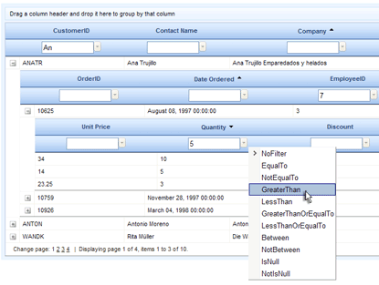

# Detail Tables Filtering

## 

To use filtering for detail tables you can either:

* Set **RadGrid.AllowFilteringByColumn**. This enables filtering for all tables in the grid;

* Set **GridTableView.AllowFilteringByColumn**for each table in which you want to enable fitlering.

