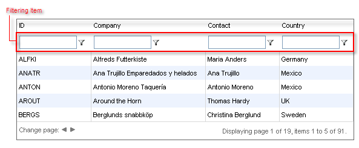

# Filtering Item

## 

The __FilteringItem__ is the row that holds the filtering boxes. It appears automatically when you enable the filtering (Set __AllowFilteringByColumn__ to __true__):

The __FilteringItem__ is always placed in <THEAD> section of a grid. As a result, it always appears on top of the grid (not at the bottom). You can customize the __FilteringItem__ by setting a CSS class to the __FilterItemStyle__ property of __RadGrid__ or __GridTableView__. You can set the __FilterItemStyle__ globally in the __RadGrid__ declaration or set it individually for each table in the grid.

>caution If you are using a skin with your __RadGrid__ control and want to customize the look and feel of the __FilteringItem__ , alter the .GridFilterRow_[SkinName] class, where [SkinName] is the name of the skin. Applying changes to __FilterItemStyle__ will not override the __Skin__ properties.
>

# See Also

 * [Overview]()

 * [Localize Filtering Menu Options]()
