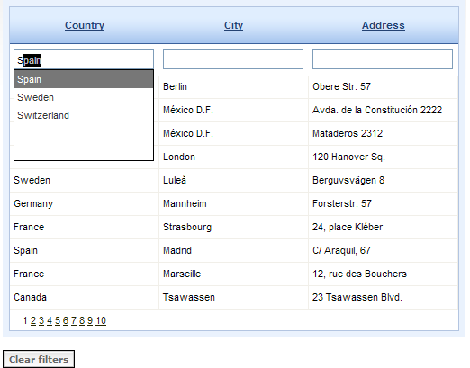

# Google-like Filtering


## 

It allows displaying the available options while the user types in a RadComboBox in RadGrid filtering item. Filtering is confirmed when item is selected or Enter is pressed.

Here is the list of actions needed to achieve this:

* Extend the default **GridBoundColumn** to remove the default textbox and embed RadComboBox inside the filtering cell.

* Configure the options for RadComboBox control as per your requirements (the essential parts are to set **ShowToggleImage = false**, **ID** for the combobox, **EnableLoadOnDemand=true, MarkFirstMatch = true** and attach the **ItemsRequested/SelectedIndexChanged** events). These operation should take place in the overridden **SetupFilterControls(TableCell cell)** method.

* Override the **SetCurrentFilterValueToControl(TableCell cell) / GetCurrentFilterValueFromControl(TableCell cell)** methods to set/get the user input.

* Filter the combobox items in the **ItemsRequested** handler depending on the **UniqueName** of the currently filtered column.

* Raise command event for the **GridFilteringItem** calling its **FireCommandEvent(commandName, new Pair(filterFunctionName, columnUniqueName))** method.

This example is expanded by enabling the AJAXmechanism of the grid along with its built-in paging and sorting features. The filtering action will be triggered when you choose item from a look-up textbox or type inside filtering input and press Enter from the keyboard.

In addition, there is **Clear filter** button on the page which restores the initial grid content.

**Note:** In this case search is performed for matches in the default grid source on each filter command. That is why each column's **CurrentFilterFunction** is set to **GridKnownFunction.NoFilter* *and **CurrentFilterValue** to **String.Empty** on filter operation.




````ASP.NET
<asp:ScriptManager ID="ScriptManager1" runat="server" />
  <telerik:RadAjaxManager ID="RadAjaxManager1" runat="server">
      <AjaxSettings>
          <telerik:AjaxSetting AjaxControlID="RadGrid1">
              <UpdatedControls>
                  <telerik:AjaxUpdatedControl ControlID="RadGrid1" />
              </UpdatedControls>
          </telerik:AjaxSetting>
          <telerik:AjaxSetting AjaxControlID="clrFilters">
              <UpdatedControls>
                  <telerik:AjaxUpdatedControl ControlID="RadGrid1" />
                  <telerik:AjaxUpdatedControl ControlID="clrFilters" />
              </UpdatedControls>
          </telerik:AjaxSetting>
      </AjaxSettings>
  </telerik:RadAjaxManager>
  <telerik:RadGrid RenderMode="Lightweight" ID="RadGrid1" AutoGenerateColumns="false" AllowPaging="true" AllowSorting="true"
      AllowFilteringByColumn="true" Width="560px" Skin="Office2007" runat="server"
      OnColumnCreating="RadGrid1_ColumnCreating" OnItemCommand="RadGrid1_ItemCommand"
      OnNeedDataSource="RadGrid1_NeedDataSource">
      <PagerStyle Mode="NumericPages" />
  </telerik:RadGrid>
  <br />
  <asp:Button ID="clrFilters" runat="server" Text="Clear filters" CssClass="button"
    OnClick="clrFilters_Click">
  </asp:Button>	
````
````C#
DataTable dt;
private void Page_Load(object sender, System.EventArgs e)
{
    if (!IsPostBack)
    {
        dt = GetDataTable("SELECT Country, City, PostalCode FROM Customers");
        this.RadGrid1.MasterTableView.Columns.Clear();
        foreach (DataColumn dataColumn in dt.Columns)
        {
            MyCustomFilteringColumnCS gridColumn = new MyCustomFilteringColumnCS();
            this.RadGrid1.MasterTableView.Columns.Add(gridColumn);
            gridColumn.DataField = dataColumn.ColumnName;
            gridColumn.HeaderText = dataColumn.ColumnName;
        }
    }
}
protected void RadGrid1_NeedDataSource(object source, GridNeedDataSourceEventArgs e)
{
    dt = GetDataTable("SELECT Country, City, PostalCode FROM Customers");
    this.RadGrid1.DataSource = dt;
}
protected void RadGrid1_ColumnCreating(object sender, GridColumnCreatingEventArgs e)
{
    if ((e.ColumnType == typeof(MyCustomFilteringColumnCS).Name))
    {
        e.Column = new MyCustomFilteringColumnCS();
    }
}
protected void RadGrid1_ItemCommand(object source, GridCommandEventArgs e)
{
    if ((e.CommandName == "Filter"))
    {
        foreach (GridColumn column in e.Item.OwnerTableView.Columns)
        {
            column.CurrentFilterValue = string.Empty;
            column.CurrentFilterFunction = GridKnownFunction.NoFilter;
        }
    }
}
protected void clrFilters_Click(object sender, EventArgs e)
{
    foreach (GridColumn column in RadGrid1.MasterTableView.Columns)
    {
        column.CurrentFilterFunction = GridKnownFunction.NoFilter;
        column.CurrentFilterValue = string.Empty;
    }
    RadGrid1.MasterTableView.FilterExpression = string.Empty;
    RadGrid1.MasterTableView.Rebind();
}
public static DataTable GetDataTable(string query)
{
    string ConnString = ConfigurationManager.ConnectionStrings["NorthwindConnectionString"].ConnectionString;
    SqlConnection conn = new SqlConnection(ConnString);
    SqlDataAdapter adapter = new SqlDataAdapter();
    adapter.SelectCommand = new SqlCommand(query, conn);
    DataTable myDataTable = new DataTable();
    conn.Open();
    try
    {
        adapter.Fill(myDataTable);
    }
    finally
    {
        conn.Close();
    }
    return myDataTable;
}

````
````VB
Private dt As DataTable
Private Sub Page_Load(ByVal sender As Object, ByVal e As System.EventArgs)
    If Not IsPostBack Then
        dt = GetDataTable("SELECT Country, City, PostalCode FROM Customers")
        Me.RadGrid1.MasterTableView.Columns.Clear()
        For Each dataColumn As DataColumn In dt.Columns
            Dim gridColumn As New MyCustomFilteringColumnCS()
            Me.RadGrid1.MasterTableView.Columns.Add(gridColumn)
            gridColumn.DataField = dataColumn.ColumnName
            gridColumn.HeaderText = dataColumn.ColumnName
        Next
    End If
End Sub
Protected Sub RadGrid1_NeedDataSource(ByVal source As Object, ByVal e As GridNeedDataSourceEventArgs)
    dt = GetDataTable("SELECT Country, City, PostalCode FROM Customers")
    Me.RadGrid1.DataSource = dt
End Sub
Protected Sub RadGrid1_ColumnCreating(ByVal sender As Object, ByVal e As GridColumnCreatingEventArgs)
    If (e.ColumnType = GetType(MyCustomFilteringColumnCS).Name) Then
        e.Column = New MyCustomFilteringColumnCS()
    End If
End Sub
Protected Sub RadGrid1_ItemCommand(ByVal source As Object, ByVal e As GridCommandEventArgs)
    If (e.CommandName = "Filter") Then
        For Each column As GridColumn In e.Item.OwnerTableView.Columns
            column.CurrentFilterValue = String.Empty
            column.CurrentFilterFunction = GridKnownFunction.NoFilter
        Next
    End If
End Sub
Protected Sub clrFilters_Click(ByVal sender As Object, ByVal e As EventArgs)
    For Each column As GridColumn In RadGrid1.MasterTableView.Columns
        column.CurrentFilterFunction = GridKnownFunction.NoFilter
        column.CurrentFilterValue = String.Empty
    Next
    RadGrid1.MasterTableView.FilterExpression = String.Empty
    RadGrid1.MasterTableView.Rebind()
End Sub
Public Shared Function GetDataTable(ByVal query As String) As DataTable
    Dim ConnString As String = ConfigurationManager.ConnectionStrings("NorthwindConnectionString").ConnectionString
    Dim conn As New SqlConnection(ConnString)
    Dim adapter As New SqlDataAdapter()
    adapter.SelectCommand = New SqlCommand(query, conn)
    Dim myDataTable As New DataTable()
    conn.Open()
    Try
        adapter.Fill(myDataTable)
    Finally
        conn.Close()
    End Try
    Return myDataTable
End Function
````


````C#
public class MyCustomFilteringColumnCS : GridBoundColumn
{
    public static string ConnectionString
    {
        get { return ConfigurationManager.ConnectionStrings["NorthwindConnectionString"].ConnectionString; }
    }
    //RadGrid will call this method when it initializes the controls inside the filtering item cells
    protected override void SetupFilterControls(TableCell cell)
    {
        base.SetupFilterControls(cell);
        cell.Controls.RemoveAt(0);
        RadComboBox combo = new RadComboBox();
        combo.ID = ("RadComboBox1" + this.UniqueName);
        combo.ShowToggleImage = false;
        combo.Skin = "Office2007";
        combo.EnableLoadOnDemand = true;
        combo.AutoPostBack = true;
        combo.MarkFirstMatch = true;
        combo.Height = Unit.Pixel(100);
        combo.ItemsRequested += this.list_ItemsRequested;
        combo.SelectedIndexChanged += this.list_SelectedIndexChanged;
        cell.Controls.AddAt(0, combo);
        cell.Controls.RemoveAt(1);
    }
    //RadGrid will cal this method when the value should be set to the filtering input control(s)
    protected override void SetCurrentFilterValueToControl(TableCell cell)
    {
        base.SetCurrentFilterValueToControl(cell);
        RadComboBox combo = (RadComboBox)cell.Controls[0];
        if ((this.CurrentFilterValue != string.Empty))
        {
            combo.Text = this.CurrentFilterValue;
        }
    }
    //RadGrid will cal this method when the filtering value should be extracted from the filtering input control(s)
    protected override string GetCurrentFilterValueFromControl(TableCell cell)
    {
        RadComboBox combo = (RadComboBox)cell.Controls[0];
        return combo.Text;
    }
    private void list_ItemsRequested(object o, RadComboBoxItemsRequestedEventArgs e)
    {
        ((RadComboBox)o).DataTextField = this.DataField;
        ((RadComboBox)o).DataValueField = this.DataField;
        ((RadComboBox)o).DataSource = GetDataTable("SELECT DISTINCT " + this.UniqueName + " FROM Customers WHERE " + this.UniqueName + " LIKE '" + e.Text + "%'");
        ((RadComboBox)o).DataBind();
    }
    private void list_SelectedIndexChanged(object o, RadComboBoxSelectedIndexChangedEventArgs e)
    {
        GridFilteringItem filterItem = (GridFilteringItem)((RadComboBox)o).NamingContainer;
        if ((this.UniqueName == "Index"))
        {
            //this is filtering for integer column type
            filterItem.FireCommandEvent("Filter", new Pair("EqualTo", this.UniqueName));
        }
        //filtering for string column type
        filterItem.FireCommandEvent("Filter", new Pair("Contains", this.UniqueName));
    }
    public static DataTable GetDataTable(string query)
    {
        SqlConnection conn = new SqlConnection(ConnectionString);
        SqlDataAdapter adapter = new SqlDataAdapter();
        adapter.SelectCommand = new SqlCommand(query, conn);
        DataTable myDataTable = new DataTable();
        conn.Open();
        try
        {
            adapter.Fill(myDataTable);
        }
        finally
        {
            conn.Close();
        }
        return myDataTable;
    }
}
````
````VB
Public Class MyCustomFilteringColumnCS
    Inherits GridBoundColumn
    Public Shared ReadOnly Property ConnectionString() As String
        Get
            Return ConfigurationManager.ConnectionStrings("NorthwindConnectionString").ConnectionString
        End Get
    End Property
    'RadGrid will call this method when it initializes the controls inside the filtering item cells
    Protected Overloads Overrides Sub SetupFilterControls(ByVal cell As TableCell)
        MyBase.SetupFilterControls(cell)
        cell.Controls.RemoveAt(0)
        Dim combo As New RadComboBox()
        combo.ID = ("RadComboBox1" + Me.UniqueName)
        combo.ShowToggleImage = False
        combo.Skin = "Office2007"
        combo.EnableLoadOnDemand = True
        combo.AutoPostBack = True
        combo.MarkFirstMatch = True
        combo.Height = Unit.Pixel(100)
        AddHandler combo.ItemsRequested, AddressOf Me.list_ItemsRequested
        AddHandler combo.SelectedIndexChanged, AddressOf Me.list_SelectedIndexChanged
        cell.Controls.AddAt(0, combo)
        cell.Controls.RemoveAt(1)
    End Sub
    'RadGrid will cal this method when the value should be set to the filtering input control(s)
    Protected Overloads Overrides Sub SetCurrentFilterValueToControl(ByVal cell As TableCell)
        MyBase.SetCurrentFilterValueToControl(cell)
        Dim combo As RadComboBox = DirectCast(cell.Controls(0), RadComboBox)
        If (Me.CurrentFilterValue <> String.Empty) Then
            combo.Text = Me.CurrentFilterValue
        End If
    End Sub
    'RadGrid will cal this method when the filtering value should be extracted from the filtering input control(s)
    Protected Overloads Overrides Function GetCurrentFilterValueFromControl(ByVal cell As TableCell) As String
        Dim combo As RadComboBox = DirectCast(cell.Controls(0), RadComboBox)
        Return combo.Text
    End Function
    Private Sub list_ItemsRequested(ByVal o As Object, ByVal e As RadComboBoxItemsRequestedEventArgs)
        CType(o, RadComboBox).DataTextField = Me.DataField
        CType(o, RadComboBox).DataValueField = Me.DataField
        CType(o, RadComboBox).DataSource = GetDataTable("SELECT DISTINCT " + Me.UniqueName + " FROM Customers WHERE " + Me.UniqueName + " LIKE '" + e.Text + "%'")
        CType(o, RadComboBox).DataBind()
    End Sub


    Private Sub list_SelectedIndexChanged(ByVal o As Object, ByVal e As RadComboBoxSelectedIndexChangedEventArgs)
        Dim filterItem As GridFilteringItem = DirectCast((DirectCast(o, RadComboBox)).NamingContainer, GridFilteringItem)
        If (Me.UniqueName = "Index") Then
            'this is filtering for integer column type
            filterItem.FireCommandEvent("Filter", New Pair("EqualTo", Me.UniqueName))
        End If
        'filtering for string column type
        filterItem.FireCommandEvent("Filter", New Pair("Contains", Me.UniqueName))
    End Sub
    Public Shared Function GetDataTable(ByVal query As String) As DataTable
        Dim conn As New SqlConnection(ConnectionString)
        Dim adapter As New SqlDataAdapter()
        adapter.SelectCommand = New SqlCommand(query, conn)
        Dim myDataTable As New DataTable()
        conn.Open()
        Try
            adapter.Fill(myDataTable)
        Finally
            conn.Close()
        End Try
        Return myDataTable
    End Function
End Class
````


