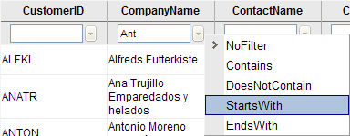

# Filtering Overview


__RadGrid__ natively supports filtering of table columns for its master and detail tables. To enable or disable filtering, set the __AllowFilteringByColumn__ property of the __RadGrid__ or __GridTableView__ control.

When filtering is enabled, a [filtering item]() (__GridFilteringItem__) appears below the column header. The user can enter a filter criterion in the filter box. A drop-down list allows the user to select a filter expression that is applied to the criterion for the column. When the user presses the filter button (next to the filter box), the grid displays only the records matching the filter criteria specified using the filter boxes:

All filters in a single table are applied using AND operator. That is, only items (grid rows) that comply with all filters are displayed.

__RadGrid__ filters data internally, after data binding. Filtering can be fully customized by setting the value of __FilterExpression__ property of the __GridTableView__ control. Note that the value of this property overrides all other filtering.

>caution The built-in filtering feature is not supported when you bind the grid by explicitly calling __DataBind()__ .
>


## Default settings

You can use the __CurrentFilterFunction__ and __CurrentFilterValue__ properties of the __GridColumn__ object to specify the default filter function and default filter value that appear in the filter text box.

>caution When you set these properties, __RadGrid__ displays this value as an initial filter but does NOT perform the filtering. For information on applying an initial filter, see[Applying default filter on initial load]().
>


Additionally, you can disable the filtering option for some of the grid columns by setting their __AllowFiltering__ property to __False__.

>note Depending on the data source, the filtering may be case-sensitive or case-insensitive. You can control this behavior using the __GroupingSettings-CaseSensitive__ property. In some *.NET 3.5* scenarios you should also turn off the __Linq__ expressions - __EnableLinqExpressions="false"__ 
>


## Filtering menus

The filtering menu is independent for each column in __RadGrid__.

You can specify the group of possible filter functions that are displayed for a column by setting its __FilterListOptions__ property. The __FilterListOptions__ property has three possible values:

* __VaryByDataType__ (the default value) - The list of filter functions depends on the __DataType__ property of the column. For example, filter functions "StartsWith", "EndsWith... " are not be available for columns with __DataType__ integer.

>note The __DataType__ property of a column is set during data binding. You can, however, set this property explictly, which can alter the allowed filtering expressions. For example, you if you set the __DataType__ property of an integer column to "string", the list of allowed filter expressions will include "StartsWith" and "EndsWith".
>


* __VaryByDataTypeAllowCustom__ - The list of filter functions depends on the __DataType__ property of the column, but an additional "Custom" item appears in the menu as well. If the user selects the "Custom" item, the value entered in the filter box is assumed to be a complete filter expression, including data field, operators, and value. This lets the user specify key words and fields from the data source in the filter text box.

* __AllowAllFilters__ - The list of filter functions contains all possible filter expressions. Note that some data types are not applicable to some filter functions. For example, the 'like' function cannot be applied to an integer data type. In such cases, you should handle the filtering in a custom manner, using the __ItemCommand__ event handler where the command name is "Filter"__.__

Users can set a filter expression based on the rules specified in the corresponding column properties: __GridColumn.FilterFormatString__.

>note The filtering menu is presented by single object server-side. This implementation was chosen to speed up grid performance by creating one menu instance server side and cloning the instance for different columns.
>


## Filter functions

The __GridKnownFunction__ enumeration lists the possible filter functions that can appear in the list of filter functions. The following table lists the possible __GridKnownFunction__ values:


>caption  

| Value | Description |
| ------ | ------ |
|NoFilter|No filter is applied, filter controls are cleared.|
|Contains|Same as: dataField LIKE '%value%'|
|DoesNotContain|Same as: dataField NOT LIKE '%value%'|
|StartsWith|Same as: dataField LIKE 'value%'|
|EndsWith|Same as: dataField LIKE '%value'|
|EqualTo|Same as: dataField = value|
|NotEqualTo|Same as: dataField != value|
|GreaterThan|Same as: dataField > value|
|LessThan|Same as: dataField < value|
|GreaterThanOrEqualTo|Same as: dataField >= value|
|LessThanOrEqualTo|Same as: dataField <= value|
|Between|Same as: value1 <= dataField <= value2.Note that value1 and value2 should be separated by [space] when entered as filter.|
|NotBetween|Same as: dataField <= value1 && dataField >= value2.Note that value1 and value2 should be separated by [space] when entered as filter.|
|IsEmpty|Same as: dataField = ''|
|NotIsEmpty|Same as: dataField != ''|
|IsNull|Only null values.|
|NotIsNull|Only those records that do not contain null values in the column.|
|Custom|A custom filter function. The filter value should contain a valid filter expression, including data field, operators, and value.|

In addition to the available filter expressions, you can create your own filter using the __GridFilterFunction__ class.

>note With the .NET 3.5 build of RadGrid for ASP.NET AJAX and LINQ filter expressions enabled (EnableLinqExpressions = true), the filter expressions set for the grid either internally by its filtering mechanism or manually in code should conform to the LINQ expression syntax instead of the old T-SQL syntax. Only thus they will be evaluated properly by the control.
>


There are also some useful shortcuts (achievable with several lines of javascript code) for applying filters when typing in the column header filter box and pressing the [__Enter__] key from the keyboard (illustrated in [this video](http://telerikwatch.com/2008/09/telerik-watch-minute-enhancing-radgrid.html)). Note that a prerequisite to trigger filter operation on [__Enter__] key press is to set the __AutoPostBackOnFilter__property of the corresponding column to __true__:

* If the user enters __[some_value]__and hits [__Enter__] key, the grid will automatically use the __Contains__ filter function

* If the user enters __[some_value]*__ and hits [__Enter__] key, the grid will automatically use the __StartsWith__ filter function

* If the user enters __*[some_value]__ and hits [__Enter__] key, the grid will automatically use the __EndsWith__ filter function

* If the user enters __=[some_value]__ and hits [__Enter__] key, the grid will automatically use the __EqualTo__ filter function

* If the user enters __<>[some_value]__ and hits [__Enter__] key, the grid will automatically use the __NotEqualTo__ filter function

* If the user enters __>[some_value]__ and hits [__Enter__] key, the grid will automatically use the __GreaterThan__filter function

* If the user enters __<[some_value]__ and hits [__Enter__] key, the grid will automatically use the __LessThan__ filter function

* If the user enters __>=[some_value]__ and hits [__Enter__] key, the grid will automatically use the __GreaterThanOrEqualTo__filter function

* If the user enters __=<[some_value]__ and hits [__Enter__] key, the grid will automatically use the __LessThanOrEqualTo__ filter function

* If the user enters __[some_value][ ][some_other_value]__ and hits [__Enter__] key, the grid will automatically use the __Between__filter function

>note To define a default filter function to be applied when you press the [Enter] key from the keyboard (when no shortcuts are used), use the __CurrentFilterFunction__ property of the respective grid column.
>


## Using the ItemCommand event with filters

When the user clicks the filter button, a server-side __ItemCommand__ event occurs with a command name of "Filter". You can use this command to replace the filter that is applied with your own value. For an example of this approach, see [Custom option for filtering (FilterListOptions -> VaryByDataTypeAllowCustom)]().

## AutoPostBackOnFilter

If you set __AutoPostBackOnFilter__ property of a column to __True__, the user does not need to press the filter button to initiate filtering. Instead, a postback filter operation occurs when the user types a filter in the filter box and presses __[Enter]__ from the keyboard.

When __AutoPostBackOnFilter__ is __True__, the column assumes a filter operation of __Contains__ for string types or __EqualTo__ for numeric types.You can change this to another filter function by setting the __CurrentFilterFunction__ property. For example:

````ASPNET
	  <telerik:GridBoundColumn DataField="ProductName" HeaderText="ProductName" SortExpression="ProductName"
	    UniqueName="ProductName" CurrentFilterFunction="StartsWith" AutoPostBackOnFilter="true" />
````


Another option is to set __FilterDelay__ property for grid column that can be filtered. Thus filtering operations will be executed after the delay specified through that property elapses. For example:

````ASPNET
	  <telerik:GridNumericColumn DataField="OrderID" HeaderText="OrderID" SortExpression="OrderID"
	    UniqueName="OrderID" FilterControlWidth="40px" AutoPostBackOnFilter="false" CurrentFilterFunction="EqualTo"
	    FilterDelay="4000" ShowFilterIcon="false" />
````


>note When the FilterDelay property is set, the filtering will be triggered after the last key stroke with the filter delay time span being respected or immediately if [ENTER] has been hit. In addition, if AutoPostBackOnFilter has been set to true along with a FilterDelay time span, the filtering should be triggered immediately on [TAB] key press. If only AutoPostBackOnFilter has been set to true, the filtering should be triggered immediately on [TAB] and [ENTER] key press.
>


## TroubleShooting

In some cases when the __RadGrid__ uses absolute positioning, you may find the filtering pop-up hidden behind the grid. You can easily fix the problem by setting the Z-index of the corresponding element in the ASPX to 0:

````ASPNET
	  <telerik:RadGrid ID="RadGrid1" Style="z-index: 0; left: 64; position: absolute..." />
````


