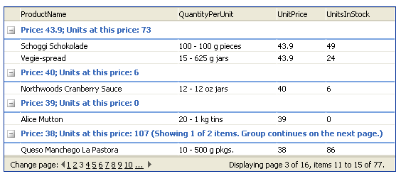

# Declarative Definition


Each **GridTableView** object has a **GroupByExpressions** property. **GroupByExpressions** is a collection of group expressions (**GridGroupByExpression** objects).

Adding a **GridGroupByExpression** object to this collection makes the current tableview display the items divided into groups and sorted. At the top of each group of items is a **GridGroupHeaderItem**, which can display information about the common properties of the group items or aggregate values that summarize the items in the group.

## GridGroupByExpression object

Each **GridGroupByExpression** object contains two collections in turn:

* The **SelectFields** collection determines the information that is displayed in the group header.

* The **GroupByFields** collection determines the field values that are used to group the data.

Both the **SelectFields** and the **GroupByFields** collections are collections of **GridGroupByField** objects. Each **GridGroupByField** object has the following properties:

* **FieldName** specifies the name of a field in the data source. If the **GridGroupByField** is in the **SelectFields** collection, this is the field whose value (or aggregated value) is shown in the group header. If the **GridGroupByField** is in the **GroupByFields** collection, this is the field that is used to group values. Meaningful for items from the **SelectFields/GroupByFields** collections.

* **FieldAlias** specifies an alias for representing the field's name. This appears as the name of the group in the group header and in the group panel, unless the **HeaderText** property is set. The **FieldAlias** value cannot contain blanks or reserved characters such as ",", "." and so on. Meaningful for items from the **SelectFields** collection only.

* **Aggregate** specifies a **GridAggregateFunction** value. These include "Sum", "Min", "Max", "Last", "First", "Count", and "None". **Aggregate** is used for fields in the **SelectFields** collection to specify the way to aggregate values on the field for display in the group header. Meaningful for items from the **SelectFields** collection only.If you want to display aggregated values in the group footer rather than the header, you can use [column aggregates]().

* **HeaderText** specifies the name to use for the field when it appears in the group header and in the group panel. This property lets you specify a field name that includes blanks or reserved characters. This property is only used for fields in the **SelectFields** collection. Meaningful for items from the **SelectFields* *collection only.

* **HeaderValueSeparator** specifies a string that appears in the group header between the header text and the value (or aggregated value). This property is only used for fields in the **SelectFields** collection. Meaningful for items from the **SelectFields** collection only.

* **FormatString** specifies a format string for formatting field values when they appear in the group header. This property is only used for fields in the **SelectFields** collection. Meaningful for items from the **SelectFields** collection only.

* **SortOrder** specifies how group values are sorted. Its value can be "Ascending" or "Descending". This property is only used for fields in the **GroupByFields** collection. Meaningful for items from the **GroupByFields** collection only.

>caution The default value of the **SortOrder** property is "Ascending". Setting it to "None" will not affect the order in which the group items are displayed.
>


## Setting GroupByExpressions declaratively

You can set the value of a table view's **GroupByExpressions** property declaratively to provide the grid with an initial grouping state. This property is independent of whether users can drag column headers to the group panel to change the grouping, or even whether the group panel appears in the grid.

>note In a hierarchical grid, you can set the **GroupByExpressions** property for each table in the hierarchy.
>


The following example shows the declaration of a grid with the **GroupByExpressions** property set to provide grouping in the **MasterTableView**. In this example, the ShowGroupPanel property is not set to **True**, so users cannot change the specified grouping.

````ASP.NET
<telerik:RadGrid RenderMode="Lightweight" ID="RadGrid1" runat="server" DataSourceID="SqlDataSource1" GridLines="None"
  AllowPaging="True" PageSize="5" Skin="Outlook">
  <MasterTableView DataSourceID="gridSource">
    <GroupByExpressions>
      <telerik:GridGroupByExpression>
        <SelectFields>
          <telerik:GridGroupByField FieldName="UnitPrice" HeaderText="Price" />
          <telerik:GridGroupByField FieldName="UnitsInStock" HeaderText="Units at this price"
            Aggregate="Sum" />
        </SelectFields>
        <GroupByFields>
          <telerik:GridGroupByField FieldName="UnitPrice" SortOrder="Descending" />
        </GroupByFields>
      </telerik:GridGroupByExpression>
    </GroupByExpressions>
  </MasterTableView>
</telerik:RadGrid>
<asp:SqlDataSource ID="SqlDataSource1" runat="server" ConnectionString="<%$ ConnectionStrings:NorthwindConnectionString %>"
          SelectCommand="SELECT [ProductName], [QuantityPerUnit], [UnitPrice], [UnitsInStock] FROM [Products]">
</asp:SqlDataSource>
````



For a live example that sets the **GroupByExpressions** property (and uses additional **GridGroupByField** properties), see [Outlook-style grouping](http://demos.telerik.com/aspnet-ajax/Grid/Examples/GroupBy/OutlookStyle/DefaultCS.aspx).

## Column group-by expressions

When the user drags a column header onto the group panel, the grid automatically adds a **GridGroupByExpression** object to the **GroupByExpressions** collection of the table view that contains the column. By default, the **GroupByExpression** has a single **GridGroupByField** in its **SelectFields** and in its **GroupByFields** collections. This **GridGroupByField** sets only the **FieldName** property (to the column's **DataField** property).

You can change this default behavior, supplying values for the **GroupByExpression** that is added when the user drags a column header to the group panel. To do this, set the **GroupByExpression** property of the column.

The value of the **GroupByExpression** property is a string that defines the grouping expression, using the following syntax:

*fieldname[ alias]/aggregate(fieldname)[ alias][, ...] Group By fieldname[ sort][, ...]*

These are the parts of the expression:

* **fieldname -** The value of the **FieldName** property of the **GridGroupByField**.

* **alias -** The value of the **FieldAlias** property of the **GridGroupByField**.

* **aggregate** - The value of the **Aggregate** property of the **GridGroupByField**.

* **sort**: "asc" to set **SortOrder** to "Ascending", "desc" to set **SortOrder** to "Descending".

The following example illustrates this syntax:

````C#
Country, City, count(ContactName) Items Group By Country, City desc
````


For this example, the resulting **GridGroupByExpression** object would be as follows:

````ASP.NET
<telerik:GridGroupByExpression>
   <SelectFields>
     <telerik:GridGroupByField FieldName="Country" />
     <telerik:GridGroupByField FieldName="City" />
     <telerik:GridGroupByField
       FieldName="ContactName"
       FieldAlias="Items"
       Aggregate="Count" />
   </SelectFields>
   <GroupByFields>
      <telerik:GridGroupByField FieldName="Country" />
     <telerik:GridGroupByField
       FieldName="City"
       SortOrder="Descending" />
   </GroupByFields>
</telerik:GridGroupByExpression>
````


>note You can only set the **GroupByExpression** property of declaratively defined columns.
>


## Template columns

When you set the **GroupByExpression** property for a **GridTemplateColumn** instance, a common problem is that **RadGrid** cannot get the value from the header text for that column and display it in the **GroupHeaderItem**. In such cases you need to use the **FieldAlias** property.

The following example illustrates how this is done. It assigns an alias of "ID" in the **GroupByExpression** property of the first template column, and an alias of "Name" in the **GroupByExpression** property of the second template column.

````ASP.NET
<telerik:RadGrid RenderMode="Lightweight" ID="RadGrid1" runat="server" DataSourceID="SqlDataSource1" AutoGenerateColumns="False"
  AllowPaging="true" ShowGroupPanel="true">
  <ClientSettings AllowDragToGroup="true" />
  <MasterTableView>
    <Columns>
      <telerik:GridTemplateColumn HeaderText="ID" GroupByExpression="CustomerID ID Group By CustomerID">
        <ItemTemplate>
          <%# Eval("CustomerID") %>
        </ItemTemplate>
      </telerik:GridTemplateColumn>
      <telerik:GridTemplateColumn HeaderText="Name" GroupByExpression="CompanyName Name Group By CompanyName">
        <ItemTemplate>
          <%# Eval("CompanyName") %>
        </ItemTemplate>
      </telerik:GridTemplateColumn>
    </Columns>
  </MasterTableView>
</telerik:RadGrid>
````


