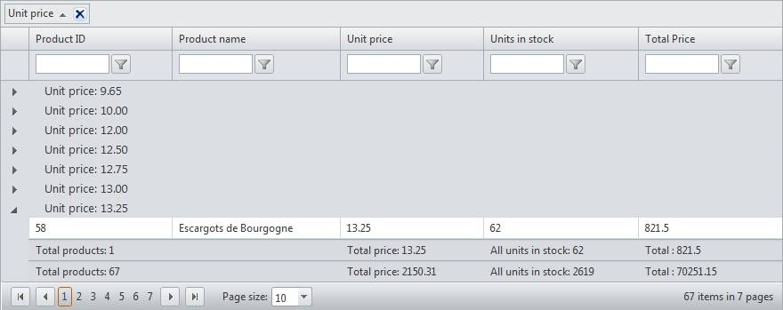

# Group Footers


## 

In addition to displaying summaries/results from aggregates in the group header (see [this topic]()), RadGrid exposes group footers feature which provides the option to render footer under each group in the grid. The type of this footer item is **GridGroupFooterItem** . To enable this functionality merely set the **ShowGroupFooter** property of the respective GridTableView instance to true (its default value is false).


RadGrid also gives you the opportunity to retain the visibility of the group footers when their corresponding group header row is collapsed. In order to switch on this feature, just set the **GroupingSettings.RetainGroupFooterVisibility** property to true.

The group footers are most commonly used to visualize calculations from aggregate functions within the scope of the current group. Furthermore, with nested groups you will have group footer for each inner group along with one for the main group. Aggregate calculations are supported for GridBoundColumns, GridCalculatedColumns and GridTemplateColumns.

In order to specify how the group aggregates will be evaluated, specify in every GridBoundColumn/GridCalculatedColumn/GridTemplateColumn the **Aggregate** property which accepts values from the **GridAggregateFunction** enumeration. The options available for the GridAggregateFunction enumeration are listed below:

**GridAggregateFunction enumeration members**


>caption  

|  **Member**  |  **Description**  |
| ------ | ------ |
| **Sum** |Returns the sum of all column values in the source|
| **Min** |Returns the min value from the source column|
| **Max** |Returns the max value from the source column|
| **Last** |Returns the last value from the source column|
| **First** |Returns the first value from the source column|
| **Count** |Returns the count of source column values|
| **Avg** |Returns the average value from the source column values|
| **Custom** |Raises OnCustomAggregate event where the custom result can be set using the e.Result argument|
| **None** |Default value, no aggregate function applied|


>note RadGrid will calculate aggregates over the entire data source and will respect the filter expression applied (if present).
>


>note The default style applied for the group footers will be this set for the common footer of the corresponding table.
>


[This online demo](http://demos.telerik.com/aspnet-ajax/Grid/Examples/GroupBy/GroupFooter/DefaultCS.aspx) represents the functionality in question. Review the code excerpt below for additional details:

````ASP.NET
<asp:ScriptManager ID="ScriptManager1" runat="server" />
<telerik:RadAjaxManager ID="RadAjaxManager1" runat="server">
  <AjaxSettings>
    <telerik:AjaxSetting AjaxControlID="RadGrid1">
      <UpdatedControls>
        <telerik:AjaxUpdatedControl ControlID="RadGrid1" />
      </UpdatedControls>
    </telerik:AjaxSetting>
  </AjaxSettings>
</telerik:RadAjaxManager>
<telerik:RadGrid ShowGroupPanel="true" AutoGenerateColumns="false" ID="RadGrid1"
  DataSourceID="SqlDataSource1" AllowFilteringByColumn="True" AllowSorting="True"
  ShowFooter="True" runat="server" GridLines="None" AllowPaging="true" Skin="WebBlue">
  <PagerStyle Mode="NextPrevAndNumeric" />
  <MasterTableView ShowGroupFooter="true" AllowMultiColumnSorting="true">
    <Columns>
      <telerik:GridBoundColumn Aggregate="Count" DataField="ProductID" HeaderText="Product ID"
        FooterText="Total products: ">
      </telerik:GridBoundColumn>
      <telerik:GridBoundColumn DataField="ProductName" HeaderText="Product name" SortExpression="ProductName"
        UniqueName="ProductName">
      </telerik:GridBoundColumn>
      <telerik:GridBoundColumn Aggregate="Sum" DataField="UnitPrice" HeaderText="Unit price"
        FooterText="Total price: ">
      </telerik:GridBoundColumn>
      <telerik:GridBoundColumn Aggregate="Sum" DataField="UnitsInStock" HeaderText="Units in stock"
        FooterText="All units in stock: ">
      </telerik:GridBoundColumn>
      <telerik:GridCalculatedColumn HeaderText="Total Price" UniqueName="TotalPrice" DataType="System.Double"
        DataFields="UnitPrice, UnitsInStock" Expression="{0}*{1}" FooterText="Total : "
        Aggregate="Sum" />
    </Columns>
    <GroupByExpressions>
      <telerik:GridGroupByExpression>
        <GroupByFields>
          <telerik:GridGroupByField FieldName="UnitPrice" />
        </GroupByFields>
        <SelectFields>
          <telerik:GridGroupByField FieldName="UnitPrice" HeaderText="Unit price" />
        </SelectFields>
      </telerik:GridGroupByExpression>
    </GroupByExpressions>
  </MasterTableView>
  <ClientSettings AllowDragToGroup="true" />
</telerik:RadGrid>
<br />
<asp:SqlDataSource ID="SqlDataSource1" ConnectionString="<%$ ConnectionStrings:NorthwindConnectionString %>"
  SelectCommand="SELECT * FROM Products Where UnitPrice > 9.50" runat="server"></asp:SqlDataSource>
````


