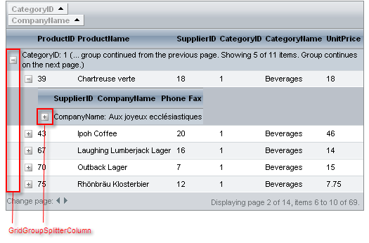

# Grouping Overview


**RadGrid** supports grouping of items based on the value of a particular column. You can even have multilevel grouping based on different criteria.

To group the data in a grid, specify grouping criteria by setting the **GroupByExpressions** property of a table view in the grid. You can set the group-by expressions [declaratively]() at design time, or [programmatically]() in the code-behind.

## GridGroupPanel

To facilitate grouping, a special area called the **GridGroupPanel** can be displayed at the top of the grid to display grouping options. To display the group panel, set the grid's **ShowGroupPanel** property to **True**. When a table view is grouped, all group fields appear in this group panel as elements along with an icon that indicates the sort order:

You can access the group panel using the grid's **GroupPanel** property. You can use **PanelStyle** and **PanelItemsStyle** to control the style of the group panel and its items.

You can also specify the position of the **GroupPanel** by setting the	**GroupPanelPosition** property of the grid. The available options for	the **GroupPanel** positions are: **Top**, **BeforeHeader** and	**Bottom**. The following screenshots illustrate the different rendering with those options:

**GroupPanelPosition - Top**

**GroupPanelPosition - BeforeHeader**

**GroupPanelPosition - Bottom**

Users can use the sort indicator of the items in the group panel to specify the sort order of the grouping field.

Optionally, you can let users add sorting fields and rearrange the existing ones by dragging and dropping column headers onto the group panel or allow ungroup option for group panel items by setting the **GroupingSettings -> ShowUnGroupButton** property of the grid to true:

To allow users to change the grouping by dragging column headers, set the **ClientSettings.AllowDragToGroup** property to **True**. You can set this property at design time:

````ASPNET
	<telerik:RadGrid runat="server" ... />
	   <ClientSettings AllowDragToGroup="True"/>
	   ...
	</telerik:RadGrid>
````


Alternatively, you can set the **AllowDragToGroup** property at runtime in the code-behind:


````C#
	        RadGrid RadGrid1 = new RadGrid();
	        RadGrid1.ClientSettings.AllowDragToGroup = true;
````
````VB.NET
	    Dim RadGrid1 As RadGrid = New RadGrid
	    RadGrid1.ClientSettings.AllowDragToGroup = true			
````


## GridGroupSplitterColumn

When a table view is grouped, **RadGrid** automatically adds a special column (**GridGroupSplitterColumn**) that holds the buttons which let users expand and collapse groups of items:

>note You can expand all groups on grid load by setting the **GroupsDefaultExpanded** property of the **MasterTableView** to **True** (this is the default value).
>


## Expand/Collapse all

RadGrid’s grouping structure has been extended with buttons in the group expand column headers that allow all group headerson a given level to be expanded/collapsed.The buttons in question are switched on through the **EnableGroupsExpandAll** property exposedboth on the level of the grid and the table views.

The new expand-all functionality supports all group load modes.

It is important to note that in the case of grouping for a given table view, the header expand-all buttons’ visibility dependson whether their preceding counterparts are visible and expanded. In other words, if, for example, the expand-all button for grouplevel 2 is collapsed/hidden then all expand-all buttons for the following group levels will be hidden.

When you have grouping and hierarchy combined in a common table view, the visibility of the hierarchy expand-all button depends on whether the expand-all button for the last group level is expanded/visible.
