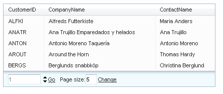

# Accessing the Elements of Advanced Type Pager


## 

When using the advanced grid pager/slider, you can customize the properties of the buttons or labels inside the pager or the slider pager itself. The following steps describe how to access these controls:

1. Create a handler for the grid's **ItemCreated** event.

2. In the event handler, check if **e.Item** is an instance of **GridPagerItem**.

3. Use the **FindControl** method of **e.Item** to locate the controls inside the pager. The following table lists the ID's of the controls in the pager when **Mode** is "NextPrevAndNumeric":

	
	|  **Control**  |  **Type**  |  **ID**  |
	| ------ | ------ | ------ |
	|"Page Size:" text|Label|ChangePageSizeLabel|
	|"Page Size" combo box|RadComboBox|PageSizeComboBox|

	**Example**:

	**C#**

	protected void RadGrid1_ItemDataBound(object sender, GridItemEventArgs e)
	{
	    if (e.Item is GridPagerItem)
	    {
	        Label lblPageSize = (Label)e.Item.FindControl("ChangePageSizeLabel");
	        lblPageSize.Text = "Number of items:";
	    }
	}

	**VB**

	Protected Sub RadGrid1_ItemDataBound(sender As Object, e As GridItemEventArgs) Handles RadGrid1.ItemDataBound()
	    If TypeOf e.Item Is GridPagerItem Then
	        Dim lblPageSize As Label = DirectCast(e.Item.FindControl("ChangePageSizeLabel"), Label)
	        lblPageSize.Text = "Number of items:"
	    End If
	End Sub


4. The following table lists the ID's of the controls in the pager when **Mode** is "Advanced" or "Slider":


>caption  

| Control | Type | ID |
| ------ | ------ | ------ |
|"Go to page" text|Label|GoToPageLabel|
|"Go to page" input|RadNumericTextBox|GoToPageTextBox|
|"Go to page" " **of** " text|Label|PageOfLabel|
|"Go to page" link button|Button|GoToPageLinkButton|
|"Change page size" text|Label|ChangePageSizeLabel|
|"Change page size" input|RadNumericTextBox|ChangePageSizeTextBox|
|"Change page size" link button|Button|ChangePageSizeLinkButton|
|Slider pager|RadSlider|GridSliderPager|


````ASP.NET
<telerik:RadGrid
    ID="RadGrid1"
    runat="server"
    Width="95%"
    Skin="Vista"
    AllowSorting="True"
    DataSourceID="SqlDataSource1"
    AllowPaging="True" PageSize="5"
    OnItemCreated="RadGrid1_ItemCreated">
    <PagerStyle Mode="Advanced" />
    <MasterTableView Width="100%" DataSourceID="AccessDataSource1" />
</telerik:RadGrid>		
````
````C#
protected void RadGrid1_ItemCreated(object sender, GridItemEventArgs e)
{
    if (e.Item is GridPagerItem)
    {
        RadNumericTextBox goToPageText = (RadNumericTextBox)e.Item.FindControl("GoToPageTextBox");
        goToPageText.Width = Unit.Pixel(80);
        goToPageText.ShowSpinButtons = true;
        goToPageText.Style.Add("color", "gray");
        Label changePageLabel = (Label)e.Item.FindControl("GoToPageLabel");
        changePageLabel.Visible = false;
    }
}
````
````VB
Protected Sub RadGrid1_ItemCreated(ByVal sender As Object, ByVal e As GridItemEventArgs) Handles RadGrid1.ItemCreated
    If TypeOf e.Item Is GridPagerItem Then
        Dim goToPageText As RadNumericTextBox = CType(e.Item.FindControl("GoToPageTextBox"), RadNumericTextBox)
        goToPageText.Width = Unit.Pixel(80)
        goToPageText.ShowSpinButtons = True
        goToPageText.Style.Add("color", "gray")
        Dim changePageLabel As Label = CType(e.Item.FindControl("GoToPageLabel"), Label)
        changePageLabel.Visible = False
    End If
End Sub
````




>note When setting the **PageOfLabel,** in order to to display the page count number, you would need to append it to the label text as demonstrated below:
>


````C#
protected void RadGrid1_ItemDataBound(object sender, GridItemEventArgs e)
{
    if (e.Item is GridPagerItem)
    {
        GridPagerItem item = e.Item as GridPagerItem;
        Label pageOfLabel = e.Item.FindControl("PageOfLabel") as Label;
        pageOfLabel.Text = "OF " + item.Paging.PageCount.ToString();
    }
}
````
````VB
Protected Sub RadGrid1_ItemDataBound(ByVal sender As Object, ByVal e As GridItemEventArgs)
    If TypeOf e.Item Is GridPagerItem Then
        Dim item As GridPagerItem = TryCast(e.Item, GridPagerItem)
        Dim pageOfLabel As Label = TryCast(e.Item.FindControl("PageOfLabel"), Label)
        pageOfLabel.Text = "OF " + item.Paging.PageCount.ToString
    End If
End Sub
````


## See Also

 * [Pager Item]()
