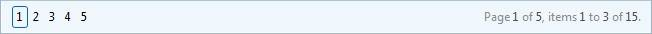

# Using PagerTextFormat


## 

You can set the format of the text that appears in the __Pager__ using the __PagerTextFormat__ property. The value of this property is an __ASP.NET__ formatting string.

Here is the format that should be used when __Mode__ is "__NextPrev__":


>caption  

| Change page: {4}|Page {0} of {1}, items {2} to {3} of {5} |
| ------ |

The rest of the grid pagers ("__NumericPages__", "__NextPrevAndNumeric__", "__Advanced__", "__NextPrevNumericAndAdvanced__" and "__Slider__") use a slightly different format:


>caption  

| {4}|Page {0} of {1}, items {2} to {3} of {5} |
| ------ |

No matter which pager you choose, the meaning of the different parameters is as follows:

* {0} is used to display current page number.

* {1} is total number of pages.

* {2} is the number of the first item (record) in the current page.

* {3} is the number of the last item (record) in the current page.

* {4} indicates where the set of controls for the corresponding pager type (positioned on the left) appear.

* {5} is the total number of items (records) in the data source.

>note The ' __{4}__ ' parameter is mandatory when setting the property. __'Page {0} of {1}, items {2} to {3} of {5}__ ' represents the text message displayed on the right side of the pager item. Setting this part of the property is optional.
>


The following screen shots show how the pager looks for each of the different pager modes before and after __PagerTextFormat__ is set:

````ASPNET
	  <PagerStyle Mode="NextPrev" />
````


````ASPNET
	  <PagerStyle Mode="NextPrev" PagerTextFormat="Navigate pages {4} Page {0} from {1}, rows {2} to {3} from {5}" />
````


````ASPNET
	  <PagerStyle Mode="NextPrevAndNumeric" />
````


````ASPNET
	  <PagerStyle Mode="NextPrevAndNumeric" PagerTextFormat="{4} Page {0} from {1}, rows {2} to {3} from {5}" />
````


````ASPNET
	  <PagerStyle Mode="NextPrevNumericAndAdvanced" />
````


````ASPNET
	  <PagerStyle Mode="NextPrevNumericAndAdvanced" PagerTextFormat="{4} Page {0} from {1}, rows {2} to {3} from {5}" />
````


````ASPNET
	  <PagerStyle Mode="Advanced" />
````


````ASPNET
	  <PagerStyle Mode="Advanced" PagerTextFormat="{4} Page {0} from {1}, rows {2} to {3} from {5}" />
````


````ASPNET
	  <PagerStyle Mode="NumericPages" />
	  .
````




````ASPNET
	  <PagerStyle Mode="NumericPages" PagerTextFormat="{4} Page {0} from {1}, rows {2} to {3} from {5}" />
````


````ASPNET
	  <PagerStyle Mode="Slider" />
````


````ASPNET
	  <PagerStyle Mode="Slider" PagerTextFormat="{4} Page {0} from {1}, rows {2} to {3} from {5}" />
	  ....
	  <ClientSettings>
	       <ClientMessages PagerTooltipFormatString="Slider pages {0} from {1}" />
	  </ClientSettings>
````


>note In order to change the text on the right side of the __RadSlider__ you should set the __ClientMessages.PagerTooltipFormatString__  ** property.
>

