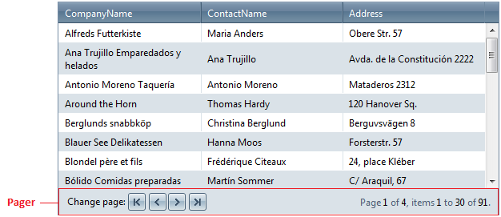

# Paging Overview

**RadGrid** natively supports table paging, which lets users view large sets of data in small chunks for faster loading and easier navigation. It also provides a set of events, helper methods and properties if the paging operation requires custom intervention.

To see the paging functionality in action, check out the [Paging Demo](https://demos.telerik.com/aspnet-ajax/grid/examples/functionality/paging/basic-paging/defaultcs.aspx).

Set the **AllowPaging** property to **True** to have **RadGrid** handle paging. By default, the **AllowPaging** property is **False**. You can set the AllowPaging property for the entire grid or individually for each **GridTableView**. The **AllowPaging** setting for a **GridTableView** control overrides the setting specified for **RadGrid**.

If you want to [handle paging in a custom manner](), set the grid's **AllowCustomPaging** property to **True** as well.

Set the **PageSize** property on the grid or table view to specify the number of records that should appear in each chunk. When paging is enabled, **RadGrid** renders a [pager item]() (**GridPagerItem**) on the bottom and/or top of each **GridTableView** displayed in the hierarchy. The pager item appears when the number of records in the table view exceeds the page size.

You can also set the **PageSizes** property, which determines the values that will be displayed in the PageSize combo box in the RadGrid pager item. The default value of this property is **int[] { 10,20,50 }**.

There are several different [pager types]() that you can use. The [template support]() allows you to design your own pager.

**RadGrid** exposes the **PageSizeControlType** property in its **PagerStyle** property collection, which is an enum of type **PagerDropDownControlType**. It has three available values:

* **None**

* **RadComboBox** (default)

* **RadDropDownList**

As its name implies, the property specifies what type of page size drop-down control will be rendered. The property provides an easy way to switch off the page size combo or replace it with its lightweight counterpart **RadDropDownList**.

## Next Steps

[Search-Engine Optimized Paging]()

[Use Custom Paging]()
