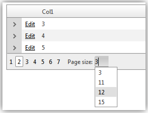

# Paging Overview

## 

**RadGrid** natively supports table paging, which lets users view large sets of data in small chunks for faster loading and easier navigation. It also provides a set of events, helper methods and properties if the paging operation requires custom intervention.

Set the **AllowPaging** property to **True** to have **RadGrid** handle paging. By default, the **AllowPaging** property is **False**. You can set the AllowPaging property on the entire grid, or set it for each **GridTableView** individually. The **AllowPaging** setting on a **GridTableView** control overrides the default specified by the grid.

If you want to [handle paging in a custom manner](), set the grid's **AllowCustomPaging** property to **True** as well.

Set the **PageSize** property on the grid or table view to specify the number of records that should appear in each chunk. When paging is enabled, **RadGrid** renders a pager item (**GridPagerItem**) on the bottom and/or top of each **GridTableView** displayed in the hierarchy when the number of records in the table view exceeds the page size.

Since Q2 2012 the RadGrid control provides **PageSizes** property which determines the values that will be displayed in the PageSize combo box in the RadGrid pager item.

The default value of this property is **int[] { 10,20,50 }**.

There are a number of different [pager types]() you can use, including [template support]() for designing your own pager.

**RadGrid** exposes the **PageSizeControlType** property in its**PagerStyle** property collection which is an enum of type **PagerDropDownControlType**. It has three values available with **RadComboBox** being the default one:

* **None**

* **RadComboBox**

* **RadDropDownList**

As it name implies, the property specifies what type of page size drop down control will be rendered.The property provides an easy wayto switch off the page size combo or replace it with its light weight counterpart **RadDropDownList**.
