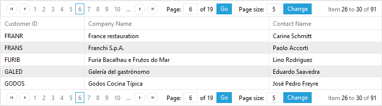
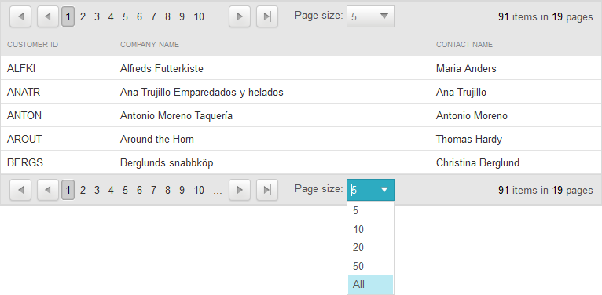

# Pager Item


When paging is enabled, __RadGrid__ renders a pager item (__GridPagerItem__) on the bottom and/or top of each table view (__GridTableView__) displayed in the hierarchy.

## PagerStyle

The appearance of the pager item can be controlled using the __PagerStyle__ property of the __GridTableView__ object. As with most appearance options, the default __PagerStyle__ for each __GridTableView__ can specified using the __PagerStyle__ property of the __RadGrid__ control. You then only need to set the __PagerStyle__ property of a __GridTableView__ if you want it to differ from the default set in the __RadGrid__ object.

In addition to the usual item style properties such as __ForeColor__, __BackColor__, __BorderStyle__, and so on, __PagerStyle__ includes a number of properties that are unique to the pager item. These are described below:

## Position

__PagerStyle.Position__ lets you specify where the pager appears in the table view. You can set the __Position__ sub-property to "Top", "Bottom" or "TopAndBottom".

## Mode

__PagerStyle.Mode__ lets you specify what controls appear in the pager item to help users navigate through the pages. The __Mode__ sub-property can be set to "NextPrev", "NumericPages", "NextPrevAndNumeric", "Advanced", "NextPrevNumericAndAdvanced", or "Slider".

>note The __Mode__ property, (or any other properties controlling paging behavior) can be set using either the[RadGrid Property Builder](), or programmatically in the code-behind. Values set programmatically are persisted into the __ViewState__ , providing consistency in the grid's page navigation.
>


>note Note that the default (NextPrevAndNumeric) and the advanced grid pagers require the viewstate of the control to be enabled.
>


The following screen shots show how the pager looks for each of the __PagerStyle.Mode__ values:

NextPrev

When __Mode__ is "NextPrev", the pager contains two buttons; a backward pointing arrow and a forward pointing arrow. These let the user move to the previous or next page:

NumericPages

When __Mode__ is "NumericPages", the pager contains link buttons with page numbers:

The __PagerStyle.PagebuttonCount__ property specifies the number of link buttons appear in this list.

NextPrevAndNumeric

When __Mode__ is "NextPrevAndNumeric", the pager contains both the arrow buttons and the link buttons with page numbers:

Advanced

When __Mode__ is "Advanced", the pager contains text boxes that let the user enter a page number or a new page size:

NextPrevNumericAndAdvanced

When __Mode__ is "NextPrevNumericAndAdvanced", the pager contains all of the controls available in both the "NextPrevAndNumeric" and "Advanced" modes:

Slider

When __Mode__ is "Slider", the pager contains a slider control for changing pages:

You can also customize the pager to provide an alphabetic mode. For details on how to do this, see [Alphabetic paging in RadGrid]().

## Pager button images

By default, the appearance of the controls in the pager are taken from the current [Skin](). You can substitute your own images for these controls by setting one of the following sub-properties:

* __PagerStyle.NextPageImageUrl__ specifies the URL for the next page control.

* __PagerStyle.PrevPageImageUrl__ specifies the URL for the previous page control.

* __PagerStyle.FirstPageImageUrl__ specifies the URL for a first page control.

* __PagerStyle.LastPageImageUrl__ specifies the URL for a last page control.

## Localizing GridPagerItem strings

When the pager's __Mode__ is "NextPrev" or "NextPrevAndNumeric", you can localize the strings that appear in the pager.

To localize the tooltips that appear when the mouse hovers over a control in the pager, use the following sub-properties:

* __PagerStyle.PrevPageToolTip__ specifies the tooltip that is displayed for the previous page button.

* __PagerStyle.PrevPagesToolTip__ specifies the tooltip that is displayed for the previous pages button.

* __PagerStyle.NextPageToolTip__ specifies the tooltip that is displayed for the next page button.

* __PagerStyle.NextPagesToolTip__ specifies the tooltip that is displayed for the next pages button.

You can also localize the strings that appear as the "Change page" prompt and indicating the current page position by setting the [PagerStyle.PagerTextFormat]() property. If you want to hide these strings altogether, set the __PagerStyle.ShowPagerText__ property to __False__.

>caution You can also add your own strings to the right of the Previous page button or the left of the NextPage button by setting the __PagerStyle.PrevPageText__ and __PagerStyle.NextPageText__ properties.
>


## Custom Pager Buttons

You can add and use any command buttons to control grid paging. When using command buttons to control paging, set the __CommandName__ to "Page", and the __CommandArgument__ to "Next", "Prev", or the number of a page (e.g. "5").

If the built-in paging commands are not sufficient, you can also provide your own [custom paging]().

## Controlling when the pager appears

You can have the grid (or table view) display the pager regardless of whether the number of records exceeds the page size by setting the __PagerStyle.AlwaysVisible__property to __True__. (Its default value is __False__.)

## Getting the total row count

You can get the exact numbers of rows in your __RadGrid__ either directly from the DataSource or in an __ItemDataBound__ event handler from the pager item:


````C#
	
	    protected void RadGrid1_ItemDataBound(object sender, GridItemEventArgs e)
	    {
	        if (e.Item is GridPagerItem)
	        {
	            Label1.Text = (e.Item as GridPagerItem).Paging.DataSourceCount.ToString();
	        }
	    }
	
````
````VB.NET
	
	    Protected Sub RadGrid1_ItemDataBound(ByVal sender As Object, ByVal e As GridItemEventArgs) Handles RadGrid1.ItemDataBound
	        If TypeOf e.Item Is GridPagerItem Then
	            Label1.Text = CType(e.Item, GridPagerItem).Paging.DataSourceCount.ToString()
	        End If
	    End Sub
	
````


You can also get the row count from the pager in the ASPX file as follows:

````ASPNET
	  <PagerTemplate>  
	    <%# (Container as GridPagerItem).Paging.DataSourceCount %>
	  </PagerTemplate>
````


## Option to show all items in the pager dropdown

Since __Q1 2015__ version of __UI for ASP.NET AJAX__ we intoduced a new property named __EnableAllOptionInPagerComboBox__ which will add a new item with text "__All__" in the pager dropdown. The item will be included in both __RadComboBox__ and __RadDropDown__ page size controls.When selecting this item all items will be displayed and the pager item will remain visible.

````ASPNET
	  <PagerStyle EnableAllOptionInPagerComboBox="true" />
````


