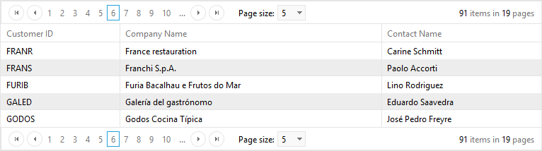
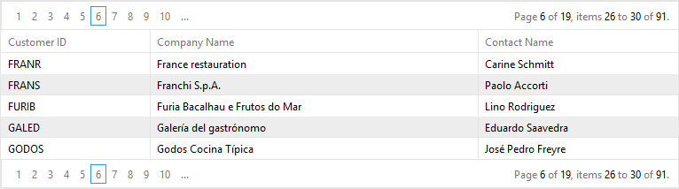

# Pager Item


When paging is enabled, **RadGrid** renders a pager item (**GridPagerItem**) on the bottom and/or top of each table view (**GridTableView**) displayed in the hierarchy.


## PagerStyle

The appearance of the pager item can be controlled using the **PagerStyle** property of the **GridTableView** object. As with most appearance options, the default **PagerStyle** for each **GridTableView** can specified using the **PagerStyle** property of the **RadGrid** control. You then only need to set the **PagerStyle** property of a **GridTableView** if you want it to differ from the default set in the **RadGrid** object.

In addition to the usual item style properties such as **ForeColor**, **BackColor**, **BorderStyle**, and so on, **PagerStyle** includes a number of properties that are unique to the pager item. These are described below:

## Position

**PagerStyle.Position** lets you specify where the pager appears in the table view. You can set the **Position** sub-property to "Top", "Bottom" or "TopAndBottom".

## Mode

**PagerStyle.Mode** lets you specify what controls appear in the pager item to help users navigate through the pages. The **Mode** sub-property can be set to "NextPrev", "NumericPages", "NextPrevAndNumeric", "Advanced", "NextPrevNumericAndAdvanced", or "Slider".

>note The **Mode** property, (or any other properties controlling paging behavior) can be set using either the[RadGrid Property Builder](), or programmatically in the code-behind. Values set programmatically are persisted into the **ViewState** , providing consistency in the grid's page navigation.
>


>note The default (NextPrevAndNumeric) and the advanced grid pagers require the viewstate of the control to be enabled.
>


The following screen shots show how the pager looks for each of the **PagerStyle.Mode** values:

NextPrev

When **Mode** is "NextPrev", the pager contains two buttons; a backward pointing arrow and a forward pointing arrow. These let the user move to the previous or next page:


NumericPages

When **Mode** is "NumericPages", the pager contains link buttons with page numbers:


The **PagerStyle.PagebuttonCount** property specifies the number of link buttons appear in this list.

NextPrevAndNumeric

When **Mode** is "NextPrevAndNumeric", the pager contains both the arrow buttons and the link buttons with page numbers:


Advanced

When **Mode** is "Advanced", the pager contains text boxes that let the user enter a page number or a new page size:


NextPrevNumericAndAdvanced

When **Mode** is "NextPrevNumericAndAdvanced", the pager contains all of the controls available in both the "NextPrevAndNumeric" and "Advanced" modes:


Slider

When **Mode** is "Slider", the pager contains a slider control for changing pages:


You can also customize the pager to provide an alphabetic mode. For details on how to do this, see [Alphabetic paging in RadGrid]().

## Pager button images

By default, the appearance of the controls in the pager are taken from the current [Skin](). You can substitute your own images for these controls by setting one of the following sub-properties:

* **PagerStyle.NextPageImageUrl** specifies the URL for the next page control.

* **PagerStyle.PrevPageImageUrl** specifies the URL for the previous page control.

* **PagerStyle.FirstPageImageUrl** specifies the URL for a first page control.

* **PagerStyle.LastPageImageUrl** specifies the URL for a last page control.

## Localizing GridPagerItem strings

When the pager's **Mode** is "NextPrev" or "NextPrevAndNumeric", you can localize the strings that appear in the pager.

To localize the tooltips that appear when the mouse hovers over a control in the pager, use the following sub-properties:

* **PagerStyle.PrevPageToolTip** specifies the tooltip that is displayed for the previous page button.

* **PagerStyle.PrevPagesToolTip** specifies the tooltip that is displayed for the previous pages button.

* **PagerStyle.NextPageToolTip** specifies the tooltip that is displayed for the next page button.

* **PagerStyle.NextPagesToolTip** specifies the tooltip that is displayed for the next pages button.

You can also localize the strings that appear as the "Change page" prompt and indicating the current page position by setting the [PagerStyle.PagerTextFormat]() property. If you want to hide these strings altogether, set the **PagerStyle.ShowPagerText** property to **False**.

>caution You can also add your own strings to the right of the Previous page button or the left of the NextPage button by setting the **PagerStyle.PrevPageText** and **PagerStyle.NextPageText** properties.
>


## Custom Pager Buttons

You can add and use any command buttons to control grid paging. When using command buttons to control paging, set the **CommandName** to "Page", and the **CommandArgument** to "Next", "Prev", or the number of a page (e.g. "5").

If the built-in paging commands are not sufficient, you can also provide your own [custom paging]().

## Controlling when the pager appears

You can have the grid (or table view) display the pager regardless of whether the number of records exceeds the page size by setting the **PagerStyle.AlwaysVisible**property to **True**. (Its default value is **False**.)

## Getting the total row count

You can get the exact numbers of rows in your **RadGrid** either directly from the DataSource or in an **ItemDataBound** event handler from the pager item:


````C#
protected void RadGrid1_ItemDataBound(object sender, GridItemEventArgs e)
{
    if (e.Item is GridPagerItem)
    {
        Label1.Text = (e.Item as GridPagerItem).Paging.DataSourceCount.ToString();
    }
}
````
````VB	
Protected Sub RadGrid1_ItemDataBound(ByVal sender As Object, ByVal e As GridItemEventArgs) Handles RadGrid1.ItemDataBound
    If TypeOf e.Item Is GridPagerItem Then
        Label1.Text = CType(e.Item, GridPagerItem).Paging.DataSourceCount.ToString()
    End If
End Sub
````


You can also get the row count from the pager in the ASPX file as follows:

````ASP.NET
<PagerTemplate>  
  <%# (Container as GridPagerItem).Paging.DataSourceCount %>
</PagerTemplate>
````


## Option to show all items in the pager dropdown

Since **Q1 2015** version of **UI for ASP.NET AJAX** we introduced a new property named **EnableAllOptionInPagerComboBox** which will add a new item with text "**All**" in the pager dropdown. The item will be included in both **RadComboBox** and **RadDropDown** page size controls.When selecting this item all items will be displayed and the pager item will remain visible.

````ASP.NET
<PagerStyle EnableAllOptionInPagerComboBox="true" />
````


