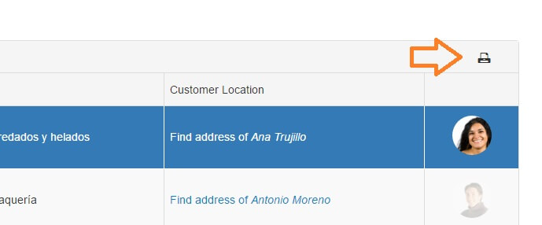

# Print

Since R2 2016 release of the **Telerik.Web.UI for ASP .NET AJAX** the RadGrid control provides a new built in **print** feature for lightweight and mobile render modes. By using the print functionality, a PDF document is generated and sent to the browser for printing, which allows the control to preserve its appearance (including built-in skins and custom styles). You can add the built in print button by setting the **ShowPrintButton** property to "true" under **CommandItemSettings**, which will render it in the command item.



In case the PrintButton is hidden you can still use the client print functionality by call the public **print()** method for the RadGrid control

````JavaScript

$find(“RadGrid1”).print();

````


>note The browser’s popups should be enabled to have the print functionality work properly.

>note In order for the output to be precise, and for Unicode support, you must declare TrueType fonts explicitly.

## See Also

 * [Demo: RadGrid Print](http://demos.telerik.com/aspnet-ajax/grid/examples/functionality/printing/defaultcs.aspx?isNew=true)


