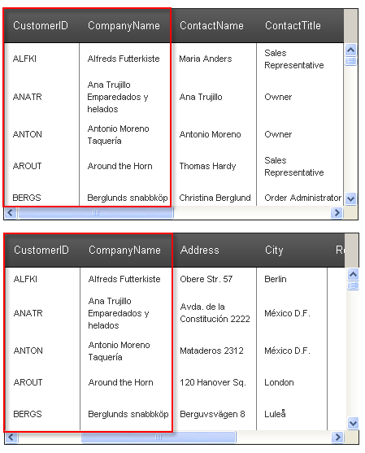

# Frozen Columns

When scrolling is enabled and you are using [static headers](), you can make **RadGrid** columns static as well. This can be useful when you want to ensure that the data in one or more columns is visible at all times but still allow a horizontal scroll bar for navigation.

>note Static columns are not enabled unless the grid is using static headers.
>

To enable static columns, set the **ClientSettings.Scrolling.FrozenColumnsCount** property to a value greater than 0. The value of FrozenColumnsCount specifies the number of columns (starting with the leftmost column) that do not scroll when the of the user scrolls the grid horizontally, using the horizontal scroll bar. This feature is functional even when in hierarchical grids and grids that support grouping.

>note  **RadGrid** has only a single horizontal scroll bar. When using frozen columns in a hierarchical grid, only the columns of the master table are frozen.
>

The following two screen shots show a grid with **FrozenColumnsCount** set to 2. Note that the first two columns do not scroll when the horizontal scroll bar is dragged:

For a live example demonstrating the frozen columns feature, see [Frozen columns](http://demos.telerik.com/aspnet-ajax/Grid/Examples/GeneralFeatures/FrozenColumns/DefaultCS.aspx).

## Unsupported scenarios

There are several limitations that you should have in mind. They are caused by the complexity and specifics of the frozen columns feature, which is implemented by means of hiding and showing columns, instead of actually scrolling them.

* Resizing with frozen column is not supported.

* Merged headers with frozen columns are not supported.

* When frozen columns are used, tabbing between the textboxes in an inline edit form is not supported out-of-the-box, because the frozen columns will be scrolled together with the non-frozen. In selected scenarios, this functionality can be achieved if you subscribe to the textboxes' focus events and scroll a specific 
 with Javascript. This 
 has a client ID of "**..._Frozen**" where "..." is the RadGrid client ID. When doing this, you should take into account the current scroll position, and the width of the column that should be hidden/shown.
