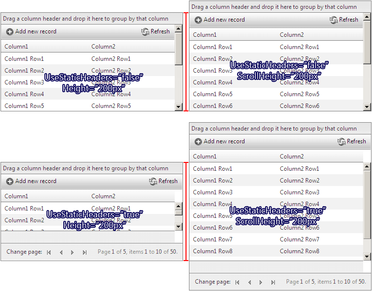

# Height vs. ScrollHeight

## 

RadGrid provides two properties for controlling its height declaratively or programmatically:

* *RadGridInstance*.__Height__

* *RadGridInstance*.ClientSettings.Scrolling.__ScrollHeight__

__Height__ determines the height of the whole RadGrid control, as it is applied to its outermost HTML element. __ScrollHeight__ determines the height of the control's scrollable area when scrolling is enabled. Depending on whether static headers are enabled or not, the scrollable area includes different portions of the RadGrid control:

* If static headers are enabled, the scrollable container includes only the data items. The header, footer, pager, group panel and command items are "static" (not scrolled).

* If static headers are not enabled, the scrollable container includes everything, except the group panel.

>caution  __Height__ and __ScrollHeight__ should not be used at the same time. In this case ScrollHeight will be ignored.
>

Depending on whether Height or ScrollHeight is set, RadGrid behaves differently:

* If __Height__ is set, it is applied to the whole RadGrid and the control calculates the height of its scrollable container on the client. The height of the scrollable container will depend on the height of the header, footer, pager, group panel and command items' heights, which will be subtracted from the total RadGrid height.

* If __ScrollHeight__ is set, it is applied to the scrollable container directly and the RadGrid control occupies as much vertical space as it needs to accommodate the elements, which are outside the scrollable container. In other words, the total RadGrid height will be larger than the ScrollHeight value.

>caution  __ScrollHeight__ should not be set in percent.
>

Using __ScrollHeight__ instead of __Height__ will improve the RadGrid client-side performance and prevent vertical flickering, which is inevitable in the case when the control needs to calculate and adjust its vertical layout on the client.

Here is a screen shot, which shows how the RadGrid will look like in the 4 possible modes, determined by the combinations of using the Height, ScrollHeight and UseStaticHeaders properties.

