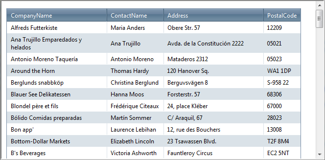

# Scrolling Overview

Often, when constructing a Web page that contains a grid, there are design limitations regarding the size of the grid. In such cases, you may need to enable client-side grid scrolling so that the grid can fit it in the allowed space. You can enable scrolling by setting the **ClientSettings.Scrolling.AllowScroll** property to **True** (By default its value is **False**.)

>note The **ClientSettings.Scrolling.ScrollHeight** property specifies the height value beyond which scrolling is turned on. The default value is 300px.
>

When scrolling is enabled, scroll bars appear on the grid when the number of records it displays would cause it to exceed the value of **ScrollHeight**:

When scrolling is not enabled, the entire grid appears in the Web page. Users must scroll the Web page instead:

**RadGrid** enhances the simple scrolling by supporting [static headers]() and [frozen columns]() - you can scroll the grid data while the header row always stays visible at the top. Furthermore, there is [virtual scrolling]() option that fetches only specified range of records to be visualized on the current page.

>note On mobile devices the scrolling and row drag-drop features in the grid are performed by the same touch gesture: dragging of the content areaof the grid. This imposes a limitation when both features are enabled on touch devices because it cannot be exclusively determined which one of the two should be performed. One way to distinguish between scrolling and row drag-drop on mobile devices is to use a GridDragDropColumn- this way the dragging of the rows will be performed only when you drag a row by the icon in the GridDragDropColumn and on the rest of the c ontent area scrolling will be performed.
>

## Appearance

You can modify the way **RadGrid** looks during scrolling by modifying the following CSS classes (the "_Default" suffix should be replaced with the name of the skin that you are using):

* **GridHeaderDiv_Default** - for controlling the appearance of the **GridHeaderItem**

* **GridDataDiv_Default -** for controlling the appearance of the **GridDataItem**

* **GridFooterDiv_Default** - for controlling the appearance of the **GridFooterItem**
