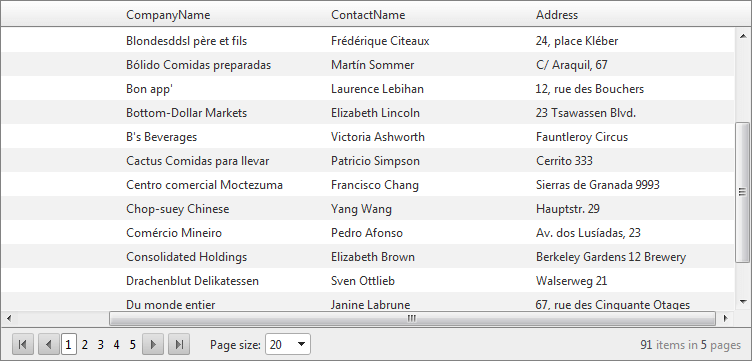
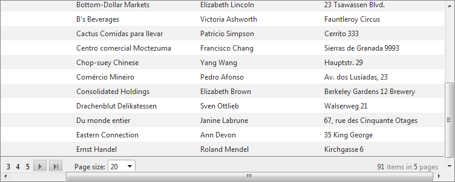

# Scroll with Static Headers


The most common problem when scrolling is losing the context of the current column. This context is supplied by the column header. **RadGrid** lets you keep the header at the top even when scrolling the grid. To enable this feature, set the **ClientSettings.Scrolling.UseStaticHeaders** property to **True**. (Its default value is **False**.)

When **UseStaticHeaders** property is set to **True**, grid header and pager remain static, even when the grid is scrolled:



When **UseStaticHeaders** is **False**, the header and pager scroll along with the data rows:



>note When scrolling is enabled and **UseStaticHeaders** is **True** , the grid columns should declare **HeaderStyle.Width** .
>


You can set **UseStaticHeaders** declaratively at design time:

````ASP.NET
<telerik:RadGrid runat="server" ... />
   <ClientSettings>
       <Scrolling AllowScroll="True" UseStaticHeaders="true" />
   <ClientSettings>
   ...
</telerik:RadGrid>		
````


You can also set the scrolling properties in the code-behind at runtime:


````C#
RadGrid1.ClientSettings.Scrolling.AllowScroll = true;
RadGrid1.ClientSettings.Scrolling.UseStaticHeaders = true;
````
````VB
RadGrid1.ClientSettings.Scrolling.AllowScroll = True
RadGrid1.ClientSettings.Scrolling.UseStaticHeaders = True
````


>note If you use static headers when the grid's **Width** and **Height** properties are set to "100%", the Web page shows only the grid scrollbars; the browser scrollbars are hidden. In this way, **RadGrid** can mimic a desktop application such as Microsoft Excel.
>

