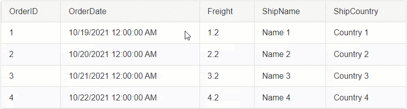
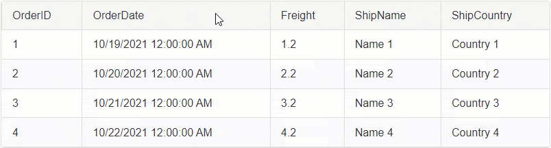
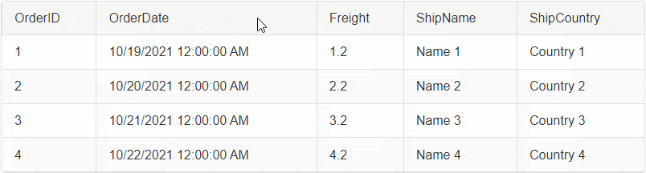
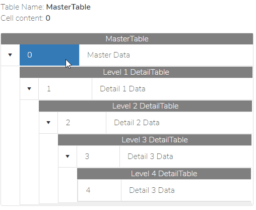

# Selecting

Selecting is a key feature of the Grid that will allow you to enable selection for [Rows](#select-rows) and [Cells](#select-cells).

In this page you will find several sections with a demo GIF animation showing different Select option you can have in the Grid. Each section has a link to the individual page that describes the configuration as well as provides with additional examples and scenarios.

- **Select Rows**
  - [Select a Single Row](#select-a-single-row)
  - [Select Multiple Rows](#select-multiple-rows)
- **Select Cells**
  - [Select a Single Cell](#select-a-single-cell)
  - [Select Multiple Cells](#select-multiple-cells)
  - [Select Cells of a Single Column](#select-cells-of-a-single-column)
  - [Select Cells of Multiple Columns](#select-cells-of-multiple-columns)
  - [Select Cells in Hierarchy](#select-cells-in-hierarchy)
- **Extract Values of Selected Cells**
  - [Extract Values of Selected Cells](#extract-values-of-selected-cells)

>note Selection is persisted across PostBacks **except when rebinding the Grid**. Having that in mind, know that some **Commands will rebind the Grid**, (see [Commands that invoke Rebind implicitly](https://docs.telerik.com/devtools/aspnet-ajax/controls/grid/control-lifecycle/commands-that-invoke-rebind-implicitly)), and therefore the selection will be lost.

# Select Rows

Depending on the settings, you can select rows in different ways:
- [Select a Single Row](#select-a-single-row)
- [Select Multiple Rows](#select-multiple-rows)

## Select a Single Row

- [Client-side Selecting with a Click]()
- [Server-side Selecting with a CheckBox]()
- [Server-side Selecting with a Select Button]()

## Select Multiple Rows

- [Client-side Selecting Multiple Rows]()
- [Server-side Selecting Multiple Rows]()

# Select Cells

Apart from row selection RadGrid supports the selection of individual cells or entire Columns in the Grid table. The cell selection functionality is controlled through the `ClientSettings.Selecting.CellSelectionMode` property.

Options are:
- `SingleCell` - Allows selecting one Cell at a time.
- `MultiCell` - Allow selecting multiple Cells.
- `Column` - Alows you to Select the Cells of one Column at a time.
- `MultiColumn` - Allows you to Select the Cells of Multiple Columns.

Here is a list of different Scenarios for Cell Selection:
  - [Select a Single Cell](#select-a-single-cell)
  - [Select Multiple Cells](#select-multiple-cells)
  - [Select Cells of a Single Column](#select-cells-of-a-single-column)
  - [Select Cells of Multiple Columns](#select-cells-of-multiple-columns)
  - [Select Cells in Hierarchy](#select-cells-in-hierarchy)
  - [Extract Values of Selected Cells](#extract-values-of-selected-cells)

## Select a Single Cell

Check out the [SingleCell]() article for instructions and examples.

## Select Multiple Cells

Check out the [MultiCell]() article for instructions and examples.

## Select Cells of a Single Column

Check out the [Column]() article for instructions and examples.

## Select Cells of Multiple Columns

Check out the [MultiColumn]() article for instructions and examples.

## Select Cells in Hierarchy

>warning **Cell Selection in Hierarchical** Structures is **not included in the built-in functionality**, therefore, an **additional implementation is required**. 
>In the [Select cells in RadGrid with Hierarchy](https://www.telerik.com/support/code-library/select-cells-in-radgrid-with-hierarchy) Code Library article we show one example that will give you an idea how this would work. 
>As this is a custom (non-supported) scenario, further tweaking will be up to the developer working on it.

## Extract Values of Selected Cells

Check out the [Extract Values of Selected Cells]() article for examples.

## See Also

- [SingleCell]()
- [MultiCell]()
- [Column]()
- [MultiColumn]()
- [Row Selection - Demo](https://demos.telerik.com/aspnet-ajax/grid/examples/functionality/selecting/row-selection/defaultcs.aspx)
- [Cell Selection - Demo](https://demos.telerik.com/aspnet-ajax/Grid/Examples/Client/CellSelection/DefaultCS.aspx)
- [Accessing Values and Controls]()
  
