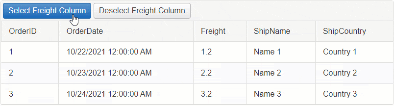
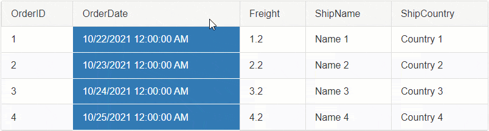

# Column

The **Column** option allows you to select the Cells of a single Column by clicking on the Column Header.


## Built-in Selection

To enable the Column selection, set the `ClientSettings.Selecting.CellSelectionMode` property to `Column`.

**Example**

````ASP.NET
<telerik:RadGrid ID="RadGrid1" runat="server">
    <ClientSettings>
        <Selecting CellSelectionMode="Column" />
    </ClientSettings>
</telerik:RadGrid>
````

By default the Column selection is happening on the Client-Side. In order to Select Cells on Server-Side, you will need to select them Programmatically, see [Programmatic Server-Side](#programmatic-selection-server-side) section for more details.

In addition to the built-in functionality, you can also Select a Column programmatically using the Client or Server APIs.
  - [Programmatic Selection Client-Side](#programmatic-selection-client-side)
  - [Programmatic Selection Server-Side](#programmatic-selection-server-side)

## Programmatic Selection Client-Side

Besides clicking on the Column to select the Cells in it, you can also use JavaScript to select them programmatically.

### Select/Deselect the Cells of a single Column on Client-Side



**Example: Select the Cells of Freight Column**

````JavaScript
function SelectFreightColumn(sender, args) {
    // Get reference to RadGrid
    var grid = $find('<%= RadGrid1.ClientID %>');
    // Get reference to MasterTable
    var masterTable = grid.get_masterTableView();
    // Get the data items collection
    var dataItems = masterTable.get_dataItems();
    // Loop through the data items
    for (var rowIndex = 0; rowIndex < dataItems.length; rowIndex++) {
        // access the current item
        var currentRow = dataItems[rowIndex];
        // find the Cell by the Column Unique Name
        var cellToSelect = currentRow.get_cell("Freight");
        // Select the cell
        grid._cellSelection.select(cellToSelect);
    }
}
````

**Example: Deselect the Cells of Freight Column**

````JavaScript
function DeselectFreightColumn(sender, args) {
    // Get reference to RadGrid
    var grid = $find('<%= RadGrid1.ClientID %>');
    // Get reference to MasterTable
    var masterTable = grid.get_masterTableView();
    // Get the data items collection
    var dataItems = masterTable.get_dataItems();
    // Loop through the data items
    for (var rowIndex = 0; rowIndex < dataItems.length; rowIndex++) {
        // access the current item
        var currentRow = dataItems[rowIndex];
        // find the Cell by the Column Unique Name
        var cellToDeselect = currentRow.get_cell("Freight");
        // Deselect the cell
        grid._cellSelection.deselect(cellToDeselect);
    }
}
````

## Programmatic Selection Server-Side

In order to Select or Deselect the Cells of a Column on Server-Side, you will need to find the GridTableCell instance of that Column for each row and set its **Selected** property to **True**/**False** respectively.

### Select/Deselect the Cells of a single Column upon clicking on the Column header



By default the Selection is handled on the Client-Side. To make it work on server-side, you will need to cancel the [OnCellSelecting]() client-side event of the Grid and use the JavaScript [fireCommand()]() function to Fire a Custom Command.

On the backend, you can capture the custom command, find the desired cell and select it respectively.

Follow the **5 steps below** to implement this functionality:

**STEP 1** 

Attach the [OnCellSelecting](), the [OnColumnClick]() client-side events and the [ItemComannd]() server-side event to RadGrid. Set the `ClientSetting-Selecting-CellSelectionMode` property to `MultiCell`.

````ASP.NET
<telerik:RadGrid ID="RadGrid1" runat="server" OnItemCommand="RadGrid1_ItemCommand">
    <ClientSettings>
        <Selecting CellSelectionMode="MultiCell" />
        <ClientEvents OnCellSelecting="OnCellSelecting" OnRowClick="OnColumnClick" />
    </ClientSettings>
</telerik:RadGrid>
````

**STEP 2** 

Cancel the CellSelecting event

````JavaScript
function OnCellSelecting(sender, args) {
    // Cancel the Built-in event for Selecting
    args.set_cancel(true);
}
````

**STEP 3** 

When the Column is clicked, gather the information and fire a Custom Command using the [fireCommand()]() function with the necessary information as arguments. To find the correct Cell instance on the server, you will need to submit the Column Unique Name in the arguments.

````JavaScript
// When the Column header is clicked
function OnColumnClick(sender, args) {
    var grid = sender;

    // Do nothing In case of a Header Template, or if Sorting is Enabled and clicking on an Control 
    if (args.get_domEvent().target.tagName.toUpperCase() != 'TH') {
        args.get_domEvent().preventDefault();
        args.get_domEvent().stopPropagation();

        return;

    // also do nothing if the CellSelectionMode is not set to Column/MultiColumn
    } else if (grid.ClientSettings.Selecting.CellSelectionMode != Telerik.Web.UI.GridCellSelectionMode.Column &&
        grid.ClientSettings.Selecting.CellSelectionMode != Telerik.Web.UI.GridCellSelectionMode.MultiColumn) {

        return;
    }

    // Get reference to the TableView
    var masterTable = grid.get_masterTableView();
    // Get reference to the Clicked Column
    var column = args.get_gridColumn();

    // Prepare a JavaScript object that holds ColumnUniqueName
    var arguments = {
        ColumnUniqueName: column.get_uniqueName(),
    };
    // Fire a custom command sending the JavaScript object as a JSON string to the server
    masterTable.fireCommand("SelectColumn", JSON.stringify(arguments));
}
````

**STEP 4**

Create a Class for the Arguments (ColumnUniqueName) in the Code Behind.

````C#
class SelectArguments
{
    public string ColumnUniqueName { get; set; }
}
````

**STEP 5**

Using the [ItemComannd]() server-side event, you can capture the command and the arguments you fired from the client. 

Parse the arguments and find the cell based on that. Once you have the Cell, set its **Selected** property to **True**.

````C#
protected void RadGrid1_ItemCommand(object sender, GridCommandEventArgs e)
{
    var grid = (RadGrid)sender;
    // Check if the CommandName is the "SelectColumn"
    if (e.CommandName == "SelectColumn")
    {
        // Create a new instance of AdvancedJavaScriptSerializer object
        AdvancedJavaScriptSerializer serializer = new AdvancedJavaScriptSerializer();

        // Serialize/parse the JSON string
        SelectArguments selectArgs = serializer.Deserialize<SelectArguments>(e.CommandArgument.ToString());
        // Get the column name
        string columnUniqueName = selectArgs.ColumnUniqueName;
        // Loop through each grid item
        foreach (GridDataItem dataItem in grid.MasterTableView.Items)
        {
            // Access the item's cell by Column Unique Name
            GridTableCell cellToSelect = dataItem[columnUniqueName] as GridTableCell;
            // Select the cell
            cellToSelect.Selected = true;
        }
    }
}
````


### Select/Deselect the Cells of a Single Column upon Clicking on a Button


**Example: Select the Cells of Freight Column**

````C#
protected void RadButtonSelectFreightColumn_Click(object sender, EventArgs e)
{
    foreach (GridDataItem dataItem in RadGrid1.MasterTableView.Items)
    {
        GridTableCell cellToSelect = dataItem["Freight"] as GridTableCell;

        cellToSelect.Selected = true;
    }
}
````


**Example: Deselect the Cells of Freight Column**

````C#
protected void RadButtonDeselectFreightColumn_Click(object sender, EventArgs e)
{
    foreach (GridDataItem dataItem in RadGrid1.MasterTableView.Items)
    {
        GridTableCell cellToDeselect = dataItem["Freight"] as GridTableCell;

        cellToDeselect.Selected = false;
    }
}
````

**See Next**: [MultiColumn]()

## See Also

- [SingleCell]()
- [MultiCell]()
- [MultiColumn]()
 
