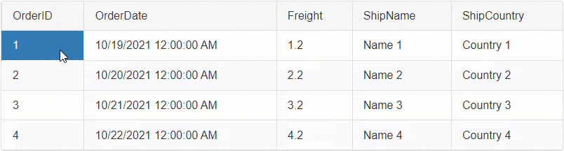
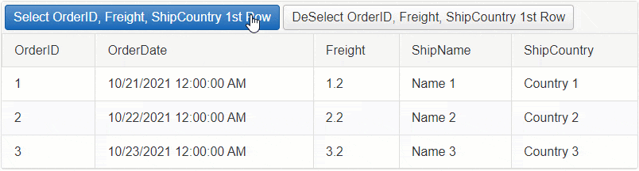
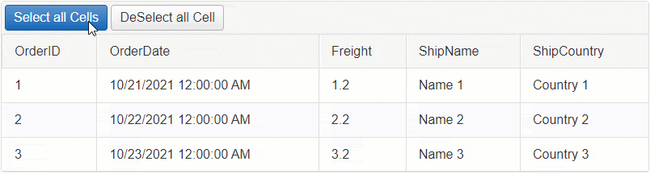
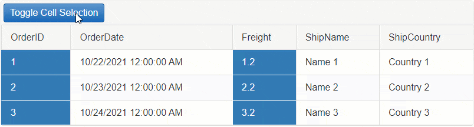
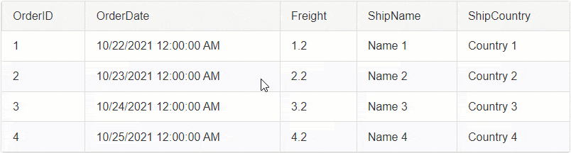
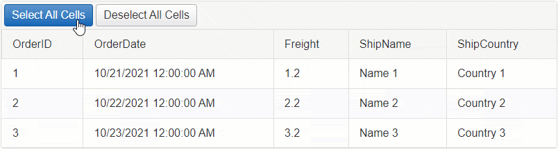
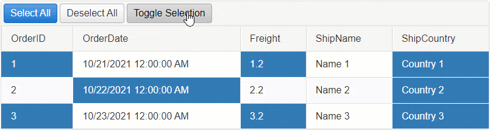

# MultiCell

The **MultiCell** option allows you to select multiple cells.



## Built-in Selection

To enable the MultiCell selection, set the `ClientSettings.Selecting.CellSelectionMode` property to `MultiCell`.

**Example**

````ASP.NET
<telerik:RadGrid ID="RadGrid1" runat="server">
    <ClientSettings>
        <Selecting CellSelectionMode="MultiCell" />
    </ClientSettings>
</telerik:RadGrid>
````

**Usage**: To Select Multiple Cells, hold down the `Ctrl` key then Click on each Cell you want to select.

By default the Cell selection is happening on the Client-Side. In order to Select Cells on Server-Side, you will need to select them Programmatically, see [Programmatic Server-Side](#programmatic-selection-server-side) section for more details.

In addition to the built-in functionality, you can also Select cells programmatically using the Client or Server APIs.
  - [Programmatic Selection Client-Side](#programmatic-selection-client-side)
  - [Programmatic Selection Server-Side](#programmatic-selection-server-side)

## Programmatic Selection Client-Side

Besides clicking on the Cells to select them, you can also use JavaScript to select them programmatically.

### Select/Deselect one or more Cells using JavaScript



**Example: Select OrderID, Freight, ShipCountry Column cells in the first row.**

````JavaScript
function SelectOneOrMoreCells(sender, args) {
    // Get reference to RadGrid
    var grid = $find('<%= RadGrid1.ClientID %>');
    // Get reference to MasterTable
    var masterTable = grid.get_masterTableView();
    // Access the first GridDataItem
    var firstDataItem = masterTable.get_dataItems()[0];
    // Access the Freight cell element in the GridDataItem
    var cellToSelect = firstDataItem.get_cell("Freight");
    // Select the Cell
    grid._cellSelection.select(cellToSelect);

    // Repeat with other Cells
    cellToSelect = firstDataItem.get_cell("OrderID");
    grid._cellSelection.select(cellToSelect);

    cellToSelect = firstDataItem.get_cell("ShipCountry");
    grid._cellSelection.select(cellToSelect);
}
````

**Example: Deselect OrderID, Freight, ShipCountry Column cells in the first row.**

````JavaScript
function DeselectOneOrMoreCells(sender, args) {
    // Get reference to RadGrid
    var grid = $find('<%= RadGrid1.ClientID %>');
    // Get reference to MasterTable
    var masterTable = grid.get_masterTableView();
    // Access the first GridDataItem
    var firstDataItem = masterTable.get_dataItems()[0];
    // Access the Freight cell element in the GridDataItem
    var cellToDeselect = firstDataItem.get_cell("Freight");
    // Deselect the Cell
    grid._cellSelection.deselect(cellToDeselect);

    // Repeat with other Cells
    cellToDeselect = firstDataItem.get_cell("OrderID");
    grid._cellSelection.deselect(cellToDeselect);

    cellToDeselect = firstDataItem.get_cell("ShipCountry");
    grid._cellSelection.deselect(cellToDeselect);
}
````

### Select/Deselect all Cells using JavaScript



Here are **two approaches** for selecting/deselecting all cells.

#### Approach 1 (RECOMMENDED)

Since the select() and deselect() methods take the cell (TD element) as argument, the fastest way to find the cells would be by using jQuery. Write a jQuery code to find all cells in the Table, then loop through each and select/deselect them respectively.

**Example: Select All Cells using jQuery**

````JavaScript
function SelectAllCells(sender, args) {
    // Get reference to RadGrid
    var grid = $find('<%= RadGrid1.ClientID %>');
    // Get reference to MasterTable
    var masterTable = grid.get_masterTableView();
    // Find all Cells using jQuery
    var cellsToSelect = $(masterTable.get_element()).find('> tbody > tr > td');
    // Loop through the cells collection
    cellsToSelect.each(function () {
        var cell = this;
        // select the cell
        grid._cellSelection.select(cell);
    })
}
````

**Example: Deselect All Cells using jQuery**

````JavaScript
function DeSelectAllCells(sender, args) {
    // Get reference to RadGrid
    var grid = $find('<%= RadGrid1.ClientID %>');
    // Get reference to MasterTable
    var masterTable = grid.get_masterTableView();
    // Find all Cells using jQuery
    var cellsToDeselect = $(masterTable.get_element()).find('> tbody > tr > td');
    // Loop through the cells collection
    cellsToDeselect.each(function () {
        var cell = this;
        // deselect the cell
        grid._cellSelection.deselect(cell);
    })
}
````

**Example: Deselect only Selected Cells using jQuery**

````JavaScript
function DeselectSelectedCells(sender, args) {
    // Get reference to RadGrid
    var grid = $find('<%= RadGrid1.ClientID %>');
    // Get reference to MasterTable
    var masterTable = grid.get_masterTableView();
    // Find all Selected Cells using jQuery
    var $selectedCells = $telerik.$(masterTable.get_element()).find("> tbody > tr > td." + grid._cellSelection.selectable.options.styles.SELECTED);
    // Loop through the cells collection
    $selectedCells.each(function () {
        var cell = this;
        // deselect the cell
        grid._cellSelection.deselect(cell);
    })
}
````


#### Approach 2

This approach uses the [Grid's Client-Side APIs](). While this can provide more information on Rows, Columns and Cells, instantiating Telerik Classes can be heavier and consume more time than jQuery select would do on HTML elements.

**Example: Select all Cells using RadGrid Client-Side APIs**

````JavaScript
function SelectAllCellsUsingGridAPIs(sender, args) {
    // Get reference to RadGrid
    var grid = $find('<%= RadGrid1.ClientID %>');
    // Get reference to MasterTable
    var masterTable = grid.get_masterTableView();
    // Get reference to Rows and Columns
    var rows = masterTable.get_dataItems();
    var columns = masterTable.get_columns();
    // Loop through each Row
    for (var rowIndex = 0; rowIndex < rows.length; rowIndex++) {
        var currentRow = rows[rowIndex];
        // Loop through each Column
        for (var colIndex = 0; colIndex < columns.length; colIndex++) {
            var currentColumn = columns[colIndex];
            // Get the Column Unique Name
            var columnUniqueName = currentColumn.get_uniqueName();
            // Find the Cell by ColumnUniqueName
            var cellToSelect = currentRow.get_cell(columnUniqueName);
            // Select the Cell
            grid._cellSelection.select(cellToSelect);
        }
    }
}
````

**Example: Deselect all Cells using RadGrid Client-Side APIs**

````JavaScript
function DeselectAllCellsUsingGridAPIs(sender, args) {
    // Get reference to RadGrid
    var grid = $find('<%= RadGrid1.ClientID %>');
    // Get reference to MasterTable
    var masterTable = grid.get_masterTableView();
    // Get reference to Rows and Columns
    var rows = masterTable.get_dataItems();
    var columns = masterTable.get_columns();
    // Loop through each Row
    for (var rowIndex = 0; rowIndex < rows.length; rowIndex++) {
        var currentRow = rows[rowIndex];
        // Loop through each Column
        for (var colIndex = 0; colIndex < columns.length; colIndex++) {
            var currentColumn = columns[colIndex];
            // Get the Column Unique Name
            var columnUniqueName = currentColumn.get_uniqueName();
            // Find the Cell by ColumnUniqueName
            var cellToDeselect = currentRow.get_cell(columnUniqueName);
            // Deselect the Cell
            grid._cellSelection.deselect(cellToDeselect);
        }
    }
}
````

**Example: Toggle Cell selection using Grid's Client-Side APIs.**



````JavaScript
function ToggleCellSelectionUsingGridAPIs(sender, args) {
    // Get reference to RadGrid
    var grid = $find('<%= RadGrid1.ClientID %>');
    // Get reference to MasterTable
    var masterTable = grid.get_masterTableView();
    // Get reference to Rows and Columns
    var rows = masterTable.get_dataItems();
    var columns = masterTable.get_columns();
    // Loop through each Row
    for (var rowIndex = 0; rowIndex < rows.length; rowIndex++) {
        var currentRow = rows[rowIndex];
        // Loop through each Column
        for (var colIndex = 0; colIndex < columns.length; colIndex++) {
            var currentColumn = columns[colIndex];
            // Get the Column Unique Name
            var columnUniqueName = currentColumn.get_uniqueName();
            // Find the Cell by ColumnUniqueName
            var cellToToggle = currentRow.get_cell(columnUniqueName);
            // Create a boolean value based on whether a cell has the selected style or not
            var isSelected = cellToToggle.classList.contains(grid._cellSelection.selectable.options.styles.SELECTED);

            // Condition to check whether the cell was selected
            if (isSelected) {
                // If yes Deselect the Cell
                grid._cellSelection.deselect(cellToToggle);
            } else {
                // if not Select the Cell
                grid._cellSelection.select(cellToToggle);
            }
        }
    }
}
````

## Programmatic Selection Server-Side

Selecting Multiple Cells on the server is done the same way as described in the [SingleCell]() article. However, to let the Grid allow multiple cells to be selected, you will need to change the `ClientSettings-Selecting-CellSelectionMode` property of the Grid instance to `MultiCell`.

**Example**

````ASP.NET
<telerik:RadGrid ID="RadGrid1" runat="server">
    <ClientSettings>
        <Selecting CellSelectionMode="MultiCell" />
    </ClientSettings>
</telerik:RadGrid>
````

### Select/Deselect Multiple Cells upon clicking on them



By default the Selection is handled on the Client-Side. To make it work on server-side, you will need to cancel the [OnCellSelecting]() client-side event of the Grid and use the JavaScript [fireCommand()]() function to Fire a Custom Command.

On the backend, you can capture the custom command, find the desired cell and select it respectively.

Follow the **5 steps below** to implement this functionality (Same steps as in the [SingleCell - Programmatic Server-Side](#selectdeselect-a-cell-upon-clicking-on-it) article):

**STEP 1** 

Attach the [OnCellSelecting]() and [OnRowClick]() client-side events and the [ItemComannd]() server-side event to RadGrid.

````ASP.NET
<telerik:RadGrid ID="RadGrid1" runat="server" OnItemCommand="RadGrid1_ItemCommand">
    <ClientSettings>
        <Selecting CellSelectionMode="SingleCell" />
        <ClientEvents OnCellSelecting="OnCellSelecting" OnRowClick="OnRowClick" />
    </ClientSettings>
</telerik:RadGrid>
````

**STEP 2** 

Cancel the CellSelecting event

````JavaScript
function OnCellSelecting(sender, args) {
    // Cancel the Built-in event for Selecting
    args.set_cancel(true);
}
````

**STEP 3** 

When the Row is clicked, gather the information and fire a Custom Command using the [fireCommand()]() function with the necessary information as arguments. To find the correct Cell instance on the server, you will need to submit the Column Unique Name and the Item (row) Index in the arguments.

````JavaScript
// When the Grid row is clicked
function OnRowClick(sender, args) {
    // Get reference to the DOM event
    var domEvent = args.get_domEvent();
    // Find the Clicked Target
    var target = domEvent.target;

    // In case of Templates, the Grid cell may contain Labels, or other elements that might be clicked.
    // Because of that, you will need to make sure that you always get the instance to the cell (TD element)
    var clickedCell = target.tagName.toUpperCase() === "TD" ? target : $telerik.$(target).closest('td')[0];

    // Get reference to RadGrid instance
    var grid = sender;
    // Get reference to the MasterTable
    var masterTable = grid.get_masterTableView();
    // Find the Column based on the clicked Cell
    var column = masterTable.get_columns()[clickedCell.cellIndex];
    // Get the Clicked row
    var dataItem = args.get_gridDataItem();

    // Create a JavaScript Object with that will hold the "Item Index" and "Column Unique Name".
    var arguments = {
        ItemIndex: dataItem.get_itemIndex(),
        ColumnUniqueName: column.get_uniqueName(),
    };

    // Fire a custom command and pass the JavaScript object as a JSON string.
    masterTable.fireCommand("SelectCell", JSON.stringify(arguments));
}
````

**STEP 4**

Create a Class for the Arguments (ItemIndex, ColumnUniqueName) in the Code Behind.

````C#
class SelectArguments
{
    public int ItemIndex { get; set; }
    public string ColumnUniqueName { get; set; }
}
````

**STEP 5**

Using the [ItemComannd]() server-side event, you can capture the command and the arguments you fired from the client. 

Parse the arguments and find the cell based on that. Once you have the Cell, set its **Selected** property to **True**.

````C#
protected void RadGrid1_ItemCommand(object sender, GridCommandEventArgs e)
{
    var grid = (RadGrid)sender;
    // Check if the CommandName is the "SelectCell"
    if (e.CommandName == "SelectCell")
    {
        // Create a new instance of AdvancedJavaScriptSerializer object
        AdvancedJavaScriptSerializer serializer = new AdvancedJavaScriptSerializer();

        // Serialize/parse the JSON string
        SelectArguments selectArgs = serializer.Deserialize<SelectArguments>(e.CommandArgument.ToString());

        int itemIndex = selectArgs.ItemIndex;
        string columnUniqueName = selectArgs.ColumnUniqueName;

        // Find the Clicked row by the ItemIndex
        GridDataItem dataItem = grid.MasterTableView.Items[itemIndex];

        // Find the Clicked cell in the Clicked Row
        GridTableCell cellToSelect = dataItem[columnUniqueName] as GridTableCell;

        // Set the Selected property to True
        cellToSelect.Selected = !cellToSelect.Selected;
    }
}
````


### Select/Deselect all Cells on Server Side



Example - Select all Cells on Server-Side

````C#
protected void RadButtonSelectAll_Click(object sender, EventArgs e)
{
    foreach (GridDataItem dataItem in RadGrid1.MasterTableView.Items)
    {
        foreach (GridColumn column in RadGrid1.MasterTableView.RenderColumns.Where(col=> !(col is GridExpandColumn) && !(col is GridRowIndicatorColumn)))
        {
            GridTableCell cellToSelect = dataItem[column.UniqueName] as GridTableCell;

            cellToSelect.Selected = true;
        }
    }
}
````

Example - Deselect all Cells on Server-Side

````C#
protected void RadButtonDeselectAll_Click(object sender, EventArgs e)
{
    foreach (GridDataItem dataItem in RadGrid1.MasterTableView.Items)
    {
        foreach (GridColumn column in RadGrid1.MasterTableView.RenderColumns.Where(col => !(col is GridExpandColumn) && !(col is GridRowIndicatorColumn)))
        {
            GridTableCell cellToDeselect = dataItem[column.UniqueName] as GridTableCell;

            cellToDeselect.Selected = false;
        }
    }
}
````

Example - Toggle Cell Selection on Server-Side



**Example**

````C#
protected void RadButtonToggleSelection_Click(object sender, EventArgs e)
{
    foreach (GridDataItem dataItem in RadGrid1.MasterTableView.Items)
    {
        foreach (GridColumn column in RadGrid1.MasterTableView.RenderColumns.Where(col => !(col is GridExpandColumn) && !(col is GridRowIndicatorColumn)))
        {
            GridTableCell cellToDeselect = dataItem[column.UniqueName] as GridTableCell;

            cellToDeselect.Selected = !cellToDeselect.Selected;
        }
    }
}
````

**See Next**: [Column]()

## See Also

- [SingleCell]()
- [Column]()
- [MultiColumn]()
 
