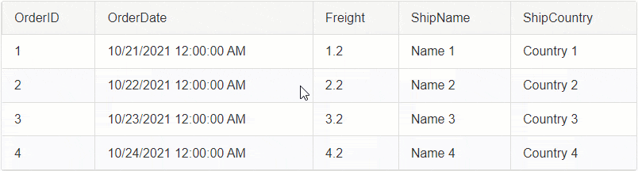
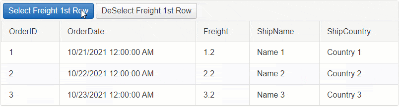

# SingleCell

The **SingleCell** option allows selecting only one Cell at a time.


## Built-in Selection

To enable the Single Cell selection, set the `ClientSettings.Selecting.CellSelectionMode` property to `SingleCell`.

**Example**

````ASP.NET
<telerik:RadGrid ID="RadGrid1" runat="server">
    <ClientSettings>
        <Selecting CellSelectionMode="SingleCell" />
    </ClientSettings>
</telerik:RadGrid>
````

By default the Cell selection is happening on the Client-Side. In order to Select Cells on Server-Side, you will need to select them Programmatically, see [Programmatic Selection Server-Side](#programmatic-selection-server-side) section for more details.

In addition to the built-in functionality, you can also Select cells programmatically using the Client or Server APIs.

- [Programmatic Client-Side](#programmatic-selection-client-side)
- [Programmatic Server-Side](#programmatic-selection-server-side)

## Programmatic Selection Client-Side

Besides clicking on the Cells to select them, you can also use JavaScript to select them programmatically.

### Select and Deselect a Cell using JavaScript


To **Select** a Cell, call the `_cellSelection.select()` function of the RadGrid instance.

Example - Select the Freight Column's Cell in the first row

````JavaScript
function btnSelectFreightCell(sender, args) {
    // Get reference to RadGrid
    var grid = $find('<%= RadGrid1.ClientID %>');
    // Get reference to MasterTable
    var masterTable = grid.get_masterTableView();
    // Access the first GridDataItem
    var firstDataItem = masterTable.get_dataItems()[0];
    // Access the Freight cell element in the GridDataItem
    var cellToSelect = firstDataItem.get_cell("Freight");
    // Call the "_cellSelection.select()" function to Select the Cell
    grid._cellSelection.select(cellToSelect);
}
````

To **Deselect** a Cell, call the `_cellSelection.deselect()` function of the RadGrid instance.

Example - Deselect the Freight Column's Cell in the first row

````JavaScript
function btnDeSelectFreightCell(sender, args) {
    // Get reference to RadGrid
    var grid = $find('<%= RadGrid1.ClientID %>');
    // Get reference to MasterTable
    var masterTable = grid.get_masterTableView();
    // Access the first GridDataItem
    var firstDataItem = masterTable.get_dataItems()[0];
    // Access the Freight cell element in the GridDataItem
    var cellToDeselect = firstDataItem.get_cell("Freight");
    // Call the "_cellSelection.deselect()" function to Deselect the Cell
    grid._cellSelection.deselect(cellToDeselect);
}
````

## Programmatic Selection Server-Side

In order to Select or Deselect a Cell on Server-Side, you will need to find the GridTableCell instance and set its **Selected** property to **True**/**False** respectively.

### Select/Deselect a Cell upon clicking on it



By default the Selection is handled on the Client-Side. To make it work on server-side, you will need to cancel the [OnCellSelecting]() client-side event of the Grid and use the JavaScript [fireCommand()]() function to Fire a Custom Command.

On the backend, you can capture the custom command, find the desired cell and select it respectively.

Follow the **5 steps below** to implement this functionality:

**STEP 1** 

Attach the [OnCellSelecting]() and [OnRowClick]() client-side events and the [ItemComannd]() server-side event to RadGrid.

````ASP.NET
<telerik:RadGrid ID="RadGrid1" runat="server" OnItemCommand="RadGrid1_ItemCommand">
    <ClientSettings>
        <Selecting CellSelectionMode="SingleCell" />
        <ClientEvents OnCellSelecting="OnCellSelecting" OnRowClick="OnRowClick" />
    </ClientSettings>
</telerik:RadGrid>
````

**STEP 2** 

Cancel the CellSelecting event

````JavaScript
function OnCellSelecting(sender, args) {
    // Cancel the Built-in event for Selecting
    args.set_cancel(true);
}
````

**STEP 3** 

When the Row is clicked, gather the information and fire a Custom Command using the [fireCommand()]() function with the necessary information as arguments. To find the correct Cell instance on the server, you will need to submit the Column Unique Name and the Item (row) Index in the arguments.

````JavaScript
// When the Grid row is clicked
function OnRowClick(sender, args) {
    // Get reference to the DOM event
    var domEvent = args.get_domEvent();
    // Find the Clicked Target
    var target = domEvent.target;

    // In case of Templates, the Grid cell may contain Labels, or other elements that might be clicked.
    // Because of that, you will need to make sure that you always get the instance to the cell (TD element)
    var clickedCell = target.tagName.toUpperCase() === "TD" ? target : $telerik.$(target).closest('td')[0];

    // Get reference to RadGrid instance
    var grid = sender;
    // Get reference to the MasterTable
    var masterTable = grid.get_masterTableView();
    // Find the Column based on the clicked Cell
    var column = masterTable.get_columns()[clickedCell.cellIndex];
    // Get the Clicked row
    var dataItem = args.get_gridDataItem();

    // Create a JavaScript Object with that will hold the "Item Index" and "Column Unique Name".
    var arguments = {
        ItemIndex: dataItem.get_itemIndex(),
        ColumnUniqueName: column.get_uniqueName(),
    };

    // Fire a custom command and pass the JavaScript object as a JSON string.
    masterTable.fireCommand("SelectCell", JSON.stringify(arguments));
}
````

**STEP 4**

Create a Class for the Arguments (ItemIndex, ColumnUniqueName) in the Code Behind.

````C#
class SelectArguments
{
    public int ItemIndex { get; set; }
    public string ColumnUniqueName { get; set; }
}
````

**STEP 5**

Using the [ItemComannd]() server-side event, you can capture the command and the arguments you fired from the client. 

Parse the arguments and find the cell based on that. Once you have the Cell, set its **Selected** property to **True**.

````C#
protected void RadGrid1_ItemCommand(object sender, GridCommandEventArgs e)
{
    var grid = (RadGrid)sender;
    // Check if the CommandName is the "SelectCell"
    if (e.CommandName == "SelectCell")
    {
        // Create a new instance of AdvancedJavaScriptSerializer object
        AdvancedJavaScriptSerializer serializer = new AdvancedJavaScriptSerializer();

        // Serialize/parse the JSON string
        SelectArguments selectArgs = serializer.Deserialize<SelectArguments>(e.CommandArgument.ToString());

        int itemIndex = selectArgs.ItemIndex;
        string columnUniqueName = selectArgs.ColumnUniqueName;

        // Find the Clicked row by the ItemIndex
        GridDataItem dataItem = grid.MasterTableView.Items[itemIndex];

        // Find the Clicked cell in the Clicked Row
        GridTableCell cellToSelect = dataItem[columnUniqueName] as GridTableCell;

        // Set the Selected property to True
        cellToSelect.Selected = !cellToSelect.Selected;
    }
}
````

### Select/Deselect a Cell on Button Click



Example - Select the Freight Column's Cell in the first row

````C#
// Select a Cell
protected void RadButtonSelect_Click(object sender, EventArgs e)
{
    GridDataItem dataItem = RadGrid1.MasterTableView.Items[0];
    GridTableCell cellToSelect = dataItem["Freight"] as GridTableCell;
    cellToSelect.Selected = true;
}
````

Example - Deselect the Freight Column's Cell in the first row

````C#
// Deselect a Cell
protected void RadButtonDeselect_Click(object sender, EventArgs e)
{
    GridDataItem dataItem = RadGrid1.MasterTableView.Items[0];
    GridTableCell cellToSelect = dataItem["Freight"] as GridTableCell;
    cellToSelect.Selected = false;
}
````

**See Next**: [MultiCell]()

## See Also

- [MultiCell]()
- [Column]()
- [MultiColumn]()
 
