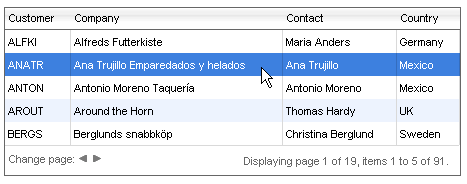
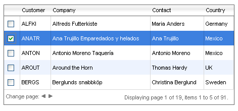

# Client-side Selecting with a Click


When the __ClientSettings.Selecting.AllowRowSelect__ property is __True__, users can select a single data row in the grid. Users cannot select the Header, Footer or Pager rows.

When client-side row selection is enabled, users can select rows by clicking anywhere within the row:



You can also add a __GridClientSelectColumn__ to the grid to let users select and de-select rows using a checkbox:



>note By default the row selection is disabled ( __AllowRowSelect__ is __False__ ).
>


The selected item can be accessed by calling the __get_selectedItems()__ method of the __GridTableView__ client-side object (see the __Client-side API Reference__ section for more information).

__RadGrid__ allows users to select several rows if the __AllowMultiRowSelection__ property is set to __True__. See [Selecting multiple rows (client-side)]().

## Selected row appearance

The style of the selected row is defined by the __SelectedItemStyle__ property. You can set this property declaratively:

````ASPNET
	  <telerik:RadGrid ID="RadGrid1" runat="server">
	    <ClientSettings>
	      <Selecting AllowRowSelect="True" />
	    </ClientSettings>
	    <SelectedItemStyle BackColor="Fuchsia" BorderColor="Purple" BorderStyle="Dashed"
	      BorderWidth="1px" />
	  </telerik:RadGrid>
````


You can also set the __SelectedItemStyle__ property in the code-behind:


````C#
	    RadGrid1.SelectedItemStyle.BackColor = System.Drawing.Color.Fuchsia;
	    RadGrid1.SelectedItemStyle.BorderColor = System.Drawing.Color.Purple;
	    RadGrid1.SelectedItemStyle.BorderStyle = BorderStyle.Dashed;
	    RadGrid1.SelectedItemStyle.BorderWidth = new Unit("1px");
````
````VB.NET
	RadGrid1.SelectedItemStyle.BackColor = System.Drawing.Color.Fuchsia
	RadGrid1.SelectedItemStyle.BorderColor = System.Drawing.Color.Purple
	RadGrid1.SelectedItemStyle.BorderStyle = BorderStyle.DashedRadGrid1.SelectedItemStyle.BorderWidth = new Unit("1px")
````


For a live example demonstrating client-side selection, see [Client-side row selection](http://demos.telerik.com/aspnet-ajax/Grid/Examples/Client/Selecting/DefaultCS.aspx).

# See Also

 * [Customizing Row Appearance]()
