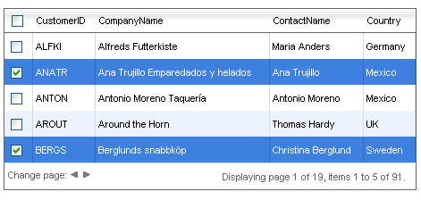

# Server-side Selecting Multiple Rows

## 

**RadGrid** allows multiple rows to be selected at the same time when the **AllowMultiRowSelection**property is set to **true**When multi-row selection is enabled, you can still use the approaches described in [Selecting a row with a checkbox (server-side)]() and [ Selecting a row with a select button (server-side)]() topics.

The selected rows can be accessed using the grid's **SelectedItems** collection. In addition, you can handle the grid's **SelectedIndexChanged** server event to detect when an item's selection changes and perform additional operations if needed.

For a live example of multi-row selection that is handled server-side, see [Server-side row selection](https://demos.telerik.com/aspnet-ajax/Grid/Examples/Programming/SelectRowWithCheckBox/DefaultCS.aspx).
