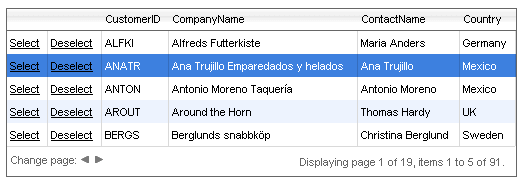

# Server-side Selecting with a Select Button


## 

You can add **GridButtonColumn** columns to a grid to handle the selection and de-selection of grid rows. The **RadGrid** [Command API]() can automatically handle the select and de-select commands: you need only add the **GridButtonColumn** objects to the **Commands** collection and set their **CommandName** property:



````ASP.NET
	  <telerik:RadGrid ID="RadGrid1" runat="server" AllowPaging="True" PageSize="5" Skin="Silk"
	    DataSourceID="SqlDataSource1" AllowMultiRowSelection="True">
	    <MasterTableView DataSourceID="AccessDataSource1">
	      <Columns>
	        <telerik:GridButtonColumn CommandName="Select" Text="Select" UniqueName="Select">
	        </telerik:GridButtonColumn>
	        <telerik:GridButtonColumn CommandName="Deselect" Text="Deselect" UniqueName="Deselect">
	        </telerik:GridButtonColumn>
	      </Columns>
	    </MasterTableView></telerik:RadGrid>
	    <asp:SqlDataSource ID="SqlDataSource1" runat="server" ConnectionString="<%$ ConnectionStrings:NorthwindConnectionString %>"
	        SelectCommand="SELECT [CustomerID], [CompanyName], [ContactName], [Country] FROM [Customers]">
	    </asp:SqlDataSource>
````


You can access the selected rows using the **SelectedItems** collection of the **RadGrid** object. In addition, you can handle the **SelectedIndexChanged** server event of the grid to detect when a row's selection changes perform additional operations if needed.

For a live example showing server-side selection, see [Server-side row selection](http://demos.telerik.com/aspnet-ajax/Grid/Examples/Programming/SelectRowWithCheckBox/DefaultCS.aspx).
